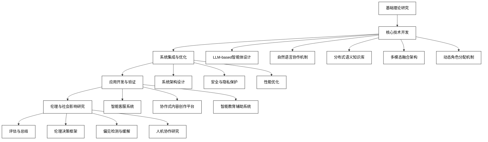

# 1 绪论

## 1.1 研究背景与意义

### 1.1.1 AI大模型的发展与应用现状

人工智能领域在近年来取得了突飞猛进的发展，其中最引人注目的莫过于AI大模型，特别是大型语言模型（Large Language Models，LLMs）的崛起。这些模型凭借其庞大的参数规模和海量的训练数据，展现出了令人惊叹的自然语言处理能力，不仅能够理解和生成人类语言，还能执行各种复杂的认知任务。

GPT（Generative Pre-trained Transformer）系列模型的发展历程清晰地展示了AI大模型的进化过程。从2018年的GPT-1开始，到2019年的GPT-2，再到2020年的GPT-3，以及最新的GPT-4，每一代模型都在规模和能力上有了质的飞跃。GPT-3拥有1750亿个参数，而GPT-4的具体参数规模虽未公开，但其性能已经接近甚至超越了人类在某些特定任务上的表现。

除GPT系列外，其他知名的大语言模型还包括Google的BERT（Bidirectional Encoder Representations from Transformers）和PaLM（Pathways Language Model），以及Meta的LLaMA（Large Language Model Meta AI）等。这些模型在各自的领域都展现出了卓越的性能，推动了自然语言处理技术的边界。

AI大模型的应用范围极其广泛，几乎涵盖了所有与语言和知识相关的领域：

1. 自然语言处理：包括机器翻译、文本摘要、问答系统、情感分析等。
2. 内容创作：从写作辅助到自动生成报告、文章、诗歌等。
3. 代码生成：能够理解自然语言描述并生成相应的程序代码。
4. 知识问答：作为智能问答系统的核心，提供准确、相关的信息。
5. 对话系统：支持更自然、更具上下文理解能力的人机对话。
6. 跨模态任务：如图像描述、视频理解等，将语言模型与其他模态结合。

然而，尽管AI大模型取得了巨大成功，但它们仍然面临着一些挑战：

1. 计算资源需求：训练和部署大模型需要巨大的计算资源，这限制了其广泛应用。
2. 数据隐私：模型训练需要海量数据，如何保护用户隐私成为一个重要问题。
3. 偏见与公平性：模型可能继承训练数据中的偏见，导致输出结果存在歧视性。
4. 可解释性：大模型的决策过程往往是不透明的，难以解释和验证。
5. 幻觉问题：模型可能生成看似合理但实际上不正确的信息。
6. 安全性：如何防止模型被滥用或产生有害内容是一个重要的研究方向。

面对这些挑战，研究者们正在积极探索解决方案。例如，通过开发更高效的训练算法和硬件来降低计算成本；使用联邦学习等技术来保护数据隐私；开发去偏见技术和公平性评估方法；探索可解释AI技术；改进模型架构和训练方法以减少幻觉问题；设计更robust的安全机制等。

总的来说，AI大模型的发展正处于一个激动人心的阶段。它们不仅推动了自然语言处理技术的进步，还为人工智能在更广泛领域的应用开辟了新的可能性。随着技术的不断进步和挑战的逐步克服，我们可以期待AI大模型在未来将发挥更加重要的作用，为人类社会带来更多创新和价值。

### 1.1.2 多智能体系统的概念与优势

多智能体系统（Multi-Agent Systems，MAS）是分布式人工智能的一个重要分支，它由多个自主的、交互的智能体（agents）组成，这些智能体共同工作以解决复杂问题或实现特定目标。每个智能体都是一个独立的实体，具有感知环境、做出决策和执行行动的能力。

多智能体系统的核心概念包括：

1. 智能体（Agent）：系统中的基本单元，具有自主性、反应性、主动性和社交能力。
2. 环境（Environment）：智能体所处的外部世界，可以是物理的或虚拟的。
3. 交互（Interaction）：智能体之间以及智能体与环境之间的信息交换和影响。
4. 组织（Organization）：定义智能体之间的关系和协作结构。
5. 协作（Collaboration）：多个智能体为实现共同目标而进行的协调行为。

多智能体系统相比于单一智能体系统具有显著的优势：

1. 分布式问题解决：
    - 能够将复杂问题分解为多个子问题，由不同智能体并行处理，提高效率。
    - 适合处理在地理上或逻辑上分布的问题。

2. 可扩展性：
    - 系统可以通过添加或移除智能体来灵活调整规模。
    - 更容易适应问题规模的变化。

3. 鲁棒性：
    - 单个智能体的失效不会导致整个系统崩溃。
    - 通过冗余和动态重组提高系统的容错能力。

4. 异构性：
    - 可以集成具有不同能力和专长的智能体。
    - 有利于解决需要多种技能的复杂问题。

5. 自适应性：
    - 系统可以根据环境变化动态调整行为和策略。
    - 通过学习和进化提高系统的整体性能。

6. 资源共享：
    - 智能体可以共享信息、知识和计算资源。
    - 提高资源利用效率，避免重复工作。

7. 开放性：
    - 系统可以动态地加入新的智能体或服务。
    - 有利于系统的持续发展和功能扩展。

8. 自组织：
    - 智能体可以自主地形成组织结构和协作关系。
    - 减少中央控制的需求，提高系统的灵活性。

多智能体系统在实际应用中已经展现出巨大的潜力，例如：

1. 智能交通系统：多个智能体代表不同的交通参与者（如车辆、信号灯），协调以优化交通流量。
2. 供应链管理：不同智能体代表供应链中的各个环节，协作以实现高效的物流和库存管理。
3. 分布式能源系统：智能体代表不同的能源生产和消费单元，协调以优化能源分配和使用。
4. 网络安全：多个智能体协作监控网络流量，检测和应对安全威胁。
5. 虚拟经济系统：在游戏或模拟环境中，智能体作为经济主体，模拟复杂的经济行为。

然而，多智能体系统也面临一些挑战：

1. 协调复杂性：随着智能体数量的增加，协调难度呈指数级增长。
2. 通信开销：频繁的智能体间通信可能导致系统性能下降。
3. 全局最优：难以在保证局部自主性的同时实现全局最优。
4. 安全性：分布式特性使得系统可能更容易受到攻击。
5. 设计复杂性：设计和实现复杂的多智能体系统需要专业知识和工具支持。

为了应对这些挑战，研究者们正在探索各种新技术和方法，如高效的协调算法、安全的通信协议、分布式优化技术等。随着人工智能和分布式计算技术的不断进步，多智能体系统有望在更多领域发挥重要作用，为解决复杂的实际问题提供强大的工具和方法。

### 1.1.3 LLM与多智能体系统结合的潜力

将大型语言模型（LLM）与多智能体系统（MAS）相结合，创造了一个充满潜力的新兴研究领域。这种结合不仅能够充分发挥LLM的强大语言理解和生成能力，还能利用MAS的分布式协作优势，为复杂问题的解决提供了全新的思路。以下详细探讨LLM与MAS结合的潜力：

1. 增强智能体的认知能力

LLM可以显著提升智能体的自然语言处理能力，使其能够更好地理解和生成人类语言。这种增强使得智能体能够：

- 处理更复杂的指令和任务描述
- 理解和生成更自然、更丰富的对话
- 从非结构化文本中提取有用信息
- 生成高质量的报告和摘要

例如，在客户服务场景中，基于LLM的智能体可以理解客户的复杂需求，提供更精准的解答，甚至处理多轮对话中的上下文信息。

2. 知识共享与协作学习

LLM作为知识库，可以为多智能体系统提供丰富的背景知识和推理能力。智能体之间可以：

- 共享从LLM获得的知识，减少重复学习
- 通过LLM进行知识迁移，将一个领域的知识应用到另一个领域
- 利用LLM的推理能力进行集体决策

在科研协作场景中，不同专业背景的智能体可以通过LLM交流和整合知识，促进跨学科研究。

3. 动态角色分配与任务规划

LLM的强大语言理解能力使得多智能体系统能够更灵活地进行角色分配和任务规划：

- 智能体可以理解复杂的任务描述，并根据自身能力动态承担合适的角色
- 系统可以生成详细的任务分解和执行计划
- 智能体间可以进行更自然的任务协商和调整

在项目管理应用中，基于LLM的智能体可以理解项目需求，自动分配任务，并在执行过程中动态调整计划。

4. 增强人机交互

LLM的自然语言处理能力可以显著改善多智能体系统与人类用户的交互：

- 提供更自然、更上下文相关的对话界面
- 理解和执行复杂的自然语言指令
- 生成人类可理解的解释和反馈

在智能家居系统中，用户可以通过自然语言与多个智能设备进行交互，系统能够理解复杂的指令并协调多个设备执行任务。

5. 提高系统的适应性和学习能力

LLM的泛化能力可以帮助多智能体系统更好地适应新环境和新任务：

- 智能体可以利用LLM的推理能力来处理未见过的情况
- 系统可以通过少量样本学习快速适应新任务
- 智能体可以利用LLM生成假设并进行验证，提高学习效率

在自动驾驶车队管理中，系统可以快速适应新的交通规则或道路情况，并在车辆间共享学习成果。

6. 增强多模态交互

LLM可以作为多模态信息的桥梁，增强多智能体系统处理和整合不同类型数据的能力：

- 将视觉信息转换为文本描述，便于其他智能体理解
- 根据文本指令生成图像或音频内容
- 协调不同模态的智能体进行协作

在智能监控系统中，视觉智能体可以将场景转换为文本描述，语音智能体可以生成警报，而决策智能体则可以基于这些信息制定响应策略。

7. 提高系统的可解释性

LLM的语言生成能力可以帮助提高多智能体系统的可解释性：

- 生成智能体决策过程的自然语言解释
- 将复杂的系统状态转化为人类可理解的描述
- 提供系统行为的合理化解释

在金融交易系统中，每个交易决策都可以附带详细的自然语言解释，便于监管和审计。

8. 增强创造性问题解决

LLM的创造性和联想能力可以帮助多智能体系统进行创新性思考：

- 生成新颖的问题解决方案
- 进行跨领域知识整合
- 模拟不同视角的思考过程

在创意设计团队中，不同专长的智能体可以通过LLM进行头脑风暴，产生创新的设计方案。

9. 伦理决策支持

LLM可以为多智能体系统提供伦理决策支持：

- 提供多角度的伦理考量
- 生成伦理困境的分析报告
- 协助制定符合伦理标准的决策

在自动驾驶系统中，当面临复杂的道德困境时，LLM可以帮助系统权衡不同的伦理考量，做出更符合人类价值观的决策。

10. 动态知识更新

LLM可以通过持续学习来更新知识库，使多智能体系统能够：

- 适应不断变化的环境和需求
- 整合最新的信息和知识
- 改进决策和推理能力

在新闻聚合系统中，智能体可以利用不断更新的LLM来理解和分类最新的新闻事件，提供实时的信息分析。

然而，将LLM与多智能体系统结合也面临一些挑战：

1. 计算资源需求：运行大规模LLM需要大量计算资源，可能限制系统的实时性能。
2. 一致性维护：确保多个智能体使用LLM得到的信息保持一致性是一个挑战。
3. 安全性考虑：LLM可能产生不适当或有害的内容，需要额外的安全机制。
4. 隐私保护：处理敏感信息时，需要确保LLM不会泄露隐私数据。
5. 偏见控制：LLM可能包含偏见，需要在多智能体系统中进行识别和缓解。

为了充分发挥LLM与多智能体系统结合的潜力，未来的研究方向可能包括：

1. 开发更高效的LLM压缩和部署技术，以减少计算资源需求。
2. 设计专门用于多智能体协作的LLM架构和训练方法。
3. 探索LLM与其他AI技术（如强化学习、图神经网络）的结合，以增强多智能体系统的能力。
4. 研究如何在保护隐私和保持模型性能之间取得平衡。
5. 开发更强大的安全机制和伦理框架，以确保系统的可靠性和负责任使用。

总之，LLM与多智能体系统的结合代表了人工智能领域一个极具前景的研究方向。这种结合不仅能够显著增强现有多智能体系统的能力，还有望催生出全新的应用场景和解决方案。随着技术的不断进步和挑战的逐步克服，我们可以期待看到更多创新性的应用在各个领域涌现，推动人工智能技术向着更智能、更灵活、更人性化的方向发展。

## 1.2 国内外研究现状

### 1.2.1 AI大模型在智能体系统中的应用进展

AI大模型，尤其是大型语言模型（LLMs），在智能体系统中的应用正在迅速发展，为传统的智能体系统带来了革命性的变革。以下是当前研究的主要进展：

1. 增强型对话智能体

研究者们正在利用LLMs来创建更加智能和自然的对话系统。例如，微软的DialoGPT和Google的LaMDA都展示了LLM在多轮对话中的强大能力。这些模型不仅能够理解复杂的上下文，还能生成连贯、信息丰富的回复。

关键进展：
- 上下文理解：能够跟踪长期对话历史，保持对话的连贯性。
- 多样性生成：使用技术如nucleus sampling来生成更加多样和有趣的回复。
- 个性化：根据用户特征和对话历史调整回复风格。

2. 任务导向型智能体

LLMs被用来增强任务导向型智能体的能力，使其能够理解更复杂的指令并执行多步骤任务。

关键进展：
- 指令跟随：如OpenAI的GPT-3展示了强大的few-shot学习能力，能够根据简单的指令执行各种任务。
- 任务规划：利用LLM的推理能力来分解复杂任务并生成执行计划。
- 多模态任务执行：结合LLM和计算机视觉模型，实现如图像生成、视觉问答等任务。

3. 知识增强型智能体

研究者正在探索如何将LLMs的广泛知识与智能体系统结合，创建具有深度和广度知识的智能体。

关键进展：
- 知识检索：使用LLM作为知识库，智能体可以查询复杂的信息。
- 知识整合：将LLM的知识与结构化知识图谱相结合，提高知识的准确性和可解释性。
- 持续学习：探索让智能体通过与LLM的交互来不断更新和扩展其知识库。

4. 多智能体协作系统

LLMs正被用于增强多智能体系统中的协作和通信能力。

关键进展：
- 自然语言协商：智能体可以使用自然语言进行复杂的协商和决策。
- 角色扮演：LLM可以模拟不同角色，帮助训练和评估多智能体系统。
- 集体智慧：利用LLM整合多个智能体的意见，形成更好的决策。

5. 自主学习智能体

研究者正在探索如何利用LLMs来增强智能体的自主学习能力。

关键进展：
- 元学习：利用LLM的泛化能力来快速适应新任务。
- 自我提示：智能体学会生成有效的提示来指导自己的行为。
- 概念学习：通过与LLM的交互，智能体可以学习抽象概念并应用到新情境。

6. 情感和社交智能体

LLMs正被用于创建具有更高情感智能和社交能力的智能体。

关键进展：
- 情感理解：能够从文本中准确识别和理解复杂的情感状态。
- 同理心生成：生成表现出同理心的回应，提高用户体验。
- 社交规范学习：智能体学习并遵循复杂的社交规范和礼仪。

7. 创造性智能体

研究者正在探索如何利用LLMs的创造性来开发能够生成原创内容的智能体。

关键进展：
- 故事生成：创建能够生成连贯、有趣故事的智能体。
- 创意写作：开发能够进行诗歌创作、广告文案撰写等任务的智能体。
- 创新问题解决：利用LLM的联想能力来生成创新的问题解决方案。

8. 伦理决策智能体

研究者正在探索如何利用LLMs来增强智能体的伦理决策能力。

关键进展：
- 伦理推理：利用LLM分析复杂的伦理情境并提供多角度的考量。
- 价值对齐：开发能够理解和遵循人类价值观的智能体。
- 伦理约束：在智能体的决策过程中集成伦理考虑。

9. 可解释AI智能体

LLMs正被用于提高智能体系统的可解释性。

关键进展：
- 决策解释：生成人类可理解的决策过程解释。
- 行为合理化：为智能体的行为提供合理的解释。
- 交互式解释：允许用户通过自然语言对话来询问和理解智能体的决策。

10. 安全和鲁棒性增强

研究者正在探索如何利用LLMs来增强智能体系统的安全性和鲁棒性。

关键进展：
- 对抗样本检测：利用LLM的语言理解能力来识别潜在的恶意输入。
- 不确定性估计：智能体能够表达对其决策的不确定性，提高系统的可靠性。
- 安全策略生成：在潜在危险情况下，生成安全的行动策略。

这些研究进展展示了AI大模型在智能体系统中的巨大潜力。然而，仍然存在许多挑战，如计算效率、模型偏见、隐私保护等。未来的研究将继续致力于解决这些问题，进一步推动AI大模型在智能体系统中的应用和发展。

### 1.2.2 多智能体系统的最新研究动态

多智能体系统（Multi-Agent Systems, MAS）作为人工智能和分布式计算的交叉领域，近年来取得了显著的进展。以下是该领域的最新研究动态：

1. 深度强化学习在多智能体系统中的应用

深度强化学习（DRL）与多智能体系统的结合是当前研究的热点之一。

关键进展：
- 多智能体深度确定性策略梯度（MADDPG）：这种算法能够处理连续动作空间的多智能体协作和竞争问题。
- 注意力机制：研究者们正在探索如何将注意力机制引入多智能体强化学习，以提高智能体对环境和其他智能体的感知能力。
- 经验回放优化：开发了优先级经验回放等技术，以提高多智能体学习的效率。

数学模型：
多智能体强化学习的目标通常可以表示为最大化所有智能体的累积奖励：

$$\max_{\theta_1,\ldots,\theta_N} J(\theta_1,\ldots,\theta_N) = \mathbb{E}_{s\sim\rho^\pi,a_i\sim\pi_{\theta_i}}[\sum_{i=1}^N R_i(s,a_1,\ldots,a_N)]$$

其中，$\theta_i$是第i个智能体的策略参数，$\pi_{\theta_i}$是其策略，$R_i$是奖励函数。

2. 多智能体通信协议

研究者们正在开发更高效、更安全的智能体间通信协议。

关键进展：
- 差分隐私：将差分隐私技术应用于多智能体通信，以保护敏感信息。
- 自适应通信：开发能够根据任务需求动态调整通信频率和内容的协议。
- 基于区块链的通信：探索使用区块链技术来确保多智能体系统中的通信安全和可信度。

3. 多智能体协作学习

研究者们正在探索如何让多个智能体共同学习，以提高整体系统的性能。

关键进展：
- 联邦学习：将联邦学习应用于多智能体系统，使智能体能够在保护隐私的同时共享学习成果。
- 知识蒸馏：探索如何在多智能体系统中进行知识蒸馏，以实现高效的知识传递。
- 元学习：开发能够快速适应新任务的多智能体元学习算法。

数学模型：
联邦学习在多智能体系统中的目标函数可以表示为：

$$\min_w F(w) = \sum_{i=1}^N p_i F_i(w)$$

其中，$w$是全局模型参数，$F_i$是第i个智能体的局部目标函数，$p_i$是权重。

4. 多智能体系统的可解释性

提高多智能体系统的可解释性是当前研究的重要方向之一。

关键进展：
- 可解释的协作策略：开发能够生成人类可理解的协作策略解释的方法。
- 决策树可视化：使用决策树等可视化技术来展示多智能体系统的决策过程。
- 因果推理：将因果推理引入多智能体系统，以提供更深入的系统行为解释。

5. 多智能体系统的鲁棒性和安全性

研究者们正在探索如何提高多智能体系统在面对不确定性和潜在攻击时的鲁棒性。

关键进展：
- 对抗训练：开发针对多智能体系统的对抗训练方法，提高系统的鲁棒性。
- 异常检测：设计能够在多智能体环境中检测异常行为的算法。
- 自适应防御策略：开发能够动态调整防御策略的多智能体系统。

6. 大规模多智能体系统

随着应用场景的复杂化，研究者们正在探索如何有效管理和优化大规模多智能体系统。

关键进展：
- 分层架构：开发能够处理数千甚至数百万智能体的分层多智能体架构。
- 稀疏交互：探索如何在大规模系统中实现智能体间的稀疏但有效的交互。
- 分布式优化：开发适用于大规模多智能体系统的分布式优化算法。

数学模型：
大规模多智能体系统中的分布式优化问题可以表示为：

$$\min_{x_1,\ldots,x_N} \sum_{i=1}^N f_i(x_i) \quad \text{s.t.} \quad \sum_{i=1}^N A_i x_i = b$$

其中，$x_i$是第i个智能体的局部变量，$f_i$是局部目标函数，$A_i$和$b$定义了全局约束。

7. 多智能体系统中的公平性和伦理

随着多智能体系统在现实世界中的应用日益广泛，确保系统的公平性和伦理性变得越来越重要。

关键进展：
- 公平资源分配：开发考虑公平性的资源分配算法，确保不同智能体获得公平的资源分配。
- 伦理决策框架：设计能够在多智能体系统中集成伦理考量的决策框架。
- 偏见检测与缓解：开发能够识别和减少多智能体系统中潜在偏见的方法。

数学模型：
考虑公平性的资源分配问题可以表示为最大化效用的同时最小化不公平性：

$$\max_{x} \sum_{i=1}^N u_i(x_i) - \lambda \cdot \text{inequality}(x_1, \ldots, x_N)$$

其中，$u_i$是第i个智能体的效用函数，$\text{inequality}$衡量分配的不公平程度，$\lambda$是平衡参数。

8. 多智能体系统在复杂环境中的适应性

研究者们正在探索如何提高多智能体系统在动态、不确定和部分可观察环境中的适应性。

关键进展：
- 迁移学习：开发能够在不同任务和环境之间迁移知识的多智能体学习算法。
- 自适应策略：设计能够根据环境变化动态调整策略的智能体。
- 多目标优化：探索在多目标场景下的多智能体决策和优化方法。

9. 多智能体系统的形式化验证

随着多智能体系统在关键应用领域的使用，确保系统行为的正确性和可预测性变得至关重要。

关键进展：
- 模型检验：开发适用于多智能体系统的高效模型检验技术。
- 运行时监控：设计能够在系统运行时持续验证行为的方法。
- 形式化规范：探索如何为复杂的多智能体系统定义精确的形式化规范。

10. 多智能体系统与物联网的结合

随着物联网技术的发展，研究者们正在探索如何将多智能体系统与物联网设备有效结合。

关键进展：
- 边缘计算：开发能够在边缘设备上运行的轻量级多智能体系统。
- 自组织网络：设计能够自主形成和维护网络结构的多智能体物联网系统。
- 分布式感知：探索如何利用多智能体系统实现大规模分布式传感器网络的协调。

这些研究动态展示了多智能体系统领域的蓬勃发展。研究者们正在不断突破技术边界，探索新的应用场景，同时也在积极应对伦理、安全和可扩展性等挑战。未来，我们可以期待看到更多创新性的多智能体系统解决方案，为人工智能和分布式计算领域带来新的突破。

### 1.2.3 LLM-based多智能体系统的相关工作

LLM-based多智能体系统是一个新兴的研究领域，它结合了大型语言模型（LLMs）的强大语言理解和生成能力与多智能体系统的分布式协作优势。以下是该领域的一些重要相关工作：

1. 基于LLM的多智能体对话系统

研究者们正在探索如何利用LLMs来创建更加智能和自然的多智能体对话系统。

关键工作：
- ChatHaruhi项目：该项目使用LLM来模拟多个角色之间的对话，展示了LLM在多智能体对话生成中的潜力。
- Multi-Agent Debate：OpenAI的研究者们探索了使用GPT-3来模拟多个智能体之间的辩论，以解决复杂问题。

技术细节：
这些系统通常使用角色提示（role prompting）技术，为每个智能体分配特定的角色和背景，然后让LLM生成符合该角色特征的对话。例如：

```python
def generate_dialogue(agents, topic):
    conversation = []
    for agent in agents:
        prompt = f"You are {agent.name}, {agent.background}. Discuss {topic}."
        response = llm.generate(prompt + "\n".join(conversation))
        conversation.append(f"{agent.name}: {response}")
    return conversation
```

2. LLM驱动的多智能体任务规划与执行

研究者们正在探索如何利用LLMs的推理能力来改进多智能体系统的任务规划和执行。

关键工作：
- AutoGPT：这个项目展示了如何使用GPT-4来创建能够自主规划和执行复杂任务的智能体。
- LLM-based Multi-Agent Task Planning：研究者们探索了使用LLM来分解复杂任务，并为多个智能体分配子任务的方法。

技术细节：
这些系统通常使用LLM来生成任务计划，然后将计划转化为可执行的指令。例如：

```python
def plan_and_execute(task, agents):
    plan = llm.generate(f"Create a plan to {task} using {len(agents)} agents.")
    steps = parse_plan(plan)
    for step in steps:
        agent = select_agent(step, agents)
        result = agent.execute(step)
        update_state(result)
    return get_final_result()
```

3. 基于LLM的多智能体协作学习

研究者们正在探索如何利用LLMs来促进多智能体系统中的知识共享和协作学习。

关键工作：
- Collaborative Learning with LLMs：这项研究探索了如何使用LLM作为知识中介，促进多个智能体之间的知识交流和整合。
- Multi-Agent Reinforcement Learning with LLM Guidance：研究者们探索了如何使用LLM来指导多智能体强化学习过程，提供高级策略建议。

数学模型：
在LLM指导下的多智能体强化学习可以表示为：

$$Q_i(s,a) = (1-\alpha)Q_i(s,a) + \alpha[r_i + \gamma \max_{a'} Q_i(s',a') + \lambda \cdot \text{LLM}_\text{advice}(s,a)]$$

其中，$\text{LLM}_\text{advice}$是LLM提供的建议，$\lambda$是平衡参数。

4. LLM增强的多智能体通信

研究者们正在探索如何利用LLMs来改进多智能体系统中的通信效率和效果。

关键工作：
- Natural Language Coordination in Multi-Agent Systems：这项研究探索了使用LLM来实现基于自然语言的智能体协调。
- Semantic Communication in Multi-Agent Systems：研究者们探索了如何使用LLM来实现智能体之间的语义级通信，提高信息传递的效率和准确性。

技术细节：
这些系统通常使用LLM来编码和解码智能体之间的消息，实现更高级的语义通信。例如：

```python
def communicate(sender, receiver, message):
    encoded = llm.generate(f"Encode the message '{message}' for {receiver.name}")
    decoded = llm.generate(f"As {receiver.name}, decode the message: {encoded}")
    return decoded
```

5. LLM-based多智能体决策系统

研究者们正在探索如何利用LLMs的推理能力来改进多智能体系统的集体决策过程。

关键工作：
- Collective Decision Making with LLMs：这项研究探索了如何使用LLM来整合多个智能体的观点，形成集体决策。
- LLM-powered Voting Mechanisms：研究者们探索了如何使用LLM来实现更复杂和灵活的多智能体投票机制。

数学模型：
基于LLM的集体决策可以表示为：

$$D = \arg\max_d \sum_{i=1}^N w_i \cdot \text{LLM}_\text{score}(o_i, d)$$

其中，$o_i$是第i个智能体的观点，$d$是可能的决策，$w_i$是权重，$\text{LLM}_\text{score}$评估观点和决策的一致性。

6. LLM-based多智能体伦理决策框架

随着AI系统在关键领域的应用，确保多智能体系统的伦理决策变得越来越重要。

关键工作：
- Ethical Multi-Agent Decision Making with LLMs：这项研究探索了如何使用LLM来为多智能体系统提供伦理指导。
- LLM-powered Ethical Reasoning in Multi-Agent Systems：研究者们探索了如何利用LLM的推理能力来处理复杂的伦理困境。

技术细节：
这些系统通常使用LLM来评估决策的伦理影响，并提供伦理建议。例如：

```python
def ethical_decision(agents, options):
    evaluations = []
    for option in options:
        ethical_score = llm.generate(f"Evaluate the ethical implications of {option}")
        evaluations.append((option, ethical_score))
    return max(evaluations, key=lambda x: x[1])[0]
```

7. LLM-based多智能体系统的可解释性

研究者们正在探索如何利用LLMs的语言生成能力来提高多智能体系统的可解释性。

关键工作：
- Explainable Multi-Agent Systems with LLMs：这项研究探索了如何使用LLM来生成多智能体系统行为的自然语言解释。
- Interactive Explanations in LLM-based Multi-Agent Systems：研究者们探索了如何创建允许用户通过自然语言对话来询问和理解系统行为的交互式解释系统。

技术细节：
这些系统通常使用LLM来将系统的内部状态和决策过程转化为人类可理解的解释。例如：

```python
def explain_decision(system_state, decision):
    explanation = llm.generate(f"Explain why the system decided to {decision} given the current state: {system_state}")
    return explanation
```

这些相关工作展示了LLM-based多智能体系统的巨大潜力和多样性。研究者们正在探索如何充分利用LLMs的语言理解和生成能力来增强多智能体系统的各个方面，从通信和决策到学习和伦理。然而，这个领域仍然面临着许多挑战，如计算效率、模型偏见、系统稳定性等。未来的研究将继续致力于解决这些问题，进一步推动LLM-based多智能体系统的发展和应用。

## 1.3 研究内容与目标

### 1.3.1 主要研究内容概述

本研究旨在深入探讨基于大型语言模型（LLM）的多智能体系统的设计、实现和应用。主要研究内容包括以下几个方面：

1. LLM-based智能体设计

研究如何利用LLM构建具有高度语言理解和生成能力的智能体。主要包括：

- 基于LLM的智能体认知模型设计
- 智能体个性化与角色定制方法
- LLM与传统AI技术（如强化学习、规划算法）的融合

技术细节：
```python
class LLMAgent:
    def __init__(self, llm, personality):
        self.llm = llm
        self.personality = personality
        self.memory = []

    def perceive(self, observation):
        prompt = f"As {self.personality}, analyze: {observation}"
        analysis = self.llm.generate(prompt)
        self.memory.append(analysis)

    def decide(self, task):
        context = "\n".join(self.memory[-5:])  # Use last 5 memories
        prompt = f"As {self.personality}, given the context:\n{context}\nDecide how to: {task}"
        decision = self.llm.generate(prompt)
        return decision
```

2. 多智能体协作机制

研究基于LLM的多智能体协作方法，包括：

- 基于自然语言的智能体间通信协议
- LLM驱动的任务分解与分配策略
- 多智能体共识达成机制

数学模型：
多智能体共识问题可以形式化为：

$$\min_{\theta} \sum_{i=1}^N \| f_i(\theta) - \text{LLM}_\text{consensus}(\{f_j(\theta)\}_{j=1}^N) \|^2$$

其中，$f_i(\theta)$是第i个智能体的局部决策，$\text{LLM}_\text{consensus}$是使用LLM生成的共识决策。

3. 知识表示与推理

探索如何利用LLM增强多智能体系统的知识处理能力：

- 分布式知识库设计与管理
- 基于LLM的跨域知识迁移方法
- 不确定性推理与决策制定

技术细节：
```python
class DistributedKnowledgeBase:
    def __init__(self, agents):
        self.agents = agents

    def query(self, question):
        responses = [agent.llm.generate(f"Answer: {question}") for agent in self.agents]
        consensus = self.reach_consensus(responses)
        return consensus

    def reach_consensus(self, responses):
        prompt = f"Given these responses:\n{responses}\nProvide a consensus answer."
        return self.agents[0].llm.generate(prompt)  # Use first agent's LLM for consensus
```

4. 多模态交互

研究如何将LLM与其他模态（如视觉、语音）结合，实现多模态的多智能体系统：

- LLM与计算机视觉模型的集成
- 多模态输入的语义理解与融合
- 跨模态任务执行与协调

技术细节：
```python
class MultimodalAgent:
    def __init__(self, llm, vision_model, speech_model):
        self.llm = llm
        self.vision_model = vision_model
        self.speech_model = speech_model

    def process_input(self, input_type, input_data):
        if input_type == 'text':
            return self.llm.generate(input_data)
        elif input_type == 'image':
            image_description = self.vision_model.describe(input_data)
            return self.llm.generate(f"Analyze this image: {image_description}")
        elif input_type == 'speech':
            text = self.speech_model.transcribe(input_data)
            return self.llm.generate(f"Respond to this speech: {text}")
```

5. 系统架构设计

研究适合LLM-based多智能体系统的架构设计：

- 分层设计理念与核心组件定义
- 智能体生命周期管理机制
- 可扩展性和容错性设计

6. 安全与隐私保护

探索LLM-based多智能体系统中的安全和隐私问题：

- 智能体身份认证与授权机制
- 基于联邦学习的隐私保护方法
- 对抗性攻击防御策略

数学模型：
基于联邦学习的隐私保护训练可以表示为：

$$\min_w \sum_{i=1}^N p_i F_i(w) + \lambda R(w)$$

其中，$F_i(w)$是第i个智能体的局部目标函数，$R(w)$是正则化项，$p_i$是权重，$\lambda$是正则化参数。

7. 应用场景研究

探索LLM-based多智能体系统在各个领域的应用：

- 智能客服系统
- 协作式内容创作平台
- 智能教育辅助系统
- 金融决策支持系统
- 智能城市管理平台

8. 伦理与社会影响

研究LLM-based多智能体系统的伦理问题和社会影响：

- 伦理决策框架设计
- 偏见检测与缓解方法
- 人机协作新范式探讨

技术细节：
```python
class EthicalDecisionMaker:
    def __init__(self, llm, ethical_guidelines):
        self.llm = llm
        self.ethical_guidelines = ethical_guidelines

    def evaluate_decision(self, decision):
        prompt = f"""
        Given the ethical guidelines:
        {self.ethical_guidelines}
        
        Evaluate the ethical implications of this decision:
        {decision}
        
        Provide an ethical score from 0 to 100 and explain your reasoning.
        """
        evaluation = self.llm.generate(prompt)
        score, explanation = self.parse_evaluation(evaluation)
        return score, explanation

    def parse_evaluation(self, evaluation):
        # Implementation to extract score and explanation from LLM output
        pass
```

### 1.3.2 预期目标和创新点

1. 预期目标

- 构建一个通用的LLM-based多智能体系统框架，支持快速开发和部署各种应用。
- 提出新的多智能体协作机制，显著提高系统的问题解决能力和效率。
- 开发一套基于LLM的知识表示和推理方法，增强系统的认知能力和适应性。
- 实现多模态交互的无缝集成，提升系统的用户体验和应用范围。
- 设计一套完整的安全和隐私保护方案，确保系统的可靠性和用户信任。
- 在至少三个不同领域开发和部署实际应用，验证系统的有效性和实用性。
- 提出一个伦理决策框架，为AI系统的负责任发展提供指导。

2. 创新点

- LLM-driven智能体设计：提出一种新的智能体设计方法，充分利用LLM的语言理解和生成能力，实现更灵活、更智能的智能体行为。

- 自然语言协作机制：开发基于自然语言的多智能体协作机制，突破传统符号化通信的限制，实现更自然、更高效的智能体间交互。

- 分布式语义知识库：设计一种新型的分布式知识表示方法，结合LLM的语义理解能力和传统知识图谱的结构化特性，实现更灵活、更强大的知识管理和推理。

- 多模态融合架构：提出一种新的多模态信息融合架构，利用LLM作为中介，实现不同模态间的深度语义整合和理解。

- 动态角色分配机制：开发一种基于任务上下文和LLM推理的动态角色分配机制，提高系统的灵活性和适应性。

- 伦理增强学习：提出一种将伦理考量集成到智能体学习过程中的新方法，确保系统行为符合预定的伦理标准。

- 交互式可解释性框架：设计一个基于LLM的交互式可解释性框架，允许用户通过自然语言对话来理解和质疑系统的决策过程。

### 1.3.3 技术路线

为实现上述研究目标，我们采用以下技术路线：

1. 基础理论研究阶段

- 深入分析现有LLM技术和多智能体系统理论
- 探索LLM与多智能体系统结合的理论基础
- 制定初步的系统设计方案和评估指标

2. 核心技术开发阶段

- 开发LLM-based智能体设计方法
- 实现基于自然语言的多智能体协作机制
- 构建分布式语义知识库
- 设计多模态融合架构
- 开发动态角色分配机制

3. 系统集成与优化阶段

- 整合各个核心技术模块
- 设计并实现系统总体架构
- 开发安全和隐私保护机制
- 进行系统性能优化和压力测试

4. 应用开发与验证阶段

- 选择典型应用场景进行系统部署
- 开发具体应用并进行实地测试
- 收集用户反馈并进行系统改进

5. 伦理与社会影响研究阶段

- 设计并实现伦理决策框架
- 开发偏见检测与缓解方法
- 进行人机协作实验和用户研究

6. 评估与总结阶段

- 进行全面的系统评估实验
- 分析研究成果和存在的问题
- 总结经验教训并提出未来研究方向

技术路线图：



这个技术路线将指导我们有序地开展研究工作，确保各个研究目标的实现。在研究过程中，我们将保持灵活性，根据实际进展和新的发现适时调整研究计划。

## 1.4 论文结构安排

本论文的结构安排如下：

1. 绪论
    - 研究背景与意义
    - 国内外研究现状
    - 研究内容与目标
    - 论文结构安排

2. 基础理论与关键技术
    - AI大模型概述
    - 多智能体系统基础
    - LLM-based智能体设计
    - 多模态交互技术

3. LLM-based多智能体系统架构设计
    - 系统总体架构
    - 智能体管理层
    - 知识库与记忆系统
    - 通信与协作机制
    - 环境感知与交互接口

4. 核心算法与技术实现
    - 基于LLM的智能体认知模型
    - 多智能体协作算法
    - 知识获取与推理
    - 自适应学习机制
    - 安全与隐私保护

5. 系统实现与优化
    - 开发环境与工具选择
    - 智能体模块实现
    - 协作机制实现
    - 用户界面与交互设计
    - 系统集成与部署
    - 测试与调试策略

6. 应用实例与案例分析
    - 智能客服系统
    - 协作式内容创作平台
    - 智能教育辅助系统
    - 金融决策支持系统
    - 智能城市管理平台

7. 系统评估与分析
    - 评估指标体系
    - 对比实验设计
    - 性能瓶颈分析
    - 可解释性与可信度分析
    - 用户研究与反馈

8. 结论与展望
    - 主要研究成果总结
    - 系统局限性分析
    - 未来研究方向
    - 伦理与社会影响讨论

参考文献

附录
- A 核心算法伪代码
- B 系统配置与部署指南
- C 典型应用场景用例
- D 评估数据集与实验结果详情
- E 术语表

这种结构安排遵循了从理论到实践、从设计到实现、从应用到评估的逻辑顺序。每一章都聚焦于LLM-based多智能体系统研究的特定方面，确保了内容的全面性和深度。

第1章绪论为整个研究提供了背景和框架。第2章介绍了必要的基础理论和关键技术，为后续章节奠定基础。第3章详细阐述了系统的架构设计，是整个研究的核心。第4章深入探讨了核心算法和技术实现，展示了研究的技术深度。第5章描述了系统的实际实现过程，体现了研究的工程价值。第6章通过具体的应用实例和案例分析，展示了系统的实际应用价值。第7章进行了全面的系统评估和分析，验证了研究成果的有效性。最后，第8章总结了研究成果，分析了局限性，并展望了未来的研究方向。

附录部分提供了补充材料，包括核心算法的详细伪代码、系统配置指南、典型用例、实验数据等，为读者提供了更深入了解研究细节的机会。

这种结构安排确保了论文内容的完整性、逻辑性和可读性，同时也便于读者根据自己的兴趣和需求选择性地阅读特定章节。