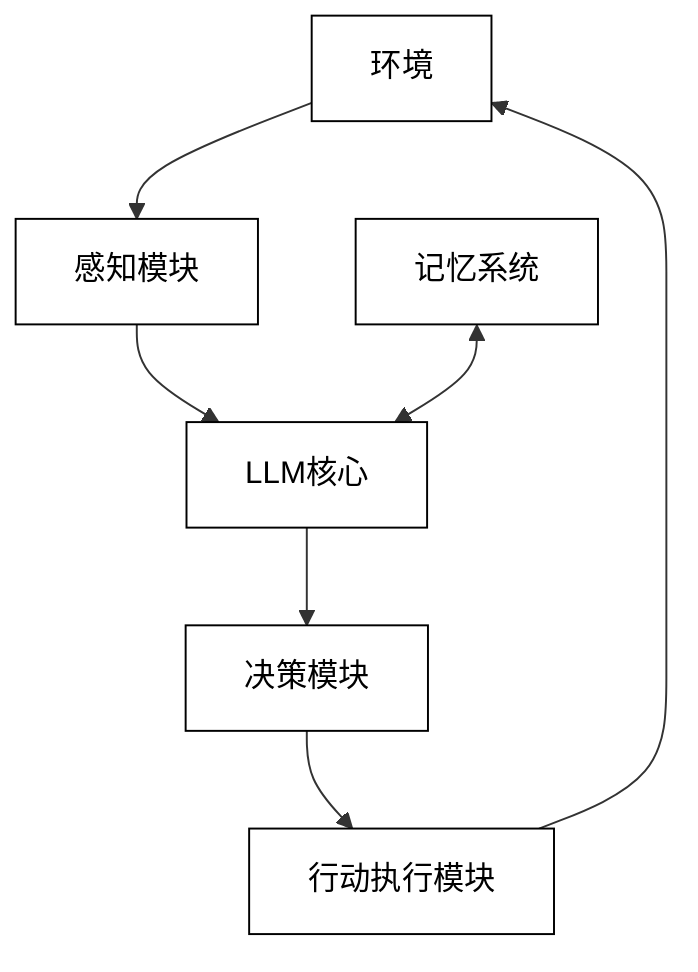

# 2 基础理论与关键技术

## 2.1 AI大模型概述

### 2.1.1 大型语言模型（LLM）的原理与特点

大型语言模型（Large Language Models, LLMs）是基于深度学习技术，通过海量文本数据训练而成的人工智能模型。它们能够理解和生成人类语言，执行各种复杂的自然语言处理任务。LLMs的核心原理和特点如下：

1. 基于Transformer架构

LLMs主要基于Transformer架构，这是一种完全依赖注意力机制的神经网络结构。

关键组件：
- 多头自注意力机制（Multi-head Self-attention）
- 前馈神经网络（Feed-forward Neural Network）
- 层归一化（Layer Normalization）
- 残差连接（Residual Connections）

数学模型：
自注意力机制可以表示为：

$$\text{Attention}(Q, K, V) = \text{softmax}(\frac{QK^T}{\sqrt{d_k}})V$$

其中，Q、K、V分别表示查询、键和值矩阵，$d_k$是键的维度。

2. 大规模预训练

LLMs通过在海量文本数据上进行自监督学习来获得语言理解能力。

主要预训练任务：
- 掩码语言模型（Masked Language Model）
- 下一句预测（Next Sentence Prediction）
- 因果语言模型（Causal Language Model）

3. 上下文学习能力

LLMs能够从给定的上下文中学习并完成任务，无需针对特定任务进行微调。

特点：
- Few-shot learning：仅需少量示例即可完成新任务
- Zero-shot learning：无需示例，直接根据任务描述完成任务

4. 大规模参数

现代LLMs通常包含数十亿到数千亿个参数。

影响：
- 更强的表达能力和泛化能力
- 更好的长程依赖建模能力
- 更高的计算和存储需求

5. 涌现能力

随着模型规模的增大，LLMs展现出了一些意想不到的能力，这被称为"涌现能力"。

例如：
- 复杂推理能力
- 多步骤任务规划
- 跨领域知识迁移

6. 提示工程

通过精心设计的提示（Prompts），可以引导LLMs执行各种任务。

技术：
- Few-shot prompting
- Chain-of-thought prompting
- Instruction tuning

示例代码：

```python
def generate_with_prompt(llm, task, examples, input):
    prompt = f"Task: {task}\n\nExamples:\n"
    for ex in examples:
        prompt += f"Input: {ex['input']}\nOutput: {ex['output']}\n\n"
    prompt += f"Input: {input}\nOutput:"
    
    return llm.generate(prompt)
```

7. 持续学习与适应

研究者正在探索让LLMs能够持续学习和适应新知识的方法。

方法：
- 参数高效微调（Parameter-Efficient Fine-tuning）
- 检索增强生成（Retrieval-Augmented Generation）
- 在线学习（Online Learning）

8. 多模态扩展

将LLMs与其他模态（如视觉、音频）结合，实现多模态理解和生成。

例如：
- CLIP：将文本和图像嵌入到同一空间
- GPT-4：能够理解和分析图像输入

9. 计算效率优化

为了使LLMs在实际应用中更加高效，研究者们正在探索各种优化技术。

方法：
- 知识蒸馏（Knowledge Distillation）
- 量化（Quantization）
- 稀疏化（Sparsification）

数学模型：
知识蒸馏的损失函数可以表示为：

$$L = \alpha * L_{CE}(y, \sigma(z_s/T)) + (1-\alpha) * L_{KL}(\sigma(z_t/T), \sigma(z_s/T))$$

其中，$L_{CE}$是交叉熵损失，$L_{KL}$是KL散度，$z_t$和$z_s$分别是教师模型和学生模型的logits，T是温度参数，$\alpha$是平衡参数。

10. 伦理和安全考量

随着LLMs的能力不断增强，其伦理和安全问题也日益受到关注。

关注点：
- 偏见和公平性
- 隐私保护
- 生成有害内容的风险
- 误导性信息的传播

LLMs的这些原理和特点使其成为了当前AI研究和应用的前沿。它们不仅推动了自然语言处理技术的进步，还为人工智能在更广泛领域的应用开辟了新的可能性。然而，LLMs也面临着计算资源需求大、可解释性差、潜在偏见等挑战，这些都是未来研究需要解决的重要问题。

### 2.1.2 主流LLM介绍（如GPT、BERT、LLaMA等）

当前，有多个主流的大型语言模型（LLMs）在学术研究和工业应用中广泛使用。以下是对几个代表性LLM的详细介绍：

1. GPT（Generative Pre-trained Transformer）系列

GPT系列由OpenAI开发，是目前最知名的生成式语言模型之一。

特点：
- 单向语言模型，从左到右预测下一个词
- 强大的文本生成能力
- 每一代都显著增加了模型规模和能力

版本：
- GPT-1 (2018): 1.17亿参数
- GPT-2 (2019): 15亿参数
- GPT-3 (2020): 1750亿参数
- GPT-4 (2023): 参数规模未公开，但性能大幅提升

应用：
- 文本生成
- 对话系统
- 代码生成
- 翻译

示例代码（使用OpenAI API）：

```python
import openai

openai.api_key = 'your-api-key'

response = openai.Completion.create(
  engine="text-davinci-002",
  prompt="Translate the following English text to French: 'Hello, how are you?'",
  max_tokens=60
)

print(response.choices[0].text.strip())
```

2. BERT（Bidirectional Encoder Representations from Transformers）

BERT由Google AI团队开发，是一种预训练的双向Transformer编码器。

特点：
- 双向上下文理解
- 使用掩码语言模型（MLM）和下一句预测（NSP）任务进行预训练
- 适合各种自然语言理解任务

版本：
- BERT-Base: 1.1亿参数
- BERT-Large: 3.4亿参数

应用：
- 文本分类
- 命名实体识别
- 问答系统
- 情感分析

示例代码（使用Hugging Face Transformers）：

```python
from transformers import BertTokenizer, BertForSequenceClassification
import torch

tokenizer = BertTokenizer.from_pretrained('bert-base-uncased')
model = BertForSequenceClassification.from_pretrained('bert-base-uncased')

inputs = tokenizer("Hello, my dog is cute", return_tensors="pt")
labels = torch.tensor([1]).unsqueeze(0)  # Batch size 1
outputs = model(**inputs, labels=labels)
loss = outputs.loss
logits = outputs.logits
```

3. LLaMA（Large Language Model Meta AI）

LLaMA是由Meta AI开发的开源大型语言模型。

特点：
- 相对较小的参数规模，但性能接近更大的模型
- 开源，允许研究者和开发者进行进一步的研究和应用
- 使用了更高效的训练技术

版本：
- LLaMA: 7B, 13B, 33B, 65B参数版本

应用：
- 文本生成
- 对话系统
- 代码补全
- 推理任务

数学模型：
LLaMA使用了RoPE（Rotary Position Embedding）来编码位置信息：

$$\text{RoPE}(x_m, m) = [x_m \cos(m\theta) + x_{m+1} \sin(m\theta); x_{m+1} \cos(m\theta) - x_m \sin(m\theta)]$$

其中，$x_m$是输入向量的第m个元素，$\theta$是预定义的角度。

4. T5（Text-to-Text Transfer Transformer）

T5是由Google Research开发的，将所有NLP任务统一为文本到文本的格式。

特点：
- 统一的文本到文本框架
- 使用了去噪目标的预训练
- 支持多任务学习

版本：
- T5-Small: 60M参数
- T5-Base: 220M参数
- T5-Large: 770M参数
- T5-3B: 3B参数
- T5-11B: 11B参数

应用：
- 机器翻译
- 文本摘要
- 问答系统
- 文本分类

示例代码（使用Hugging Face Transformers）：

```python
from transformers import T5Tokenizer, T5ForConditionalGeneration

tokenizer = T5Tokenizer.from_pretrained("t5-small")
model = T5ForConditionalGeneration.from_pretrained("t5-small")

input_text = "translate English to German: Hello, how are you?"
input_ids = tokenizer(input_text, return_tensors="pt").input_ids

outputs = model.generate(input_ids)
print(tokenizer.decode(outputs[0], skip_special_tokens=True))
```

5. ERNIE（Enhanced Representation through kNowledge IntEgration）

ERNIE是由百度开发的知识增强型预训练语言模型。

特点：
- 融合了结构化知识
- 支持中英双语
- 使用了持续学习技术

版本：
- ERNIE 1.0, 2.0, 3.0
- ERNIE-GEN, ERNIE-DOC

应用：
- 知识问答
- 情感分析
- 命名实体识别
- 机器翻译

这些主流LLMs各有特点和优势，在不同的应用场景中发挥着重要作用。随着研究的不断深入，我们可以期待看到更多创新的LLM架构和应用出现，进一步推动自然语言处理技术的发展。

### 2.1.3 LLM在智能系统中的应用前景

大型语言模型（LLMs）凭借其强大的语言理解和生成能力，正在智能系统的各个领域展现出巨大的应用潜力。以下是LLM在智能系统中的一些主要应用前景：

1. 智能对话系统

LLMs能够显著提升对话系统的自然度和智能程度。

应用场景：
- 客户服务聊天机器人
- 虚拟个人助理
- 心理健康咨询助手
- 教育辅导系统

技术细节：
- 使用few-shot learning适应特定领域对话
- 结合知识图谱提供更准确的信息
- 利用上下文学习能力处理多轮对话

示例代码（使用OpenAI API创建简单的对话系统）：

```python
import openai

openai.api_key = 'your-api-key'

def chat_bot(user_input, conversation_history):
    prompt = f"{conversation_history}\nHuman: {user_input}\nAI:"
    response = openai.Completion.create(
        engine="text-davinci-002",
        prompt=prompt,
        max_tokens=150
    )
    return response.choices[0].text.strip()

conversation_history = "The following is a conversation with an AI assistant.\n"
while True:
    user_input = input("You: ")
    if user_input.lower() == 'exit':
        break
    ai_response = chat_bot(user_input, conversation_history)
    print(f"AI: {ai_response}")
    conversation_history += f"Human: {user_input}\nAI: {ai_response}\n"
```

2. 智能内容生成

LLMs可以生成各种类型的高质量内容，大大提高内容创作的效率。

应用场景：
- 自动新闻写作
- 广告文案生成
- 产品描述生成
- 创意写作辅助

技术细节：
- 使用条件生成控制内容风格和结构
- 结合外部知识源确保生成内容的准确性
- 利用prompt engineering引导生成过程

3. 代码智能

LLMs在代码理解、生成和优化方面展现出了强大的能力。

应用场景：
- 智能代码补全
- 自动化程序修复
- 代码文档生成
- 代码翻译（如将一种编程语言转换为另一种）

技术细节：
- 使用特定于编程的预训练模型（如CodeBERT）
- 结合静态分析技术提高代码质量
- 利用上下文理解能力处理大型代码库

示例代码（使用Hugging Face Transformers进行代码补全）：

```python
from transformers import AutoTokenizer, AutoModelForCausalLM

tokenizer = AutoTokenizer.from_pretrained("microsoft/CodeGPT-small-py")
model = AutoModelForCausalLM.from_pretrained("microsoft/CodeGPT-small-py")

def complete_code(prompt):
    inputs = tokenizer(prompt, return_tensors="pt")
    outputs = model.generate(**inputs, max_length=100, num_return_sequences=1)
    return tokenizer.decode(outputs[0], skip_special_tokens=True)

code_prompt = "def fibonacci(n):"
completed_code = complete_code(code_prompt)
print(completed_code)
```

4. 智能决策支持

LLMs可以辅助复杂的决策过程，提供多角度的分析和建议。

应用场景：
- 金融投资分析
- 医疗诊断辅助
- 法律咨询系统
- 战略规划支持

技术细节：
- 结合领域特定知识库增强决策质量
- 使用多任务学习处理不同类型的决策问题
- 实现可解释性机制，提供决策理由

数学模型：
决策支持系统可以使用贝叶斯决策理论，其中LLM可以帮助估计先验概率和似然函数：

$$P(A|B) = \frac{P(B|A)P(A)}{P(B)}$$

其中，$P(A|B)$是后验概率，$P(B|A)$是似然，$P(A)$是先验概率，$P(B)$是证据。

5. 智能信息检索与问答

LLMs可以显著提升信息检索和问答系统的性能。

应用场景：
- 高级搜索引擎
- 企业知识管理系统
- 科研文献分析
- 智能教育问答平台

技术细节：
- 使用密集检索技术提高检索效率
- 结合知识图谱增强答案的准确性和完整性
- 实现多跳推理能力，处理复杂问题

6. 多模态智能系统

将LLMs与其他模态（如视觉、音频）结合，实现更全面的智能交互。

应用场景：
- 图像描述生成
- 视频内容分析
- 语音交互系统
- 虚拟现实/增强现实内容生成

技术细节：
- 使用多模态预训练模型（如CLIP）实现跨模态理解
- 设计多模态fusion机制，整合不同模态的信息
- 实现多模态生成能力，如根据文本生成图像

示例代码（使用CLIP进行图像文本匹配）：

```python
import torch
from PIL import Image
from transformers import CLIPProcessor, CLIPModel

model = CLIPModel.from_pretrained("openai/clip-vit-base-patch32")
processor = CLIPProcessor.from_pretrained("openai/clip-vit-base-patch32")

image = Image.open("image.jpg")
texts = ["a photo of a cat", "a photo of a dog"]

inputs = processor(text=texts, images=image, return_tensors="pt", padding=True)
outputs = model(**inputs)
logits_per_image = outputs.logits_per_image
probs = logits_per_image.softmax(dim=1)

print(f"Label probs: {probs}")
```

7. 智能创作辅助

LLMs可以作为创意伙伴，辅助各种创作过程。

应用场景：
- 音乐创作辅助
- 剧本写作支持
- 游戏剧情生成
- 产品设计创意激发

技术细节：
- 使用条件生成技术控制创作风格和结构
- 实现交互式创作过程，允许用户引导和修改
- 结合领域特定知识，提高创作的专业性

8. 个性化推荐系统

LLMs可以提升推荐系统的个性化程度和解释能力。

应用场景：
- 电商产品推荐
- 新闻和文章推荐
- 音乐和视频推荐
- 社交网络好友推荐

技术细节：
- 利用LLM理解用户偏好和物品特征
- 生成个性化的推荐理由
- 实现多目标推荐，平衡用户兴趣和系统目标

数学模型：
个性化推荐可以使用矩阵分解方法，其中LLM可以帮助生成用户和物品的初始嵌入：

$$R \approx U V^T$$

其中，$R$是用户-物品交互矩阵，$U$是用户嵌入矩阵，$V$是物品嵌入矩阵。

9. 智能教育系统

LLMs可以revolutionize教育领域，提供个性化和适应性的学习体验。

应用场景：
- 智能辅导系统
- 自适应学习路径生成
- 自动作业评分
- 个性化学习内容生成

技术细节：
- 使用知识追踪技术评估学生的知识状态
- 实现概念图谱，建模知识点之间的关系
- 生成个性化的解释和反馈

10. 智能机器人控制

LLMs可以提升机器人的语言理解和任务规划能力。

应用场景：
- 家庭服务机器人
- 工业协作机器人
- 自动驾驶车辆
- 智能无人机系统

技术细节：
- 将自然语言指令转换为机器人可执行的动作序列
- 实现上下文感知的任务规划
- 生成人类可理解的行为解释

这些应用前景展示了LLMs在智能系统中的巨大潜力。随着技术的不断进步，我们可以期待看到更多创新性的应用出现，推动人工智能向着更智能、更自然、更有用的方向发展。然而，在实现这些应用时，我们也需要注意解决计算效率、模型偏见、隐私保护等挑战，确保LLM技术的负责任发展和应用。

## 2.2 多智能体系统基础

### 2.2.1 多智能体系统的定义与特征

多智能体系统（Multi-Agent Systems, MAS）是由多个自主的、交互的智能体（agents）组成的系统，这些智能体共同工作以解决复杂问题或实现特定目标。以下是多智能体系统的详细定义和主要特征：

1. 定义

多智能体系统可以定义为：
一个由多个交互的智能实体（智能体）组成的网络，这些智能体在共享的环境中自主行动，通过协作或竞争来实现个体或集体目标。

数学表示：
一个多智能体系统可以表示为一个元组：

$$MAS = (A, E, I, O, F)$$

其中：
- $A = \{a_1, a_2, ..., a_n\}$ 是智能体集合
- $E$ 是环境
- $I$ 是交互协议集合
- $O$ 是组织结构
- $F$ 是性能评估函数集合

2. 主要特征

a) 自主性（Autonomy）

- 智能体能够独立做出决策和执行行动
- 不需要直接的外部干预

示例代码（智能体的自主决策）：

```python
class Agent:
    def __init__(self, state):
        self.state = state

    def perceive(self, environment):
        self.state.update(environment.get_percepts())

    def decide(self):
        if self.state['energy'] < 50:
            return 'find_food'
        elif self.state['threat_level'] > 70:
            return 'seek_shelter'
        else:
            return 'explore'

    def act(self, action):
        # Execute the action
        pass

agent = Agent({'energy': 75, 'threat_level': 30})
action = agent.decide()
agent.act(action)
```

b) 局部观察（Local Views）

- 每个智能体只能获取环境的部分信息
- 没有智能体拥有系统的全局视图

c) 分散化（Decentralization）

- 没有中央控制单元
- 控制和数据分布在各个智能体中

d) 交互性（Interaction）

- 智能体之间通过通信和行动进行交互
- 可以是协作、竞争或混合模式

数学模型：
智能体间的交互可以用博弈论模型表示：

$$u_i : A_1 \times A_2 \times ... \times A_n \rightarrow \mathbb{R}$$

其中，$u_i$是智能体i的效用函数，$A_j$是智能体j的行动集合。

e) 适应性（Adaptivity）

- 智能体能够学习和改进其行为
- 系统能够适应环境的变化

f) 涌现行为（Emergent Behavior）

- 系统级的复杂行为从个体智能体的简单交互中涌现
- 整体大于部分之和

g) 可扩展性（Scalability）

- 系统可以通过增加或减少智能体来调整规模
- 性能不会随着规模增加而显著下降

h) 异构性（Heterogeneity）

- 系统可以包含具有不同能力和目标的智能体
- 允许专业化和分工

i) 并行性（Parallelism）

- 多个智能体可以同时执行任务
- 提高系统的整体效率

示例代码（并行执行任务）：

```python
import multiprocessing

def agent_task(agent_id, shared_resource):
    # Simulate agent's task
    result = f"Agent {agent_id} completed task"
    shared_resource.put(result)

if __name__ == '__main__':
    num_agents = 5
    shared_resource = multiprocessing.Queue()
    
    processes = []
    for i in range(num_agents):
        p = multiprocessing.Process(target=agent_task, args=(i, shared_resource))
        processes.append(p)
        p.start()
    
    for p in processes:
        p.join()
    
    while not shared_resource.empty():
        print(shared_resource.get())
```

j) 鲁棒性（Robustness）

- 单个智能体的失效不会导致整个系统崩溃
- 系统能够在不确定和动态环境中保持稳定

k) 开放性（Openness）

- 智能体可以动态地加入或离开系统
- 系统边界可以是模糊和可变的

l) 社会能力（Social Ability）

- 智能体能够进行复杂的社会互动
- 包括协商、形成联盟、遵守社会规范等

数学模型：
社会选择函数可以表示为：

$$f: P^n \rightarrow A$$

其中，$P$是所有可能偏好的集合，$n$是智能体数量，$A$是可能的集体决策集合。

这些特征使得多智能体系统特别适合处理分布式、动态和复杂的问题。它们在许多领域都有广泛的应用，如分布式问题解决、资源分配、智能交通系统、电子商务、机器人集群等。

然而，这些特征也带来了一些挑战，如协调复杂性、通信开销、全局最优性保证、安全性考虑等。这些挑战正是多智能体系统研究的重点领域，研究者们正在不断探索新的方法和技术来应对这些挑战，以充分发挥多智能体系统的潜力。

### 2.2.2 智能体通信与协作机制

在多智能体系统中，智能体通信与协作机制是实现系统功能的关键。这些机制使得智能体能够交换信息、协调行动，并共同完成复杂任务。以下是智能体通信与协作机制的详细介绍：

1. 通信协议

通信协议定义了智能体之间交换信息的方式和规则。

主要类型：
a) 直接通信：智能体之间直接发送消息
b) 间接通信：通过环境或中介进行通信（如信息素通信）
c) 广播：一个智能体向所有其他智能体发送消息
d) 多播：一个智能体向特定组的智能体发送消息

示例代码（简单的直接通信）：

```python
class Agent:
    def __init__(self, name):
        self.name = name
        self.inbox = []

    def send_message(self, receiver, content):
        receiver.receive_message(self.name, content)

    def receive_message(self, sender, content):
        self.inbox.append((sender, content))

    def process_messages(self):
        for sender, content in self.inbox:
            print(f"{self.name} received from {sender}: {content}")
        self.inbox.clear()

# Usage
agent1 = Agent("Agent1")
agent2 = Agent("Agent2")

agent1.send_message(agent2, "Hello, Agent2!")
agent2.process_messages()
```

2. 消息格式

标准化的消息格式确保了通信的一致性和可理解性。

常见格式：
- FIPA ACL (Agent Communication Language)
- KQML (Knowledge Query and Manipulation Language)

典型消息结构：
- 发送者
- 接收者
- 内容
- 语言（用于解释内容的语言）
- 本体（用于理解内容的概念集）
- 会话ID
- 协议（如请求-响应、订阅等）

3. 协作策略

协作策略定义了智能体如何共同工作以实现目标。

主要类型：
a) 任务分解与分配
b) 共享计划
c) 团队形成
d) 协商与共识达成

数学模型（任务分配）：
使用匈牙利算法进行最优任务分配：

$$\min \sum_{i=1}^n \sum_{j=1}^n c_{ij} x_{ij}$$

subject to:
$$\sum_{i=1}^n x_{ij} = 1, \forall j \quad \text{and} \quad \sum_{j=1}^n x_{ij} = 1, \forall i$$

其中，$c_{ij}$是智能体i执行任务j的成本，$x_{ij}$是0-1变量，表示是否分配任务j给智能体i。

示例代码（简单的任务分配）：

```python
import numpy as np
from scipy.optimize import linear_sum_assignment

def allocate_tasks(cost_matrix):
    row_ind, col_ind = linear_sum_assignment(cost_matrix)
    return list(zip(row_ind, col_ind))

# Cost matrix: rows are agents, columns are tasks
cost_matrix = np.array([
    [4, 1, 3],
    [2, 0, 5],
    [3, 2, 2]
])

allocations = allocate_tasks(cost_matrix)
for agent, task in allocations:
    print(f"Agent {agent} is assigned to Task {task}")
```

4. 协作学习

智能体通过共享经验和知识来提高整个系统的性能。

方法：
a) 经验共享
b) 知识转移
c) 集体学习
d) 多智能体强化学习

数学模型（多智能体Q-learning）：

$$Q_i(s,a_i) \leftarrow (1-\alpha)Q_i(s,a_i) + \alpha[r_i + \gamma \max_{a'_i} Q_i(s',a'_i)]$$

其中，$Q_i$是智能体i的Q值函数，$s$是状态，$a_i$是智能体i的动作，$r_i$是奖励，$\alpha$是学习率，$\gamma$是折扣因子。

5. 冲突解决

在多智能体系统中，冲突是不可避免的，需要有效的机制来解决。

方法：
a) 协商（Negotiation）
b) 仲裁（Arbitration）
c) 投票（Voting）
d) 拍卖（Auction）

示例代码（简单的投票机制）：

```python
from collections import Counter

class VotingSystem:
    def __init__(self, agents):
        self.agents = agents

    def collect_votes(self, options):
        votes = [agent.vote(options) for agent in self.agents]
        return votes

    def tally_votes(self, votes):
        vote_counts = Counter(votes)
        winner = max(vote_counts, key=vote_counts.get)
        return winner

# Usage
class Agent:
    def __init__(self, name, preference):
        self.name = name
        self.preference = preference

    def vote(self, options):
        return min(options, key=lambda x: abs(x - self.preference))

agents = [Agent("A", 2), Agent("B", 5), Agent("C", 3)]
voting_system = VotingSystem(agents)

options = [1, 3, 5]
votes = voting_system.collect_votes(options)
winner = voting_system.tally_votes(votes)
print(f"The winning option is: {winner}")
```

6. 协作计划

智能体共同制定和执行计划以实现复杂目标。

步骤：
a) 目标分解
b) 任务分配
c) 计划同步
d) 执行监控
e) 计划调整

7. 信任与声誉机制

建立信任和声誉系统以促进有效的协作。

组成：
a) 信任评估模型
b) 声誉传播机制
c) 激励机制

数学模型（简单的信任更新）：

$$T_{ij}(t+1) = (1-\alpha)T_{ij}(t) + \alpha P_{ij}(t)$$

其中，$T_{ij}(t)$是时间t时智能体i对智能体j的信任度，$P_{ij}(t)$是最近一次交互的表现评分，$\alpha$是学习率。

8. 协作知识表示

设计适合多智能体系统的知识表示方法。

方法：
a) 分布式本体
b) 共享知识库
c) 知识图谱

9. 协作决策

智能体共同做出决策，考虑集体利益。

技术：
a) 分布式约束优化
b) 集体决策支持系统
c) 多准则决策分析

数学模型（分布式约束优化）：

$$\max \sum_{i=1}^n f_i(x_i, x_{N_i})$$

subject to: $x_i \in D_i, \forall i$

其中，$f_i$是局部目标函数，$x_i$是智能体i的决策变量，$x_{N_i}$是与智能体i相邻的智能体的决策变量，$D_i$是决策变量的取值域。

10. 动态协作

适应环境和任务变化的动态协作机制。

特点：
a) 自适应团队形成
b) 动态任务重分配
c) 实时协作策略调整

示例代码（动态任务重分配）：

```python
class DynamicTaskAllocator:
    def __init__(self, agents, tasks):
        self.agents = agents
        self.tasks = tasks
        self.allocations = {}

    def initial_allocation(self):
        for task in self.tasks:
            best_agent = min(self.agents, key=lambda a: a.estimate_cost(task))
            self.allocations[task] = best_agent
            best_agent.assign_task(task)

    def reallocate(self, completed_task):
        freed_agent = self.allocations.pop(completed_task)
        freed_agent.complete_task(completed_task)
        
        for task, agent in list(self.allocations.items()):
            if freed_agent.estimate_cost(task) < agent.estimate_cost(task):
                self.allocations[task] = freed_agent
                agent.unassign_task(task)
                freed_agent.assign_task(task)
                break

# Usage would involve creating Agent and Task classes, and using the DynamicTaskAllocator
```

这些通信与协作机制为多智能体系统提供了强大的功能基础，使得系统能够处理复杂的分布式问题。然而，设计有效的通信和协作机制仍然面临许多挑战，如通信开销、可扩展性、鲁棒性等。未来的研究将继续探索更高效、更灵活的机制，以应对日益复杂的应用场景。

### 2.2.3 分布式问题求解策略

分布式问题求解是多智能体系统的核心应用之一，它利用多个智能体的协作来解决复杂问题。以下是一些主要的分布式问题求解策略：

1. 分而治之（Divide and Conquer）

将大问题分解为小问题，由不同智能体解决，然后合并结果。

步骤：
a) 问题分解
b) 子问题分配
c) 并行求解
d) 结果合并

数学模型：
设问题P可以分解为子问题$p_1, p_2, ..., p_n$，则：

$$solve(P) = combine(solve(p_1), solve(p_2), ..., solve(p_n))$$

示例代码（并行排序）：

```python
from multiprocessing import Pool

def merge(left, right):
    result = []
    i, j = 0, 0
    while i < len(left) and j < len(right):
        if left[i] <= right[j]:
            result.append(left[i])
            i += 1
        else:
            result.append(right[j])
            j += 1
    result.extend(left[i:])
    result.extend(right[j:])
    return result

def merge_sort(arr):
    if len(arr) <= 1:
        return arr
    mid = len(arr) // 2
    left = merge_sort(arr[:mid])
    right = merge_sort(arr[mid:])
    return merge(left, right)

def parallel_merge_sort(arr, processes=4):
    with Pool(processes=processes) as pool:
        chunk_size = len(arr) // processes
        chunks = [arr[i:i+chunk_size] for i in range(0, len(arr), chunk_size)]
        sorted_chunks = pool.map(merge_sort, chunks)
        while len(sorted_chunks) > 1:
            paired_chunks = zip(sorted_chunks[::2], sorted_chunks[1::2])
            sorted_chunks = pool.starmap(merge, paired_chunks)
    return sorted_chunks[0]

# Usage
arr = [64, 34, 25, 12, 22, 11, 90]
sorted_arr = parallel_merge_sort(arr)
print(sorted_arr)
```

2. 分布式约束满足（Distributed Constraint Satisfaction）

多个智能体共同解决约束满足问题，每个智能体负责部分变量。

算法：
a) 异步回溯（ABT）
b) 异步弱承诺搜索（AWC）
c) 分布式断开（Distributed Breakout）

数学模型：
分布式约束满足问题（DisCSP）定义为：
$$(X, D, C)$$
其中，$X$是变量集，$D$是域集，$C$是约束集。每个智能体负责一个或多个变量。

3. 分布式优化（Distributed Optimization）

多个智能体协作以优化全局目标函数。

算法：
a) 分布式梯度下降
b) ADMM（Alternating Direction Method of Multipliers）
c) 共识优化

数学模型（分布式梯度下降）：

$$x^{k+1}_i = x^k_i - \alpha_k \nabla f_i(x^k_i)$$
$$x^{k+1} = \frac{1}{n} \sum_{i=1}^n x^{k+1}_i$$

其中，$x^k_i$是智能体i在第k次迭代的解，$f_i$是局部目标函数，$\alpha_k$是学习率。

示例代码（简化的分布式梯度下降）：

```python
import numpy as np

class Agent:
    def __init__(self, id, initial_x):
        self.id = id
        self.x = initial_x

    def compute_gradient(self):
        # Simplified gradient computation
        return 2 * (self.x - self.id)  # Example: f(x) = (x - id)^2

    def update(self, learning_rate):
        gradient = self.compute_gradient()
        self.x -= learning_rate * gradient

def distributed_gradient_descent(agents, iterations, learning_rate):
    for _ in range(iterations):
        for agent in agents:
            agent.update(learning_rate)
        
        # Consensus step
        avg_x = sum(agent.x for agent in agents) / len(agents)
        for agent in agents:
            agent.x = avg_x

    return [agent.x for agent in agents]

# Usage
agents = [Agent(i, np.random.rand()) for i in range(5)]
final_x = distributed_gradient_descent(agents, iterations=100, learning_rate=0.1)
print(f"Final solutions: {final_x}")
```

4. 市场机制（Market-based Approaches）

使用经济学原理来分配资源和任务。

方法：
a) 拍卖
b) 合同网协议（Contract Net Protocol）
c) 议价

数学模型（第一价格密封拍卖）：
智能体i的出价策略：

$$b_i = v_i - \frac{v_i - r}{n}$$

其中，$v_i$是智能体i的真实估值，$r$是保留价格，$n$是竞标者数量。

5. 分布式规划（Distributed Planning）

多个智能体协作制定和执行计划。

步骤：
a) 目标分解
b) 任务分配
c) 计划协调
d) 执行监控
e) 重规划

6. 共识算法（Consensus Algorithms）

使多个智能体就某个值达成一致。

算法：
a) 平均共识
b) 最大共识
c) 区块链共识（如PoW, PoS）

数学模型（离散时间平均共识）：

$$x_i(t+1) = x_i(t) + \epsilon \sum_{j \in N_i} (x_j(t) - x_i(t))$$

其中，$x_i(t)$是智能体i在时间t的状态，$N_i$是智能体i的邻居集合，$\epsilon$是步长。

示例代码（简单的平均共识）：

```python
import numpy as np

def average_consensus(initial_values, adjacency_matrix, iterations):
    values = np.array(initial_values)
    n = len(values)
    for _ in range(iterations):
        new_values = np.zeros(n)
        for i in range(n):
            neighbors = np.nonzero(adjacency_matrix[i])[0]
            new_values[i] = np.mean(values[neighbors])
        values = new_values
    return values

# Usage
initial_values = [1, 2, 3, 4, 5]
adjacency_matrix = np.array([
    [0, 1, 1, 0, 0],
    [1, 0, 1, 1, 0],
    [1, 1, 0, 1, 1],
    [0, 1, 1, 0, 1],
    [0, 0, 1, 1, 0]
])

final_values = average_consensus(initial_values, adjacency_matrix, iterations=100)
print(f"Final consensus value: {np.mean(final_values)}")
```

7. 分布式机器学习

多个智能体协作进行机器学习任务。

方法：
a) 联邦学习
b) 分布式深度学习
c) 多智能体强化学习

数学模型（联邦学习）：
全局目标：

$$\min_w F(w) = \sum_{k=1}^K \frac{n_k}{n} F_k(w)$$

其中，$F_k(w)$是第k个智能体的局部目标函数，$n_k$是其本地数据量，$n$是总数据量。

8. 蚁群优化（Ant Colony Optimization）

模拟蚂蚁行为的分布式优化算法。

步骤：
a) 初始化信息素
b) 构建解
c) 更新信息素
d) 蒸发数学模型（信息素更新）：

$$\tau_{ij} \leftarrow (1-\rho)\tau_{ij} + \sum_{k=1}^m \Delta\tau_{ij}^k$$

其中，$\tau_{ij}$是边(i,j)上的信息素浓度，$\rho$是蒸发率，$\Delta\tau_{ij}^k$是第k只蚂蚁在边(i,j)上留下的信息素。

示例代码（简化的蚁群优化求解TSP）：

```python
import numpy as np

class AntColonyOptimizer:
    def __init__(self, distances, n_ants, n_iterations, alpha, beta, evaporation_rate, Q):
        self.distances = distances
        self.n_ants = n_ants
        self.n_iterations = n_iterations
        self.alpha = alpha
        self.beta = beta
        self.evaporation_rate = evaporation_rate
        self.Q = Q
        self.n_cities = len(distances)
        self.pheromones = np.ones((self.n_cities, self.n_cities))

    def run(self):
        best_path = None
        best_path_length = float('inf')
        for _ in range(self.n_iterations):
            paths = self.construct_paths()
            self.update_pheromones(paths)
            iteration_best_path = min(paths, key=lambda x: self.path_length(x))
            iteration_best_path_length = self.path_length(iteration_best_path)
            if iteration_best_path_length < best_path_length:
                best_path = iteration_best_path
                best_path_length = iteration_best_path_length
        return best_path, best_path_length

    def construct_paths(self):
        paths = []
        for _ in range(self.n_ants):
            path = self.construct_path()
            paths.append(path)
        return paths

    def construct_path(self):
        start = np.random.randint(self.n_cities)
        path = [start]
        available = list(range(self.n_cities))
        available.remove(start)
        while available:
            current = path[-1]
            probabilities = self.calculate_probabilities(current, available)
            next_city = np.random.choice(available, p=probabilities)
            path.append(next_city)
            available.remove(next_city)
        return path

    def calculate_probabilities(self, current, available):
        pheromones = np.array([self.pheromones[current][j] for j in available])
        distances = np.array([self.distances[current][j] for j in available])
        probabilities = (pheromones ** self.alpha) * ((1.0 / distances) ** self.beta)
        return probabilities / np.sum(probabilities)

    def update_pheromones(self, paths):
        self.pheromones *= (1 - self.evaporation_rate)
        for path in paths:
            path_length = self.path_length(path)
            for i in range(len(path) - 1):
                self.pheromones[path[i]][path[i+1]] += self.Q / path_length
            self.pheromones[path[-1]][path[0]] += self.Q / path_length

    def path_length(self, path):
        return sum(self.distances[path[i]][path[i+1]] for i in range(len(path) - 1)) + self.distances[path[-1]][path[0]]

# Usage
distances = np.array([
    [0, 2, 9, 10],
    [1, 0, 6, 4],
    [15, 7, 0, 8],
    [6, 3, 12, 0]
])

aco = AntColonyOptimizer(distances, n_ants=10, n_iterations=100, alpha=1, beta=2, evaporation_rate=0.1, Q=1)
best_path, best_path_length = aco.run()
print(f"Best path: {best_path}")
print(f"Best path length: {best_path_length}")
```

9. 粒子群优化（Particle Swarm Optimization）

模拟鸟群行为的分布式优化算法。

更新规则：
a) 速度更新
b) 位置更新

数学模型：

速度更新：
$$v_i(t+1) = w v_i(t) + c_1 r_1 (p_i - x_i(t)) + c_2 r_2 (g - x_i(t))$$

位置更新：
$$x_i(t+1) = x_i(t) + v_i(t+1)$$

其中，$v_i$是粒子i的速度，$x_i$是位置，$p_i$是个体最优位置，$g$是全局最优位置，$w$是惯性权重，$c_1$和$c_2$是加速常数，$r_1$和$r_2$是随机数。

10. 分布式贝叶斯推理

多个智能体协作进行贝叶斯推理。

方法：
a) 信念传播（Belief Propagation）
b) 变分推断（Variational Inference）
c) 马尔可夫链蒙特卡洛（MCMC）

数学模型（信念传播）：

消息传递：
$$m_{i\to j}(x_j) = \sum_{x_i} \phi_i(x_i) \psi_{ij}(x_i, x_j) \prod_{k\in N(i)\backslash j} m_{k\to i}(x_i)$$

信念更新：
$$b_i(x_i) = k \phi_i(x_i) \prod_{j\in N(i)} m_{j\to i}(x_i)$$

其中，$m_{i\to j}$是从节点i到j的消息，$\phi_i$是节点势能，$\psi_{ij}$是边势能，$b_i$是节点i的信念，$k$是归一化常数。

这些分布式问题求解策略为多智能体系统提供了强大的工具，使其能够处理各种复杂的分布式问题。每种策略都有其特定的应用场景和优势，选择合适的策略需要考虑问题的特性、系统的规模、通信约束等因素。

在实际应用中，这些策略往往需要根据具体问题进行调整和优化。例如，可能需要处理通信延迟、不完全信息、动态环境等挑战。此外，随着问题规模的增大，可扩展性也成为一个重要的考虑因素。

未来的研究方向包括：
1. 结合机器学习技术，提高分布式算法的自适应性和效率
2. 开发更加鲁棒和安全的分布式算法，以应对恶意攻击和系统故障
3. 探索量子计算在分布式问题求解中的应用
4. 设计能够处理大规模、动态和不确定环境的新型分布式算法
5. 研究如何在保护隐私的同时实现有效的分布式计算

通过不断创新和改进这些分布式问题求解策略，多智能体系统将能够应对更加复杂和challenging的实际问题，为各个领域带来变革性的解决方案。

## 2.3 LLM-based智能体设计

### 2.3.1 基于LLM的智能体认知模型

基于大型语言模型（LLM）的智能体认知模型是一种将LLM的强大语言理解和生成能力与智能体的决策和行动能力相结合的新型认知架构。这种模型旨在创建更加智能、灵活和自然的智能体系统。以下是基于LLM的智能体认知模型的详细介绍：

1. 认知架构概述

基于LLM的智能体认知模型通常包括以下核心组件：

a) 感知模块：负责接收和处理环境输入
b) LLM核心：作为智能体的中央处理单元
c) 记忆系统：存储长期知识和短期经验
d) 决策模块：基于LLM的输出做出决策
e) 行动执行模块：将决策转化为具体行动

图示：



2. LLM作为认知核心

LLM在智能体认知模型中扮演着核心角色，负责：

a) 自然语言理解：解析环境输入和内部状态
b) 推理和规划：基于当前情况进行推理和制定计划
c) 知识整合：将新信息与已有知识结合
d) 创造性思考：生成新的想法和解决方案
e) 语言生成：产生内部表示和外部响应

示例代码（LLM核心的简化实现）：

```python
import openai

class LLMCore:
    def __init__(self, api_key):
        openai.api_key = api_key

    def process(self, input_text, context):
        prompt = f"Context: {context}\nCurrent input: {input_text}\nThink step by step and decide on the next action:"
        response = openai.Completion.create(
            engine="text-davinci-002",
            prompt=prompt,
            max_tokens=150,
            n=1,
            stop=None,
            temperature=0.7,
        )
        return response.choices[0].text.strip()

# Usage
llm_core = LLMCore("your-api-key")
context = "You are a robot in a maze. Your goal is to find the exit."
input_text = "You see a fork in the path. Left path is dark, right path is lit."
decision = llm_core.process(input_text, context)
print(decision)
```

3. 记忆系统

记忆系统是智能体维护长期知识和短期经验的关键组件。在基于LLM的认知模型中，记忆系统可以包括：

a) 情节记忆：存储具体经验和事件
b) 语义记忆：存储一般知识和概念
c) 工作记忆：维护当前任务相关的信息

实现方法：
- 使用向量数据库存储和检索记忆
- 利用LLM的上下文学习能力动态更新记忆

数学模型（记忆检索相关性计算）：

$$relevance(q, m_i) = \cos(embed(q), embed(m_i))$$

其中，$q$是查询，$m_i$是记忆项，$embed()$是嵌入函数。

4. 决策机制

基于LLM的决策机制通常涉及以下步骤：

a) 状态表示：将当前状态转化为LLM可处理的形式
b) 选项生成：使用LLM生成可能的行动选项
c) 选项评估：对每个选项进行评估和推理
d) 行动选择：基于评估结果选择最佳行动

示例代码（简化的决策过程）：

```python
class DecisionMaker:
    def __init__(self, llm_core):
        self.llm_core = llm_core

    def make_decision(self, state, possible_actions):
        state_desc = self.state_to_text(state)
        options = "\n".join(possible_actions)
        prompt = f"Current state: {state_desc}\nPossible actions:\n{options}\nEvaluate each action and choose the best one:"
        evaluation = self.llm_core.process(prompt, "")
        return self.parse_decision(evaluation)

    def state_to_text(self, state):
        # Convert state to text description
        return str(state)

    def parse_decision(self, evaluation):
        # Parse LLM output to extract the chosen action
        # This is a simplified version
        return evaluation.split("Best action:")[-1].strip()

# Usage
decision_maker = DecisionMaker(llm_core)
state = {"position": (3, 4), "energy": 80, "items": ["key", "map"]}
possible_actions = ["move_north", "move_south", "use_key", "read_map"]
decision = decision_maker.make_decision(state, possible_actions)
print(f"Chosen action: {decision}")
```

5. 学习与适应

基于LLM的智能体可以通过以下方式实现学习和适应：

a) 提示工程：优化与LLM的交互提示
b) 少样本学习：利用LLM的快速适应能力
c) 经验回放：将过去的经验整合到决策过程中
d) 元学习：学习如何更好地使用LLM进行决策

数学模型（经验回放增强的决策）：

$$a_t = \arg\max_a Q(s_t, a) + \lambda \cdot LLM_{score}(s_t, a, M)$$

其中，$Q(s_t, a)$是传统Q函数，$LLM_{score}$是LLM基于记忆$M$对行动的评分，$\lambda$是平衡参数。

6. 多模态集成

将LLM与其他模态（如视觉、听觉）结合，创建多模态智能体：

a) 视觉-语言融合：结合图像理解和语言处理
b) 语音-文本转换：集成语音识别和合成能力
c) 跨模态推理：在不同模态间进行信息整合和推理

示例代码（简化的多模态处理）：

```python
class MultimodalAgent:
    def __init__(self, llm_core, vision_model, speech_model):
        self.llm_core = llm_core
        self.vision_model = vision_model
        self.speech_model = speech_model

    def process_input(self, input_type, input_data):
        if input_type == "text":
            return self.llm_core.process(input_data, "")
        elif input_type == "image":
            image_description = self.vision_model.describe(input_data)
            return self.llm_core.process(f"Describe this image: {image_description}", "")
        elif input_type == "speech":
            text = self.speech_model.transcribe(input_data)
            return self.llm_core.process(f"Respond to this speech: {text}", "")
        else:
            raise ValueError("Unsupported input type")

# Usage
multimodal_agent = MultimodalAgent(llm_core, vision_model, speech_model)
image_input = load_image("scene.jpg")
response = multimodal_agent.process_input("image", image_input)
print(response)
```

7. 情感和个性模拟

利用LLM模拟智能体的情感状态和个性特征：

a) 情感建模：根据上下文生成适当的情感反应
b) 个性表达：保持一致的个性特征
c) 社交互动：模拟复杂的社交行为和对话风格

示例代码（带情感的响应生成）：

```python
class EmotionalAgent:
    def __init__(self, llm_core, personality):
        self.llm_core = llm_core
        self.personality = personality
        self.emotional_state = "neutral"

    def generate_response(self, input_text):
        prompt = f"""
        Personality: {self.personality}
        Current emotional state: {self.emotional_state}
        Input: {input_text}
        Generate a response that reflects the personality and emotional state:
        """
        response = self.llm_core.process(prompt, "")
        self.update_emotional_state(input_text, response)
        return response

    def update_emotional_state(self, input_text, response):
        prompt = f"""
        Previous emotional state: {self.emotional_state}
        Input received: {input_text}
        Response given: {response}
        Determine the new emotional state:
        """
        self.emotional_state = self.llm_core.process(prompt, "").strip()

# Usage
emotional_agent = EmotionalAgent(llm_core, "friendly and optimistic")
response = emotional_agent.generate_response("I've had a terrible day.")
print(f"Agent response: {response}")
print(f"New emotional state: {emotional_agent.emotional_state}")
```

8. 伦理决策框架

在基于LLM的智能体中集成伦理决策能力：

a) 伦理规则编码：将伦理准则转化为LLM可理解的形式
b) 伦理推理：对行动的伦理影响进行评估
c) 价值对齐：确保智能体的决策与人类价值观一致

数学模型（伦理约束的决策）：

$$a^* = \arg\max_a [U(s, a) + \alpha \cdot E(s, a)]$$

其中，$U(s, a)$是行动的效用函数，$E(s, a)$是行动的伦理评分函数，$\alpha$是平衡参数。

9. 元认知能力

开发智能体的自我反思和监控能力：

a) 不确定性估计：评估自身判断的可靠性
b) 自我评价：分析自身表现并进行调整
c) 知识边界认知：识别自身知识的局限性

示例代码（带元认知的决策过程）：

```python
class MetacognitiveAgent:
    def __init__(self, llm_core):
        self.llm_core = llm_core

    def make_decision(self, state, possible_actions):
        decision = self.llm_core.process(f"State: {state}\nActions: {possible_actions}\nDecide:", "")
        confidence = self.estimate_confidence(state, decision)
        if confidence < 0.7:
            decision = self.seek_additional_info(state, possible_actions)
        return decision

    def estimate_confidence(self, state, decision):
        prompt = f"State: {state}\nDecision: {decision}\nEstimate confidence (0-1):"
        confidence = float(self.llm_core.process(prompt, ""))
        return confidence

    def seek_additional_info(self, state, possible_actions):
        prompt = f"State: {state}\nActions: {possible_actions}\nWhat additional information is needed?"
        info_needed = self.llm_core.process(prompt, "")
        # Simulate getting additional information
        additional_info = "Simulated additional information"
        return self.llm_core.process(f"State: {state}\nAdditional info: {additional_info}\nDecide:", "")

# Usage
metacognitive_agent = MetacognitiveAgent(llm_core)
decision = metacognitive_agent.make_decision("Complex situation", ["A", "B", "C"])
print(f"Final decision: {decision}")
```

10. 持续学习与知识更新

设计机制使智能体能够不断学习和更新其知识库：

a) 增量学习：逐步整合新信息
b) 知识蒸馏：从LLM中提取关键知识
c) 主动学习：识别知识缺口并主动寻求信息

数学模型（增量学习）：

$$K_{t+1} = f(K_t, I_t, LLM(K_t, I_t))$$

其中，$K_t$是时间t的知识状态，$I_t$是新信息，$f$是更新函数，$LLM(K_t, I_t)$表示LLM对新旧信息的处理结果。

这种基于LLM的智能体认知模型为创建更加智能、灵活和自然的智能体系统提供了新的可能性。它结合了LLM的强大语言能力和传统智能体的决策执行能力，使得智能体能够更好地理解复杂环境、进行高级推理、适应新情况，并与人类进行更自然的交互。

然而，这种模型也面临一些挑战，如计算资源需求、实时性能、可解释性等。未来的研究方向包括提高模型效率、增强可解释性、改进学习和适应机制、加强多模态集成，以及探索在更广泛的应用领域中的实际部署。随着这些挑战的逐步解决，基于LLM的智能体有望在各种复杂任务和交互场景中发挥越来越重要的作用。

### 2.3.2 智能体决策与规划能力构建

在基于LLM的智能体系统中，决策与规划能力是核心功能之一。这些能力使智能体能够在复杂环境中做出明智的选择并制定有效的行动计划。以下是构建智能体决策与规划能力的详细方法：

1. 基于LLM的决策框架

利用LLM的推理能力来评估不同选项并做出决策。

步骤：
a) 状态表示：将当前状态转化为LLM可理解的文本描述
b) 选项生成：使用LLM生成可能的行动选项
c) 选项评估：对每个选项进行深入分析
d) 决策：基于评估结果选择最佳行动

示例代码：

```python
class LLMDecisionMaker:
    def __init__(self, llm):
        self.llm = llm

    def make_decision(self, state, possible_actions):
        state_desc = self.state_to_text(state)
        options = self.generate_options(state_desc, possible_actions)
        evaluations = self.evaluate_options(state_desc, options)
        decision = self.choose_best_option(evaluations)
        return decision

    def state_to_text(self, state):
        return f"Current state: {state}"

    def generate_options(self, state_desc, possible_actions):
        prompt = f"{state_desc}\nPossible actions: {possible_actions}\nGenerate detailed options:"
        return self.llm.generate(prompt).split('\n')

    def evaluate_options(self, state_desc, options):
        evaluations = []
        for option in options:
            prompt = f"{state_desc}\nOption: {option}\nEvaluate this option in detail:"
            evaluation = self.llm.generate(prompt)
            evaluations.append((option, evaluation))
        return evaluations

    def choose_best_option(self, evaluations):
        prompt = "Based on these evaluations, choose the best option:\n"
        for option, evaluation in evaluations:
            prompt += f"Option: {option}\nEvaluation: {evaluation}\n\n"
        prompt += "Best option:"
        return self.llm.generate(prompt)

# Usage
decision_maker = LLMDecisionMaker(llm)
state = {"location": "forest", "health": 80, "inventory": ["map", "compass"]}
possible_actions = ["explore", "rest", "use compass", "check map"]
decision = decision_maker.make_decision(state, possible_actions)
print(f"Decided action: {decision}")
```

2. 多步骤规划

使用LLM生成和评估多步骤行动计划。

步骤：
a) 目标分解：将主要目标分解为子目标
b) 计划生成：为每个子目标生成行动序列
c) 计划评估：评估整体计划的可行性和效率
d) 计划优化：根据评估结果调整和优化计划

数学模型（计划评估）：

$$Score(Plan) = \sum_{i=1}^n w_i \cdot f_i(Plan)$$

其中，$f_i$是不同评估标准（如可行性、效率、风险等），$w_i$是相应的权重。

3. 不确定性处理

在决策和规划过程中考虑不确定性因素。

方法：
a) 概率推理：使用LLM估计不同结果的概率
b) 风险评估：评估每个决策的潜在风险
c) 鲁棒性分析：考虑最坏情况下的表现

示例代码（带不确定性的决策）：

```python
class UncertaintyAwareDecisionMaker:
    def __init__(self, llm):
        self.llm = llm

    def make_decision(self, state, possible_actions):
        evaluations = self.evaluate_actions_with_uncertainty(state, possible_actions)
        return self.choose_action(evaluations)

    def evaluate_actions_with_uncertainty(self, state, possible_actions):
        evaluations = []
        for action in possible_actions:
            prompt = f"""
            State: {state}
            Action: {action}
            Evaluate this action considering uncertainties:
            1. Possible outcomes and their probabilities
            2. Potential risks
            3. Best and worst-case scenarios
            """
            evaluation = self.llm.generate(prompt)
            evaluations.append((action, evaluation))
        return evaluations

    def choose_action(self, evaluations):
        prompt = "Based on these evaluations, choose the best action considering the balance of potential benefits and risks:\n"
        for action, evaluation in evaluations:
            prompt += f"Action: {action}\nEvaluation: {evaluation}\n\n"
        prompt += "Best action:"
        return self.llm.generate(prompt)

# Usage
uncertainty_aware_dm = UncertaintyAwareDecisionMaker(llm)
state = "Low resources, unknown terrain ahead"
possible_actions = ["explore cautiously", "wait for backup", "return to base"]
decision = uncertainty_aware_dm.make_decision(state, possible_actions)
print(f"Decided action: {decision}")
```

4. 目标导向规划

使用LLM进行目标导向的反向规划。

步骤：
a) 目标表示：明确定义最终目标
b) 反向推理：从目标开始，反向推导所需的步骤
c) 障碍识别：识别可能的障碍和挑战
d) 资源分配：规划每个步骤所需的资源

数学模型（目标达成概率）：

$$P(Goal|Plan) = \prod_{i=1}^n P(Step_i|Step_{i-1}, ..., Step_1)$$

其中，$Step_i$是计划中的第i个步骤。

5. 适应性规划

设计能够根据环境变化动态调整的规划机制。

特点：
a) 实时监控：持续监控环境和计划执行情况
b) 触发条件：定义需要重新规划的条件
c) 快速调整：能够快速生成和评估新计划
d) 平滑过渡：确保新旧计划之间的平滑过渡

示例代码（适应性规划）：

```python
class AdaptivePlanner:
    def __init__(self, llm):
        self.llm = llm
        self.current_plan = None

    def initial_plan(self, initial_state, goal):
        prompt = f"Initial state: {initial_state}\nGoal: {goal}\nCreate a detailed plan:"
        self.current_plan = self.llm.generate(prompt)
        return self.current_plan

    def monitor_and_adapt(self, current_state, goal):
        need_replan = self.check_replan_needed(current_state)
        if need_replan:
            return self.replan(current_state, goal)
        return self.current_plan

    def check_replan_needed(self, current_state):
        prompt = f"""
        Current plan: {self.current_plan}
        Current state: {current_state}
        Does the current state significantly deviate from the expected state in the plan? Answer Yes or No.
        """
        response = self.llm.generate(prompt)
        return response.strip().lower() == "yes"

    def replan(self, current_state, goal):
        prompt = f"""
        Current state: {current_state}
        Goal: {goal}
        Previous plan: {self.current_plan}
        Create a new plan that adapts to the current state while considering the previous plan:
        """
        self.current_plan = self.llm.generate(prompt)
        return self.current_plan

# Usage
adaptive_planner = AdaptivePlanner(llm)
initial_state = "Starting point A, limited resources"
goal = "Reach point B safely and efficiently"
initial_plan = adaptive_planner.initial_plan(initial_state, goal)
print(f"Initial plan: {initial_plan}")

# Simulate change in state
new_state = "Unexpected obstacle encountered, 50% resources remaining"
updated_plan = adaptive_planner.monitor_and_adapt(new_state, goal)
print(f"Updated plan: {updated_plan}")
```

6. 多智能体协作规划

利用LLM协调多个智能体的行动计划。

步骤：
a) 角色分配：基于能力和目标分配角色
b) 任务分解：将整体目标分解为可分配的子任务c) 协调机制：设计智能体间的协作和通信机制
d) 冲突解决：识别和解决潜在的冲突

数学模型（任务分配优化）：

$$\min \sum_{i=1}^n \sum_{j=1}^m c_{ij} x_{ij}$$

subject to:
$$\sum_{i=1}^n x_{ij} = 1, \forall j \quad \text{and} \quad \sum_{j=1}^m x_{ij} \leq k_i, \forall i$$

其中，$c_{ij}$是智能体i执行任务j的成本，$x_{ij}$是0-1变量表示分配，$k_i$是智能体i的容量限制。

示例代码（多智能体协作规划）：

```python
class MultiAgentPlanner:
    def __init__(self, llm):
        self.llm = llm

    def collaborative_plan(self, agents, goal):
        roles = self.assign_roles(agents, goal)
        tasks = self.decompose_tasks(goal)
        allocations = self.allocate_tasks(roles, tasks)
        coordination_plan = self.create_coordination_plan(allocations)
        return coordination_plan

    def assign_roles(self, agents, goal):
        prompt = f"Goal: {goal}\nAgents: {agents}\nAssign roles to agents based on their capabilities:"
        return self.llm.generate(prompt)

    def decompose_tasks(self, goal):
        prompt = f"Goal: {goal}\nDecompose this goal into subtasks:"
        return self.llm.generate(prompt).split('\n')

    def allocate_tasks(self, roles, tasks):
        prompt = f"Roles: {roles}\nTasks: {tasks}\nAllocate tasks to roles, ensuring efficient distribution:"
        return self.llm.generate(prompt)

    def create_coordination_plan(self, allocations):
        prompt = f"""
        Task allocations: {allocations}
        Create a coordination plan that includes:
        1. Communication protocols
        2. Synchronization points
        3. Conflict resolution strategies
        """
        return self.llm.generate(prompt)

# Usage
multi_agent_planner = MultiAgentPlanner(llm)
agents = ["Agent1 (Explorer)", "Agent2 (Analyst)", "Agent3 (Communicator)"]
goal = "Explore and map an unknown territory while gathering and analyzing data"
plan = multi_agent_planner.collaborative_plan(agents, goal)
print(f"Collaborative plan:\n{plan}")
```

7. 分层规划

实现宏观战略规划和微观战术规划的分层结构。

层级：
a) 战略层：长期目标和整体方向
b) 战术层：中期目标和资源分配
c) 操作层：短期具体行动

示例代码（分层规划）：

```python
class HierarchicalPlanner:
    def __init__(self, llm):
        self.llm = llm

    def create_hierarchical_plan(self, mission, time_horizon):
        strategic_plan = self.strategic_planning(mission, time_horizon)
        tactical_plan = self.tactical_planning(strategic_plan)
        operational_plan = self.operational_planning(tactical_plan)
        return {
            "strategic": strategic_plan,
            "tactical": tactical_plan,
            "operational": operational_plan
        }

    def strategic_planning(self, mission, time_horizon):
        prompt = f"Mission: {mission}\nTime horizon: {time_horizon}\nCreate a high-level strategic plan:"
        return self.llm.generate(prompt)

    def tactical_planning(self, strategic_plan):
        prompt = f"Strategic plan: {strategic_plan}\nDevelop medium-term tactical plans to achieve strategic objectives:"
        return self.llm.generate(prompt)

    def operational_planning(self, tactical_plan):
        prompt = f"Tactical plan: {tactical_plan}\nCreate detailed short-term operational plans:"
        return self.llm.generate(prompt)

# Usage
hierarchical_planner = HierarchicalPlanner(llm)
mission = "Establish a sustainable colony on Mars"
time_horizon = "20 years"
plan = hierarchical_planner.create_hierarchical_plan(mission, time_horizon)
for level, details in plan.items():
    print(f"{level.capitalize()} plan:\n{details}\n")
```

8. 约束满足规划

在规划过程中考虑各种约束条件。

步骤：
a) 约束识别：明确定义问题的约束条件
b) 约束表示：将约束转化为LLM可理解的形式
c) 约束传播：在规划过程中持续检查约束满足情况
d) 冲突解决：当出现约束冲突时，寻找替代方案

数学模型（约束满足问题）：

找到变量赋值 $X = \{x_1, ..., x_n\}$ 使得：

$$\forall c_i \in C, c_i(X) = true$$

其中，$C = \{c_1, ..., c_m\}$ 是约束集合。

9. 基于模拟的规划

利用LLM进行场景模拟，评估不同规划方案的效果。

步骤：
a) 场景生成：使用LLM生成可能的未来场景
b) 计划执行模拟：在生成的场景中模拟计划执行
c) 结果评估：分析模拟结果，评估计划的鲁棒性
d) 计划优化：基于模拟结果调整和优化计划

示例代码（基于模拟的规划）：

```python
class SimulationBasedPlanner:
    def __init__(self, llm):
        self.llm = llm

    def plan_with_simulation(self, initial_state, goal, num_simulations=5):
        initial_plan = self.create_initial_plan(initial_state, goal)
        best_plan = initial_plan
        best_score = float('-inf')

        for _ in range(num_simulations):
            scenario = self.generate_scenario(initial_state)
            simulated_outcome = self.simulate_plan_execution(initial_plan, scenario)
            score = self.evaluate_outcome(simulated_outcome, goal)
            
            if score > best_score:
                best_score = score
                best_plan = initial_plan
            
            initial_plan = self.optimize_plan(initial_plan, simulated_outcome)

        return best_plan

    def create_initial_plan(self, initial_state, goal):
        prompt = f"Initial state: {initial_state}\nGoal: {goal}\nCreate an initial plan:"
        return self.llm.generate(prompt)

    def generate_scenario(self, initial_state):
        prompt = f"Initial state: {initial_state}\nGenerate a possible future scenario:"
        return self.llm.generate(prompt)

    def simulate_plan_execution(self, plan, scenario):
        prompt = f"Plan: {plan}\nScenario: {scenario}\nSimulate the execution of this plan in the given scenario:"
        return self.llm.generate(prompt)

    def evaluate_outcome(self, outcome, goal):
        prompt = f"Outcome: {outcome}\nGoal: {goal}\nEvaluate how well the outcome meets the goal (0-100):"
        return int(self.llm.generate(prompt))

    def optimize_plan(self, plan, simulated_outcome):
        prompt = f"Current plan: {plan}\nSimulated outcome: {simulated_outcome}\nOptimize the plan based on this simulation:"
        return self.llm.generate(prompt)

# Usage
simulation_planner = SimulationBasedPlanner(llm)
initial_state = "Small team, limited budget, competitive market"
goal = "Launch a successful tech startup within 2 years"
optimized_plan = simulation_planner.plan_with_simulation(initial_state, goal)
print(f"Optimized plan after simulations:\n{optimized_plan}")
```

10. 伦理约束规划

在决策和规划过程中考虑伦理因素。

步骤：
a) 伦理规则定义：明确系统应遵循的伦理准则
b) 伦理评估：使用LLM评估每个决策的伦理影响
c) 权衡机制：在效用和伦理之间进行权衡
d) 伦理审计：对生成的计划进行伦理审查

数学模型（伦理约束的效用最大化）：

$$\max U(X) \quad \text{subject to} \quad E(X) \geq E_{min}$$

其中，$U(X)$是决策$X$的效用函数，$E(X)$是伦理评分函数，$E_{min}$是最低伦理标准。

这些方法和技术为构建基于LLM的智能体决策与规划能力提供了全面的框架。通过结合LLM的强大语言理解和生成能力，智能体可以进行更复杂、更灵活的决策和规划，适应各种复杂的环境和任务需求。

然而，在实际应用中，这些方法可能需要根据具体问题和场景进行调整和优化。此外，还需要考虑计算效率、实时性、可解释性等实际问题。未来的研究方向包括提高LLM在特定领域的决策能力、增强长期规划能力、改进不确定性处理机制，以及探索更高效的多智能体协作规划方法。

### 2.3.3 智能体个性化与角色定制

在基于LLM的多智能体系统中，智能体的个性化和角色定制对于创建多样化、专业化和更具人性化的智能体至关重要。这不仅能够提高系统的整体性能，还能增强用户体验和交互的自然度。以下是实现智能体个性化与角色定制的详细方法：

1. 个性特征建模

使用LLM来模拟和生成不同的个性特征。

步骤：
a) 定义个性维度（如外向性、开放性、尽责性等）
b) 为每个维度创建描述性文本
c) 使用LLM生成符合特定个性的行为和对话

示例代码：

```python
class PersonalityModel:
    def __init__(self, llm):
        self.llm = llm
        self.traits = {
            "openness": 0.5,
            "conscientiousness": 0.5,
            "extraversion": 0.5,
            "agreeableness": 0.5,
            "neuroticism": 0.5
        }

    def set_traits(self, **kwargs):
        for trait, value in kwargs.items():
            if trait in self.traits:
                self.traits[trait] = max(0, min(1, value))  # Ensure value is between 0 and 1

    def generate_response(self, input_text):
        personality_desc = self.get_personality_description()
        prompt = f"""
        Personality: {personality_desc}
        Input: {input_text}
        Generate a response that reflects this personality:
        """
        return self.llm.generate(prompt)

    def get_personality_description(self):
        descriptions = []
        for trait, value in self.traits.items():
            if value > 0.7:
                descriptions.append(f"High {trait}")
            elif value < 0.3:
                descriptions.append(f"Low {trait}")
        return ", ".join(descriptions)

# Usage
personality_model = PersonalityModel(llm)
personality_model.set_traits(openness=0.8, extraversion=0.3)
response = personality_model.generate_response("What do you think about trying new experiences?")
print(response)
```

2. 角色定义与专业知识注入

为智能体定义特定的角色和专业领域，并注入相关知识。

步骤：
a) 定义角色（如医生、教师、工程师等）
b) 收集角色相关的专业知识和术语
c) 使用LLM生成角色特定的知识库
d) 在交互中融入专业知识

示例代码：

```python
class RoleSpecificAgent:
    def __init__(self, llm, role, expertise):
        self.llm = llm
        self.role = role
        self.expertise = expertise
        self.knowledge_base = self.generate_knowledge_base()

    def generate_knowledge_base(self):
        prompt = f"Generate a concise knowledge base for a {self.role} with expertise in {self.expertise}:"
        return self.llm.generate(prompt)

    def respond(self, query):
        prompt = f"""
        Role: {self.role}
        Expertise: {self.expertise}
        Knowledge Base: {self.knowledge_base}
        Query: {query}
        Provide a response as this professional:
        """
        return self.llm.generate(prompt)

# Usage
doctor_agent = RoleSpecificAgent(llm, "Medical Doctor", "Cardiology")
response = doctor_agent.respond("What are the common symptoms of heart disease?")
print(response)
```

3. 语言风格适配

根据角色和个性调整智能体的语言风格。

方法：
a) 定义语言风格参数（如正式度、技术性、幽默感等）
b) 创建风格指南
c) 使用LLM进行风格转换

数学模型（风格相似度计算）：

$$similarity(s_1, s_2) = \cos(\text{embed}(s_1), \text{embed}(s_2))$$

其中，$s_1$和$s_2$是两个句子，$\text{embed}()$是句子嵌入函数。

示例代码：

```python
class LanguageStyleAdapter:
    def __init__(self, llm):
        self.llm = llm

    def adapt_style(self, text, target_style):
        prompt = f"""
        Original text: {text}
        Target style: {target_style}
        Rewrite the text to match the target style while preserving the main content:
        """
        return self.llm.generate(prompt)

    def generate_style_guide(self, style_params):
        prompt = "Generate a style guide based on these parameters:\n"
        for param, value in style_params.items():
            prompt += f"{param}: {value}\n"
        return self.llm.generate(prompt)

# Usage
style_adapter = LanguageStyleAdapter(llm)
original_text = "The meeting is scheduled for tomorrow at 2 PM."
target_style = "Casual and friendly"
adapted_text = style_adapter.adapt_style(original_text, target_style)
print(f"Adapted text: {adapted_text}")

style_guide = style_adapter.generate_style_guide({
    "formality": "low",
    "technicality": "medium",
    "humor": "high"
})
print(f"Style guide:\n{style_guide}")
```

4. 情感模拟与表达

为智能体添加情感模拟能力，使其反应更加自然和人性化。

步骤：
a) 定义情感状态空间
b) 实现情感状态转换机制
c) 将情感状态融入响应生成过程

示例代码：

```python
class EmotionalAgent:
    def __init__(self, llm):
        self.llm = llm
        self.emotion = "neutral"
        self.emotion_intensity = 0.5

    def update_emotion(self, stimulus):
        prompt = f"""
        Current emotion: {self.emotion} (intensity: {self.emotion_intensity})
        Stimulus: {stimulus}
        Determine the new emotion and intensity (0-1):
        """
        response = self.llm.generate(prompt)
        self.emotion, self.emotion_intensity = self.parse_emotion(response)

    def generate_response(self, input_text):
        prompt = f"""
        Current emotion: {self.emotion} (intensity: {self.emotion_intensity})
        Input: {input_text}
        Generate a response that reflects the current emotional state:
        """
        return self.llm.generate(prompt)

    def parse_emotion(self, response):
        # Implement parsing logic to extract emotion and intensity from LLM response
        # This is a simplified version
        parts = response.split(',')
        return parts[0].strip(), float(parts[1])

# Usage
emotional_agent = EmotionalAgent(llm)
emotional_agent.update_emotion("You received a compliment on your work")
response = emotional_agent.generate_response("How are you feeling today?")
print(f"Agent's response: {response}")
```

5. 目标导向行为

为智能体设定特定的目标和动机，影响其决策和行为。

步骤：
a) 定义目标层级（长期目标、短期目标）
b) 实现目标分解机制
c) 在决策过程中考虑目标优先级

数学模型（目标驱动的效用函数）：

$$U(a) = \sum_{i=1}^n w_i \cdot g_i(a)$$

其中，$a$是行动，$g_i$是与第i个目标相关的子效用函数，$w_i$是目标权重。

6. 学习和适应机制

使智能体能够从经验中学习，不断调整其行为和知识。

方法：
a) 经验存储：记录交互历史和结果
b) 反馈学习：根据反馈调整行为策略
c) 知识更新：动态更新知识库

示例代码：

```python
class AdaptiveAgent:
    def __init__(self, llm):
        self.llm = llm
        self.experience = []
        self.knowledge_base = "Initial knowledge"

    def interact(self, input_text):
        response = self.generate_response(input_text)
        self.experience.append((input_text, response))
        return response

    def generate_response(self, input_text):
        prompt = f"""
        Knowledge base: {self.knowledge_base}
        Recent experiences: {self.experience[-5:]}
        Current input: {input_text}
        Generate a response:
        """
        return self.llm.generate(prompt)

    def learn_from_feedback(self, feedback):
        prompt = f"""
        Current knowledge base: {self.knowledge_base}
        Recent experiences: {self.experience[-5:]}
        Feedback received: {feedback}
        Update the knowledge base based on this feedback:
        """
        self.knowledge_base = self.llm.generate(prompt)

# Usage
adaptive_agent = AdaptiveAgent(llm)
response = adaptive_agent.interact("Tell me about climate change")
print(f"Agent's response: {response}")
adaptive_agent.learn_from_feedback("Your information about recent climate data was outdated")
```

7. 社交能力和关系模拟

为智能体添加社交互动能力，模拟人际关系的建立和维护。

特性：
a) 社交规则理解
b) 关系状态跟踪
c) 适应性社交行为

示例代码：

```python
class SocialAgent:
    def __init__(self, llm, name):
        self.llm = llm
        self.name = name
        self.relationships = {}

    def interact(self, other_agent, context):
        relationship = self.relationships.get(other_agent.name, "neutral")
        prompt = f"""
        Your name: {self.name}
        Other agent: {other_agent.name}
        Relationship: {relationship}
        Context: {context}
        Generate an appropriate social interaction:
        """
        interaction = self.llm.generate(prompt)
        self.update_relationship(other_agent.name, interaction)
        return interaction

    def update_relationship(self, other_name, interaction):
        prompt = f"""
        Current relationship with {other_name}: {self.relationships.get(other_name, "neutral")}
        Recent interaction: {interaction}
        Evaluate how this interaction affects the relationship and update it:
        """
        self.relationships[other_name] = self.llm.generate(prompt)

# Usage
agent1 = SocialAgent(llm, "Alice")
agent2 = SocialAgent(llm, "Bob")
interaction = agent1.interact(agent2, "First meeting at a conference")
print(f"Interaction: {interaction}")
print(f"Updated relationship: {agent1.relationships[agent2.name]}")
```

8. 角色扮演和模拟

使用LLM创建能够进行复杂角色扮演的智能体，用于训练、教育或娱乐目的。

步骤：
a) 角色背景生成
b) 性格特征定义
c) 知识和技能设定
d) 情境反应模拟

示例代码：

```python
class RolePlayAgent:
    def __init__(self, llm):
        self.llm = llm
        self.character = self.generate_character()

    def generate_character(self):
        prompt = "Generate a detailed character profile including background, personality, skills, and goals:"
        return self.llm.generate(prompt)

    def act(self, situation):
        prompt = f"""
        Character profile: {self.character}
        Current situation: {situation}
        Act and speak as this character would in this situation:
        """
        return self.llm.generate(prompt)

# Usage
role_play_agent = RolePlayAgent(llm)
print(f"Character profile:\n{role_play_agent.character}")
action = role_play_agent.act("You're at a royal ball and someone has just insulted your family's honor")
print(f"Character's action:\n{action}")
```

9. 文化适应性

使智能体能够理解和适应不同的文化背景，提高跨文化交流能力。

方法：
a) 文化知识库构建
b) 文化敏感度评估
c) 动态文化适应

示例代码：

```python
class CulturallyAwareAgent:
    def __init__(self, llm):
        self.llm = llm
        self.cultural_knowledge = self.initialize_cultural_knowledge()

    def initialize_cultural_knowledge(self):
        prompt = "Generate a base knowledge of major cultural differences in communication styles, etiquette, and values:"
        return self.llm.generate(prompt)

    def culturally_adapted_response(self, input_text, target_culture):
        prompt = f"""
        Cultural knowledge: {self.cultural_knowledge}
        Target culture: {target_culture}
        Input: {input_text}
        Generate a culturally appropriate response:
        """
        return self.llm.generate(prompt)

    def learn_cultural_nuance(self, culture, new_information):
        prompt = f"""
        Current cultural knowledge: {self.cultural_knowledge}
        New information about {culture}: {new_information}
        Update the cultural knowledge base:
        """
        self.cultural_knowledge = self.llm.generate(prompt)

# Usage
cultural_agent = CulturallyAwareAgent(llm)
response = cultural_agent.culturally_adapted_response("How are you?", "Japanese")
print(f"Culturally adapted response: {response}")
cultural_agent.learn_cultural_nuance("Japanese", "It's common to exchange business cards with both hands")
```

10. 伦理决策框架

为智能体实现伦理决策能力，确保其行为符合预定的道德标准。

组件：
a) 伦理规则库
b) 伦理推理机制
c) 道德困境解决策略

示例代码：

```python
class EthicalAgent:
    def __init__(self, llm):
        self.llm = llm
        self.ethical_framework = self.initialize_ethical_framework()

    def initialize_ethical_framework(self):
        prompt = "Generate a comprehensive ethical framework including key principles and guidelines for decision making:"
        return self.llm.generate(prompt)

    def make_ethical_decision(self, situation, options):
        prompt = f"""
        Ethical framework: {self.ethical_framework}
        Situation: {situation}
        Options: {options}
        Analyze the ethical implications of each option and make a decision:
        """
        return self.llm.generate(prompt)

    def update_ethical_framework(self, new_ethical_consideration):
        prompt = f"""
        Current ethical framework: {self.ethical_framework}
        New ethical consideration: {new_ethical_consideration}
        Update the ethical framework to incorporate this new consideration:
        """
        self.ethical_framework = self.llm.generate(prompt)

# Usage
ethical_agent = EthicalAgent(llm)
decision = ethical_agent.make_ethical_decision(
    "A self-driving car must choose between hitting a group of pedestrians or sacrificing its passenger",
    ["Hit the pedestrians", "Sacrifice the passenger"]
)
print(f"Ethical decision: {decision}")
ethical_agent.update_ethical_framework("Consider the long-term societal impact of autonomous vehicle decisions")
```

这些方法和技术为创建个性化和角色定制的智能体提供了全面的框架。通过结合LLM的强大能力，我们可以创建具有丰富个性、专业知识、情感表达和文化适应性的智能体，使多智能体系统更加多样化和人性化。

然而，在实际应用中，这些方法可能需要根据具体需求和场景进行调整和优化。此外，还需要考虑计算效率、一致性维护、隐私保护等实际问题。未来的研究方向包括提高个性化模型的稳定性和一致性、增强跨文化理解能力、改进情感智能，以及探索更复杂的社会行为模拟方法。

## 2.4 多模态交互技术

### 2.4.1 自然语言处理与理解

自然语言处理（NLP）和理解是多模态交互系统的核心组件之一，特别是在基于LLM的多智能体系统中。以下是自然语言处理与理解的关键技术和方法：

1. 语言模型与文本生成

利用LLM进行高质量的文本生成和补全。

技术：
a) 自回归语言模型
b) 掩码语言模型
c) 条件文本生成

数学模型（自回归语言模型）：

$$P(w_1, ..., w_n) = \prod_{i=1}^n P(w_i | w_1, ..., w_{i-1})$$

示例代码（使用Hugging Face Transformers）：

```python
from transformers import GPT2LMHeadModel, GPT2Tokenizer

def generate_text(prompt, max_length=100):
    model = GPT2LMHeadModel.from_pretrained("gpt2")
    tokenizer = GPT2Tokenizer.from_pretrained("gpt2")

    input_ids = tokenizer.encode(prompt, return_tensors="pt")
    output = model.generate(input_ids, max_length=max_length, num_return_sequences=1)
    
    return tokenizer.decode(output[0], skip_special_tokens=True)

# Usage
prompt = "The future of artificial intelligence is"
generated_text = generate_text(prompt)
print(generated_text)
```

2. 命名实体识别（NER）

识别文本中的实体（如人名、地名、组织等）。

技术：
a) 基于规则的方法
b) 统计学习方法（如条件随机场）
c) 深度学习方法（如BiLSTM-CRF）

示例代码（使用spaCy）：

```python
import spacy

def extract_entities(text):
    nlp = spacy.load("en_core_web_sm")
    doc = nlp(text)
    entities = [(ent.text, ent.label_) for ent in doc.ents]
    return entities

# Usage
text = "Apple Inc. was founded by Steve Jobs in Cupertino, California."
entities = extract_entities(text)
print(entities)
```

3. 情感分析

分析文本的情感倾向（如正面、负面、中性）。

技术：
a) 词典基方法
b) 机器学习方法（如SVM、Naive Bayes）
c) 深度学习方法（如LSTM、BERT）

数学模型（基于词向量的情感分类）：

$$s = \sigma(W \cdot \frac{1}{n} \sum_{i=1}^n v_i + b)$$

其中，$v_i$是词向量，$W$和$b$是模型参数，$\sigma$是sigmoid函数。

示例代码（使用TextBlob）：

```python
from textblob import TextBlob

def analyze_sentiment(text):
    blob = TextBlob(text)
    sentiment = blob.sentiment.polarity
    if sentiment > 0:
        return "Positive"
    elif sentiment < 0:
        return "Negative"
    else:
        return "Neutral"

# Usage
text = "I love this product! It's amazing."
sentiment = analyze_sentiment(text)
print(f"Sentiment: {sentiment}")
```

4. 文本分类

将文本分类到预定义的类别中。

技术：
a) Naive Bayes
b) Support Vector Machines
c) 深度学习模型（如CNN、RNN）

示例代码（使用scikit-learn）：

```python
from sklearn.feature_extraction.text import TfidfVectorizer
from sklearn.naive_bayes import MultinomialNB
from sklearn.pipeline import Pipeline

def train_text_classifier(texts, labels):
    pipeline = Pipeline([
        ('tfidf', TfidfVectorizer()),
        ('clf', MultinomialNB())
    ])
    pipeline.fit(texts, labels)
    return pipeline

def classify_text(classifier, text):
    return classifier.predict([text])[0]

# Usage
train_texts = ["This is a positive review", "I hate this product", "Neutral opinion"]
train_labels = ["positive", "negative", "neutral"]
classifier = train_text_classifier(train_texts, train_labels)

new_text = "I really enjoy using this application"
prediction = classify_text(classifier, new_text)
print(f"Predicted class: {prediction}")
```

5. 问答系统

构建能够理解问题并提供准确答案的系统。

技术：
a) 信息检索
b) 知识图谱
c) 机器阅读理解

示例代码（使用Transformers进行问答）：

```python
from transformers import pipeline

def answer_question(context, question):
    qa_pipeline = pipeline("question-answering")
    result = qa_pipeline(context=context, question=question)
    return result['answer']

# Usage
context = "The Eiffel Tower is a wrought-iron lattice tower on the Champ de Mars in Paris, France. It is named after the engineer Gustave Eiffel, whose company designed and built the tower."
question = "Who designed the Eiffel Tower?"
answer = answer_question(context, question)
print(f"Answer: {answer}")
```

6. 文本摘要

自动生成文本的简短摘要。

技术：
a) 抽取式摘要
b) 生成式摘要
c) 混合方法

数学模型（TextRank算法）：

$$WS(V_i) = (1-d) + d * \sum_{j \in In(V_i)} \frac{w_{ji}}{\sum_{k \in Out(V_j)} w_{jk}} WS(V_j)$$

其中，$WS(V_i)$是顶点$V_i$的权重得分，$d$是阻尼系数。

示例代码（使用sumy库）：

```python
from sumy.parsers.plaintext import PlaintextParser
from sumy.nlp.tokenizers import Tokenizer
from sumy.summarizers.lsa import LsaSummarizer

def summarize_text(text, sentences_count=3):
    parser = PlaintextParser.from_string(text, Tokenizer("english"))
    summarizer = LsaSummarizer()
    summary = summarizer(parser.document, sentences_count)
    return " ".join([str(sentence) for sentence in summary])

# Usage
text = """
Natural language processing (NLP) is a subfield of linguistics, computer science, and artificial intelligence concerned with the interactions between computers and human language, in particular how to program computers to process and analyze large amounts of natural language data. The goal is a computer capable of understanding the contents of documents, including the contextual nuances of the language within them. The technology can then accurately extract information and insights contained in the documents as well as categorize and organize the documents themselves.
"""
summary = summarize_text(text)
print(f"Summary: {summary}")
```

7. 语义角色标注

识别句子中的谓词-论元结构。

技术：
a) 规则基方法
b) 统计学习方法
c) 神经网络方法（如BiLSTM-CRF）

8. 指代消解

解决文本中的代词指代问题。

技术：
a) 基于规则的方法
b) 机器学习方法
c) 神经网络方法

示例代码（使用neuralcoref）：

```python
import spacy
import neuralcoref

def resolve_coreferences(text):
    nlp = spacy.load('en_core_web_sm')
    neuralcoref.add_to_pipe(nlp)
    doc = nlp(text)
    return doc._.coref_resolved

# Usage
text = "John is a great programmer. He loves coding."
resolved_text = resolve_coreferences(text)
print(f"Resolved text: {resolved_text}")
```

9. 意图识别

在对话系统中识别用户的意图。

技术：
a) 规则基方法
b) 机器学习分类器
c) 深度学习模型（如BERT）

示例代码（使用Rasa NLU）：

```python
from rasa.nlu.model import Interpreter
from rasa.nlu.training_data import load_data
from rasa.nlu.config import RasaNLUModelConfig
from rasa.nlu.model import Trainer

def train_intent_model(training_data_path):
    training_data = load_data(training_data_path)
    trainer = Trainer(RasaNLUModelConfig({"pipeline": ["SpacyNLP", "SpacyTokenizer", "SpacyFeaturizer", "DIETClassifier"]}))
    interpreter = trainer.train(training_data)
    return interpreter

def predict_intent(interpreter, text):
    result = interpreter.parse(text)
    return result['intent']['name']

# Usage (assuming you have a trained model)
interpreter = Interpreter.load("./models/nlu")
text = "What's the weather like today?"
intent = predict_intent(interpreter, text)
print(f"Predicted intent: {intent}")
```

10. 语言生成

生成自然、连贯的语言输出。

技术：
a) 模板基方法
b) 统计语言生成
c) 神经语言生成（如Seq2Seq、Transformer）

示例代码（使用GPT-2进行语言生成）：

```python
from transformers import GPT2LMHeadModel, GPT2Tokenizer

def generate_text(prompt, max_length=100):
    model = GPT2LMHeadModel.from_pretrained("gpt2")
    tokenizer = GPT2Tokenizer.from_pretrained("gpt2")

    input_ids = tokenizer.encode(prompt, return_tensors="pt")
    output = model.generate(input_ids, max_length=max_length, num_return_sequences=1, no_repeat_ngram_size=2)
    
    return tokenizer.decode(output[0], skip_special_tokens=True)

# Usage
prompt = "In the future, artificial intelligence will"
generated_text = generate_text(prompt)
print(generated_text)
```

这些自然语言处理和理解技术为基于LLM的多智能体系统提供了强大的语言能力基础。它们使得智能体能够理解复杂的语言输入、生成自然的语言输出，并在各种NLP任务中表现出色。

在实际应用中，这些技术通常需要根据具体任务和领域进行微调和优化。此外，还需要考虑计算效率、多语言支持、隐私保护等实际问题。未来的研究方向包括提高模型的鲁棒性和泛化能力、增强跨语言和跨领域的迁移学习能力、改进低资源语言的处理技术，以及探索更高效的预训练和微调方法。

### 2.4.2 计算机视觉集成

在基于LLM的多智能体系统中，集成计算机视觉技术可以显著增强系统的感知和理解能力，使其能够处理和分析视觉信息。以下是计算机视觉集成的关键技术和方法：

1. 图像分类

将图像分类到预定义的类别中。

技术：
a) 卷积神经网络（CNN）
b) 迁移学习
c) 集成学习

数学模型（CNN的卷积操作）：

$$(f * g)[n] = \sum_{m=-\infty}^{\infty} f[m]g[n-m]$$

示例代码（使用TensorFlow和Keras）：

```python
from tensorflow.keras.applications import ResNet50
from tensorflow.keras.preprocessing import image
from tensorflow.keras.applications.resnet50 import preprocess_input, decode_predictions
import numpy as np

def classify_image(img_path):
    model = ResNet50(weights='imagenet')
    img = image.load_img(img_path, target_size=(224, 224))
    x = image.img_to_array(img)
    x = np.expand_dims(x, axis=0)
    x = preprocess_input(x)

    preds = model.predict(x)
    return decode_predictions(preds, top=3)[0]

# Usage
img_path = 'path/to/your/image.jpg'
results = classify_image(img_path)
for result in results:
    print(f"{result[1]}: {result[2]*100:.2f}%")
```

2. 物体检测

在图像中定位和识别多个物体。

技术：
a) R-CNN系列（Fast R-CNN, Faster R-CNN）
b) YOLO（You Only Look Once）
c) SSD（Single Shot Detector）

示例代码（使用YOLOv5）：

```python
import torch

def detect_objects(img_path):
    model = torch.hub.load('ultralytics/yolov5', 'yolov5s')
    results = model(img_path)
    return results.pandas().xyxy[0]

# Usage
img_path = 'path/to/your/image.jpg'
detections = detect_objects(img_path)
print(detections)
```

3. 图像分割

将图像分割成多个语义区域。

技术：
a) FCN（Fully Convolutional Networks）
b) U-Net
c) Mask R-CNN

数学模型（像素级分类）：

$$p_i = \text{softmax}(f_i(x))$$

其中，$p_i$是像素$i$属于各类别的概率，$f_i(x)$是该像素的特征向量。

4. 人脸识别

检测、对齐和识别人脸。

技术：
a) 人脸检测（如Haar级联、SSD）
b) 人脸对齐（如关键点检测）
c) 人脸识别（如FaceNet、ArcFace）

示例代码（使用face_recognition库）：

```python
import face_recognition

def recognize_face(known_image_path, unknown_image_path):
    known_image = face_recognition.load_image_file(known_image_path)
    unknown_image = face_recognition.load_image_file(unknown_image_path)

    known_encoding = face_recognition.face_encodings(known_image)[0]
    unknown_encoding = face_recognition.face_encodings(unknown_image)[0]

    results = face_recognition.compare_faces([known_encoding], unknown_encoding)
    return results[0]

# Usage
known_image = "path/to/known/person.jpg"
unknown_image = "path/to/unknown/person.jpg"
is_same_person = recognize_face(known_image, unknown_image)
print(f"Is the same person: {is_same_person}")
```

5. 图像生成

生成新的、逼真的图像。

技术：
a) GAN（Generative Adversarial Networks）
b) VAE（Variational Autoencoders）
c) Diffusion Models

数学模型（GAN的目标函数）：

$$\min_G \max_D V(D, G) = \mathbb{E}_{x \sim p_{data}(x)}[\log D(x)] + \mathbb{E}_{z \sim p_z(z)}[\log(1 - D(G(z)))]$$

6. 图像描述生成

自动生成描述图像内容的文本。

技术：
a) CNN + RNN架构
b) Attention机制
c) Transformer-based模型

示例代码（使用transformers库）：

```python
from transformers import VisionEncoderDecoderModel, ViTImageProcessor, AutoTokenizer
import torch
from PIL import Image

def generate_image_caption(image_path):
    model = VisionEncoderDecoderModel.from_pretrained("nlpconnect/vit-gpt2-image-captioning")
    feature_extractor = ViTImageProcessor.from_pretrained("nlpconnect/vit-gpt2-image-captioning")
    tokenizer = AutoTokenizer.from_pretrained("nlpconnect/vit-gpt2-image-captioning")

    device = torch.device("cuda" if torch.cuda.is_available() else "cpu")
    model.to(device)

    image = Image.open(image_path)
    pixel_values = feature_extractor(images=[image], return_tensors="pt").pixel_values.to(device)

    output_ids = model.generate(pixel_values, max_length=16, num_beams=4)
    preds = tokenizer.decode(output_ids[0], skip_special_tokens=True)
    return preds

# Usage
image_path = "path/to/your/image.jpg"
caption = generate_image_caption(image_path)
print(f"Image caption: {caption}")
```

7. 视频分析

处理和分析视频数据。

技术：
a) 动作识别
b) 目标跟踪
c) 视频分割

8. 3D视觉

处理和理解3D数据。

技术：
a) 点云处理
b) 3D物体检测
c) 3D重建

9. 光学字符识别（OCR）

从图像中提取文本。

技术：
a) 传统OCR（如Tesseract）
b) 深度学习based OCR（如CRNN）

示例代码（使用pytesseract）：

```python
import pytesseract
from PIL import Image

def extract_text_from_image(image_path):
    image = Image.open(image_path)
    text = pytesseract.image_to_string(image)
    return text

# Usage
image_path = "path/to/your/image.jpg"
extracted_text = extract_text_from_image(image_path)
print(f"Extracted text: {extracted_text}")
```

10. 视觉问答（VQA）

回答关于图像的自然语言问题。

技术：
a) 多模态融合
b) 注意力机制
c) 知识图谱集成

示例代码（使用transformers库的VQA模型）：

```python
from transformers import ViltProcessor, ViltForQuestionAnswering
from PIL import Image

def visual_question_answering(image_path, question):
    processor = ViltProcessor.from_pretrained("dandelin/vilt-b32-finetuned-vqa")
    model = ViltForQuestionAnswering.from_pretrained("dandelin/vilt-b32-finetuned-vqa")

    image = Image.open(image_path)
    encoding = processor(image, question, return_tensors="pt")

    outputs = model(**encoding)
    logits = outputs.logits
    idx = logits.argmax(-1).item()
    return model.config.id2label[idx]

# Usage
image_path = "path/to/your/image.jpg"
question = "What color is the car?"
answer = visual_question_answering(image_path, question)
print(f"Answer: {answer}")
```

这些计算机视觉技术为基于LLM的多智能体系统提供了强大的视觉处理能力。通过集成这些技术，系统可以理解和分析复杂的视觉场景，实现更高级的多模态交互和决策。

在实际应用中，这些技术通常需要根据具体任务和场景进行微调和优化。此外，还需要考虑实时性能、计算资源需求、隐私保护等实际问题。未来的研究方向包括提高模型的鲁棒性和泛化能力、增强跨模态学习和理解能力、改进低光照和复杂场景下的视觉处理技术，以及探索更高效的视觉-语言预训练方法。

将计算机视觉技术与LLM集成的关键挑战和解决方案包括：

1. 多模态表示学习

挑战：将视觉和语言信息统一到一个共同的表示空间。

解决方案：
a) 联合嵌入：学习视觉和文本特征的联合嵌入空间
b) 跨模态注意力：使用注意力机制在视觉和语言特征之间建立联系
c) 多模态Transformer：扩展Transformer架构以同时处理视觉和语言输入

示例代码（多模态Transformer的简化版）：

```python
import torch
import torch.nn as nn

class MultimodalTransformer(nn.Module):
    def __init__(self, vision_dim, text_dim, hidden_dim, num_heads):
        super().__init__()
        self.vision_proj = nn.Linear(vision_dim, hidden_dim)
        self.text_proj = nn.Linear(text_dim, hidden_dim)
        self.transformer = nn.TransformerEncoder(
            nn.TransformerEncoderLayer(d_model=hidden_dim, nhead=num_heads),
            num_layers=3
        )
        
    def forward(self, vision_features, text_features):
        vision_proj = self.vision_proj(vision_features)
        text_proj = self.text_proj(text_features)
        
        # Concatenate vision and text features
        multimodal_features = torch.cat([vision_proj, text_proj], dim=1)
        
        # Apply Transformer
        output = self.transformer(multimodal_features)
        return output

# Usage
vision_features = torch.randn(1, 10, 2048)  # Batch size 1, 10 image regions, 2048 features
text_features = torch.randn(1, 20, 768)     # Batch size 1, 20 tokens, 768 features
model = MultimodalTransformer(2048, 768, 512, 8)
output = model(vision_features, text_features)
print(output.shape)
```

2. 视觉推理

挑战：使LLM能够基于视觉输入进行复杂推理。

解决方案：
a) 视觉-语言预训练：在大规模图像-文本对数据上预训练模型
b) 提示工程：设计有效的视觉提示模板
c) 思维链推理：将视觉信息融入到思维链推理过程中

3. 视觉信息抽取

挑战：从图像中提取结构化信息以供LLM使用。

解决方案：
a) 场景图生成：构建描述图像内容和关系的结构化表示
b) 视觉关系检测：识别图像中物体之间的关系
c) 属性识别：检测和描述图像中物体的属性

示例代码（简化的场景图生成）：

```python
import spacy
from transformers import pipeline

def generate_scene_graph(image_path):
    # Image captioning
    captioner = pipeline("image-to-text", model="nlpconnect/vit-gpt2-image-captioning")
    caption = captioner(image_path)[0]['generated_text']
    
    # NLP processing
    nlp = spacy.load("en_core_web_sm")
    doc = nlp(caption)
    
    # Extract entities and relationships
    entities = [ent.text for ent in doc.ents]
    relationships = []
    for token in doc:
        if token.dep_ in ('nsubj', 'dobj'):
            relationships.append((token.head.text, token.dep_, token.text))
    
    return {"entities": entities, "relationships": relationships}

# Usage
image_path = "path/to/your/image.jpg"
scene_graph = generate_scene_graph(image_path)
print(scene_graph)
```

4. 视觉生成

挑战：基于LLM的文本输出生成相应的视觉内容。

解决方案：
a) 文本到图像生成：使用GAN或扩散模型从文本描述生成图像
b) 布局生成：基于文本指令生成场景布局
c) 3D场景生成：从文本描述生成3D场景

5. 持续视觉学习

挑战：使系统能够从新的视觉体验中持续学习。

解决方案：
a) 增量学习：设计能够逐步更新的视觉模型
b) 少样本学习：利用LLM的知识迁移能力实现快速视觉适应
c) 主动学习：识别并请求对最有价值的新视觉样本进行标注

6. 视觉常识推理

挑战：赋予系统理解视觉场景中隐含的常识知识的能力。

解决方案：
a) 视觉常识知识库：构建包含视觉常识的结构化知识库
b) 隐式视觉常识学习：通过大规模预训练学习视觉常识
c) 视觉常识问答：设计专门针对视觉常识的问答任务

7. 跨模态一致性

挑战：确保视觉理解和语言生成之间的一致性。

解决方案：
a) 一致性损失：在训练过程中引入跨模态一致性约束
b) 循环一致性检查：使用生成-理解循环来验证一致性
c) 对抗训练：使用对抗样本来增强跨模态一致性

示例代码（简化的跨模态一致性检查）：

```python
def check_cross_modal_consistency(image, generated_text, vqa_model, image_captioner):
    # Generate question from the text
    question = f"Does the image show {generated_text}?"
    
    # Use VQA model to answer the question
    vqa_answer = vqa_model(image, question)
    
    # Generate caption from the image
    generated_caption = image_captioner(image)
    
    # Compare generated text with the caption
    text_similarity = compute_similarity(generated_text, generated_caption)
    
    # Combine VQA answer and text similarity for consistency score
    consistency_score = (vqa_answer == "yes") * 0.5 + text_similarity * 0.5
    
    return consistency_score

# Usage
image = load_image("path/to/your/image.jpg")
generated_text = "A cat sitting on a couch"
consistency_score = check_cross_modal_consistency(image, generated_text, vqa_model, image_captioner)
print(f"Cross-modal consistency score: {consistency_score}")
```

8. 视觉偏见缓解

挑战：识别和减少视觉处理和理解中的偏见。

解决方案：
a) 多样化数据集：使用包含多样性的视觉数据集进行训练
b) 公平性约束：在模型训练中引入公平性约束
c) 偏见检测和修正：开发专门的模块来检测和修正视觉偏见

通过解决这些挑战并集成先进的计算机视觉技术，基于LLM的多智能体系统可以实现更加全面和强大的视觉-语言理解能力。这将使系统能够更好地感知和理解复杂的现实世界环境，从而做出更明智的决策和行动。

然而，实现这种高度集成的视觉-语言系统仍然面临着诸多挑战，包括计算复杂性、模型大小、实时性能等。未来的研究需要继续探索更高效的算法和架构，以及更好的硬件支持，以使这些技术在实际应用中更加可行和有效。

### 2.4.3 语音识别与合成

语音识别和合成技术是多模态交互系统中的重要组成部分，它们使得基于LLM的多智能体系统能够通过语音与用户进行自然交互。以下是语音识别与合成的关键技术和方法：

1. 语音识别（Speech Recognition）

将语音信号转换为文本。

主要技术：
a) 隐马尔可夫模型（HMM）+ 高斯混合模型（GMM）
b) 深度神经网络（DNN）
c) 端到端模型（如CTC、RNN-T、Transformer）

数学模型（CTC损失函数）：

$$L_{CTC} = -\log \sum_{\pi \in \mathcal{B}^{-1}(l)} \prod_{t=1}^T p(\pi_t|x)$$

其中，$\mathcal{B}$ 是将路径映射到标签序列的函数，$l$ 是目标标签序列。

示例代码（使用SpeechRecognition库）：

```python
import speech_recognition as sr

def transcribe_audio(audio_file):
    recognizer = sr.Recognizer()
    with sr.AudioFile(audio_file) as source:
        audio = recognizer.record(source)
    try:
        text = recognizer.recognize_google(audio)
        return text
    except sr.UnknownValueError:
        return "Speech recognition could not understand audio"
    except sr.RequestError as e:
        return f"Could not request results from speech recognition service; {e}"

# Usage
audio_file = "path/to/your/audio.wav"
transcribed_text = transcribe_audio(audio_file)
print(f"Transcribed text: {transcribed_text}")
```

2. 语音合成（Text-to-Speech, TTS）

将文本转换为语音。

主要技术：
a) 拼接式合成
b) 参数合成
c) 神经网络基合成（如Tacotron、WaveNet）

示例代码（使用gTTS库）：

```python
from gtts import gTTS
import os

def text_to_speech(text, lang='en', output_file='output.mp3'):
    tts = gTTS(text=text, lang=lang)
    tts.save(output_file)
    os.system(f"mpg321 {output_file}")  # Play the audio (requires mpg321)

# Usage
text = "Hello, this is a test of text-to-speech synthesis."
text_to_speech(text)
```

3. 声音特征提取

从音频信号中提取有用的特征。

主要技术：
a) 梅尔频率倒谱系数（MFCC）
b) 线性预测系数（LPC）
c) 声谱图

数学模型（MFCC计算）：

$$MFCC = DCT(\log(Mel(|FFT(signal)|^2)))$$

示例代码（使用librosa库计算MFCC）：

```python
import librosa
import numpy as np

def extract_mfcc(audio_file, n_mfcc=13):
    y, sr = librosa.load(audio_file)
    mfccs = librosa.feature.mfcc(y=y, sr=sr, n_mfcc=n_mfcc)
    return mfccs

# Usage
audio_file = "path/to/your/audio.wav"
mfccs = extract_mfcc(audio_file)
print(f"MFCC shape: {mfccs.shape}")
```

4. 说话人识别

识别说话人的身份。

主要技术：
a) 高斯混合模型（GMM）
b) i-vector
c) x-vector（基于深度学习）

5. 语音增强

改善语音信号的质量。

主要技术：
a) 维纳滤波
b) 谱减法
c) 深度学习基方法（如语音分离网络）

6. 语音情感识别

从语音中识别说话人的情感状态。

主要技术：
a) 特征工程 + 机器学习分类器
b) 深度学习模型（如CNN、LSTM）

示例代码（使用简单的CNN进行语音情感识别）：

```python
import numpy as np
from tensorflow.keras.models import Sequential
from tensorflow.keras.layers import Conv2D, MaxPooling2D, Flatten, Dense

def create_emotion_model(input_shape, num_emotions):
    model = Sequential([
        Conv2D(32, kernel_size=(3, 3), activation='relu', input_shape=input_shape),
        MaxPooling2D(pool_size=(2, 2)),
        Conv2D(64, kernel_size=(3, 3), activation='relu'),
        MaxPooling2D(pool_size=(2, 2)),
        Flatten(),
        Dense(64, activation='relu'),
        Dense(num_emotions, activation='softmax')
    ])
    model.compile(optimizer='adam', loss='categorical_crossentropy', metrics=['accuracy'])
    return model

# Usage (assuming you have preprocessed spectrograms)
input_shape = (128, 128, 1)  # Example spectrogram shape
num_emotions = 7  # Example number of emotion categories
model = create_emotion_model(input_shape, num_emotions)
# model.fit(X_train, y_train, ...)
```

7. 语音分离

从混合的音频信号中分离出单个说话人的语音。

主要技术：
a) 独立成分分析（ICA）
b) 非负矩阵分解（NMF）
c) 深度学习方法（如Deep Clustering、PIT）

8. 语音活动检测（VAD）

检测音频中的语音段。

主要技术：
a) 能量基方法
b) 统计模型基方法
c) 神经网络基方法

示例代码（使用webrtcvad库进行简单的VAD）：

```python
import webrtcvad
import wave

def detect_speech(audio_file, frame_duration=30):
    vad = webrtcvad.Vad(3)  # Aggressiveness mode 3
    with wave.open(audio_file, 'rb') as wf:
        sample_rate = wf.getframerate()
        frame_length = int(sample_rate * (frame_duration / 1000.0))
        while True:
            frame = wf.readframes(frame_length)
            if len(frame) < frame_length:
                break
            is_speech = vad.is_speech(frame, sample_rate)
            yield is_speech

# Usage
audio_file = "path/to/your/audio.wav"
speech_segments = list(detect_speech(audio_file))
print(f"Speech detected in {sum(speech_segments)} out of {len(speech_segments)} frames")
```

9. 声纹识别

基于说话人的声音特征进行身份验证。

主要技术：
a) GMM-UBM（高斯混合模型-通用背景模型）
b) i-vector + PLDA（概率线性判别分析）
c) 深度学习方法（如d-vector）

10. 多语言语音处理

处理和转换不同语言的语音。

主要技术：
a) 多语言声学模型
b) 跨语言迁移学习
c) 语言无关的特征提取

11. 实时语音处理

在低延迟条件下进行语音识别和合成。

主要技术：
a) 流式处理算法
b) 模型压缩和量化
c) 边缘计算部署

示例代码（使用PyAudio和SpeechRecognition进行实时语音识别）：

```python
import pyaudio
import speech_recognition as sr

def real_time_speech_recognition():
    r = sr.Recognizer()
    with sr.Microphone() as source:
        print("Say something!")
        while True:
            audio = r.listen(source)
            try:
                text = r.recognize_google(audio)
                print(f"You said: {text}")
            except sr.UnknownValueError:
                print("Google Speech Recognition could not understand audio")
            except sr.RequestError as e:
                print(f"Could not request results from Google Speech Recognition service; {e}")

# Usage
real_time_speech_recognition()
```

12. 语音到语音的翻译

直接将一种语言的语音翻译成另一种语言的语音。

主要技术：
a) 级联系统（ASR + MT + TTS）
b) 端到端神经网络模型

13. 语音合成的个性化

生成具有特定说话人特征或风格的语音。

主要技术：
a) 自适应语音合成
b) 多说话人语音合成模型
c) 声音克隆

示例代码（使用TensorflowTTS进行简单的个性化语音合成）：

```python
import numpy as np
import soundfile as sf
from tensorflow_tts.inference import TFAutoModel
from tensorflow_tts.inference import AutoProcessor

def synthesize_speech(text, speaker_id, output_file):
    processor = AutoProcessor.from_pretrained("tensorspeech/tts-tacotron2-ljspeech-en")
    tacotron2 = TFAutoModel.from_pretrained("tensorspeech/tts-tacotron2-ljspeech-en")
    mb_melgan = TFAutoModel.from_pretrained("tensorspeech/tts-mb_melgan-ljspeech-en")

    input_ids = processor.text_to_sequence(text)
    mel_outputs, _, _ = tacotron2.inference(
        input_ids=np.expand_dims(np.array(input_ids), 0),
        speaker_ids=np.array([speaker_id]),
        speed_ratios=np.array([1.0]),
    )
    audio = mb_melgan.inference(mel_outputs)[0, :, 0]
    sf.write(output_file, audio, 22050, "PCM_16")

# Usage
text = "Hello, this is a test of personalized speech synthesis."
speaker_id = 0  # Assuming we have multiple speaker embeddings
output_file = "personalized_speech.wav"
synthesize_speech(text, speaker_id, output_file)
```

这些语音识别和合成技术为基于LLM的多智能体系统提供了强大的语音交互能力。通过集成这些技术，系统可以理解和生成自然语音，实现更自然、更直观的人机交互。

在实际应用中，这些技术通常需要根据具体任务和场景进行优化和定制。此外，还需要考虑实时性能、计算资源需求、隐私保护等实际问题。未来的研究方向包括提高模型在嘈杂环境下的鲁棒性、增强多语言和口音的处理能力、改进情感和语气的表达，以及探索更自然、更具表现力的语音合成方法。

将语音技术与LLM集成的关键挑战和解决方案包括：

1. 语音-文本-语音流水线优化

挑战：减少语音识别、LLM处理和语音合成之间的延迟。

解决方案：
a) 流式处理：实现端到端的流式语音处理管道
b) 模型压缩：使用知识蒸馏或量化技术压缩模型
c) 并行处理：在语音识别的同时开始LLM的处理

2. 上下文感知的语音交互

挑战：在语音交互中保持对话上下文。

解决方案：
a) 对话状态跟踪：维护对话历史和上下文信息
b) 多轮对话管理：设计能处理多轮交互的对话管理器
c) 上下文嵌入：将对话上下文嵌入到语音处理模型中

3. 多模态融合

挑战：将语音信息与其他模态（如视觉、文本）进行有效融合。

解决方案：
a) 注意力机制：使用跨模态注意力来融合不同模态的信息
b) 多模态Transformer：扩展Transformer架构以处理多模态输入
c) 联合表示学习：学习语音、文本和视觉的统一表示

4. 个性化语音交互

挑战：适应不同用户的语音特征和偏好。

解决方案：
a) 说话人自适应：使用少量数据快速适应新说话人
b) 个性化语音合成：生成匹配用户声音特征的语音
c) 用户偏好学习：根据用户交互历史调整语音交互策略

5. 情感和语气处理

挑战：理解和生成带有适当情感和语气的语音。

解决方案：
a) 多任务学习：联合训练语音识别和情感识别
b) 情感嵌入：将情感信息嵌入到语音合成模型中
c) 语气控制：开发可控制语气的语音合成技术

通过解决这些挑战并集成先进的语音技术，基于LLM的多智能体系统可以实现更自然、更智能的语音交互能力。这将大大提升系统的可用性和用户体验，使其能够在更广泛的应用场景中发挥作用。

然而，实现高质量的语音交互系统仍然面临着诸多挑战，包括实时性能、鲁棒性、多语言支持等。未来的研究需要继续探索更高效的算法和架构，以及更好的硬件支持，以使这些技术在实际应用中更加可靠和有效。同时，也需要关注语音交互中的隐私和安全问题，确保用户的语音数据得到适当的保护。
