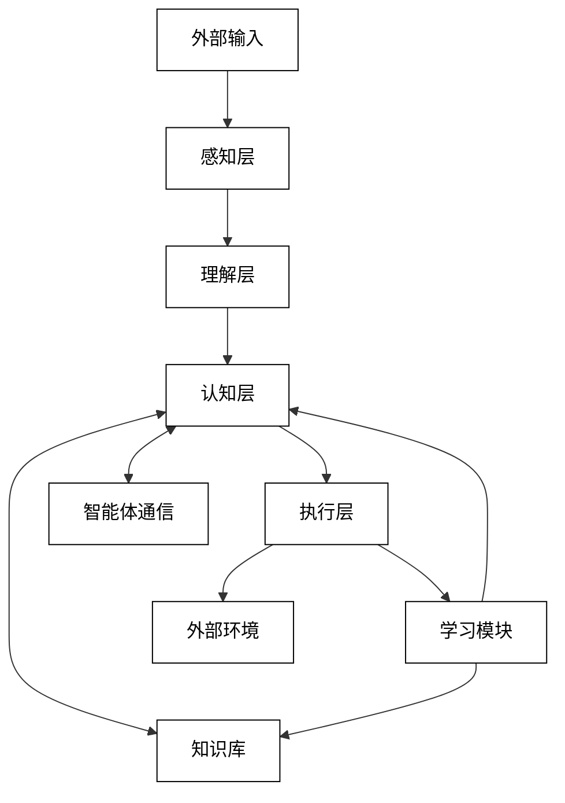
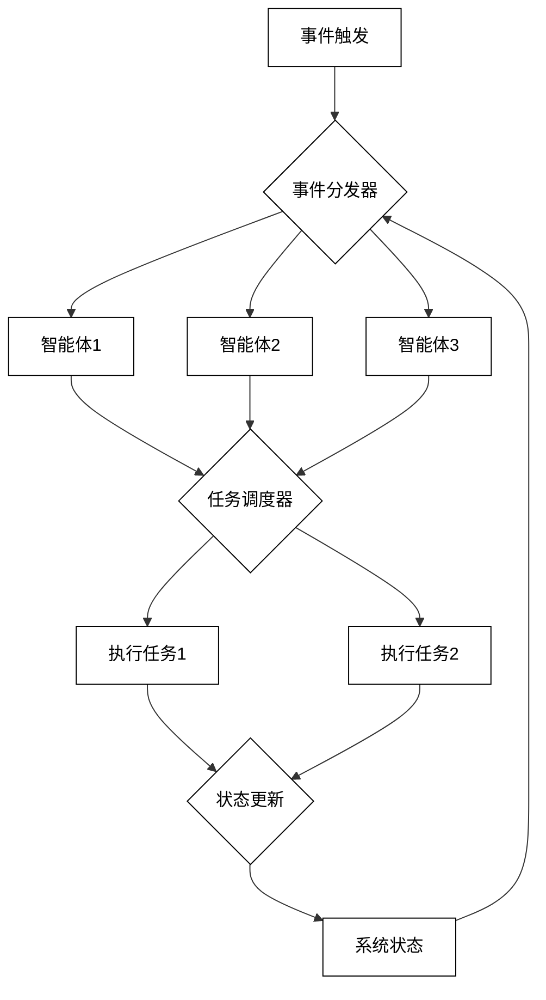

# 3 LLM-based多智能体系统架构设计

## 3.1 系统总体架构

### 3.1.1 分层设计理念

在设计基于LLM的多智能体系统时，采用分层架构可以提高系统的模块化、可扩展性和可维护性。以下是一个详细的分层设计理念：

1. 感知层（Perception Layer）

功能：负责从环境中获取各种形式的输入数据。

组件：
- 语音识别模块
- 图像处理模块
- 文本输入处理模块
- 传感器数据采集模块

设计原则：
- 模块化：每种输入类型使用独立的处理模块
- 可扩展性：易于添加新的输入类型和处理方法
- 预处理：对原始数据进行初步处理，如降噪、格式转换等

示例代码（感知层接口）：

```python
from abc import ABC, abstractmethod

class PerceptionModule(ABC):
    @abstractmethod
    def process_input(self, raw_input):
        pass

class SpeechRecognitionModule(PerceptionModule):
    def process_input(self, audio_data):
        # Implement speech recognition
        pass

class ImageProcessingModule(PerceptionModule):
    def process_input(self, image_data):
        # Implement image processing
        pass

class TextInputModule(PerceptionModule):
    def process_input(self, text_data):
        # Implement text preprocessing
        pass
```

2. 理解层（Comprehension Layer）

功能：将感知层的输出转化为系统可理解的表示形式。

组件：
- 自然语言理解模块
- 视觉场景理解模块
- 多模态融合模块
- 上下文理解模块

设计原则：
- 语义提取：从各种输入中提取语义信息
- 知识整合：将新信息与已有知识结合
- 跨模态理解：整合不同模态的信息

示例代码（理解层中的多模态融合）：

```python
import torch
import torch.nn as nn

class MultimodalFusionModule(nn.Module):
    def __init__(self, text_dim, image_dim, fusion_dim):
        super().__init__()
        self.text_proj = nn.Linear(text_dim, fusion_dim)
        self.image_proj = nn.Linear(image_dim, fusion_dim)
        self.fusion = nn.MultiheadAttention(fusion_dim, num_heads=8)
        
    def forward(self, text_features, image_features):
        text_proj = self.text_proj(text_features)
        image_proj = self.image_proj(image_features)
        fused_features, _ = self.fusion(text_proj, image_proj, image_proj)
        return fused_features
```

3. 认知层（Cognition Layer）

功能：基于LLM进行高级推理、决策和规划。

组件：
- LLM核心
- 推理引擎
- 任务规划器
- 知识图谱

设计原则：
- LLM集成：有效利用LLM的能力
- 可解释性：提供决策和推理过程的解释
- 适应性：能够学习和更新知识

示例代码（LLM核心的简化实现）：

```python
from transformers import AutoModelForCausalLM, AutoTokenizer

class LLMCore:
    def __init__(self, model_name):
        self.model = AutoModelForCausalLM.from_pretrained(model_name)
        self.tokenizer = AutoTokenizer.from_pretrained(model_name)
        
    def generate_response(self, prompt, max_length=100):
        inputs = self.tokenizer(prompt, return_tensors="pt")
        outputs = self.model.generate(**inputs, max_length=max_length)
        return self.tokenizer.decode(outputs[0], skip_special_tokens=True)

# Usage
llm_core = LLMCore("gpt2")
response = llm_core.generate_response("The future of AI is")
print(response)
```

4. 执行层（Execution Layer）

功能：将认知层的决策转化为具体的行动。

组件：
- 行动执行模块
- 反馈收集模块
- 错误处理模块
- 资源管理模块

设计原则：
- 实时性：快速响应和执行
- 鲁棒性：能够处理执行过程中的异常
- 资源优化：高效利用系统资源

示例代码（执行层的行动执行接口）：

```python
from abc import ABC, abstractmethod

class ActionExecutor(ABC):
    @abstractmethod
    def execute(self, action_plan):
        pass

class RobotActionExecutor(ActionExecutor):
    def execute(self, action_plan):
        # Implement robot action execution
        pass

class SoftwareActionExecutor(ActionExecutor):
    def execute(self, action_plan):
        # Implement software action execution
        pass
```

5. 交互层（Interaction Layer）

功能：管理系统与用户或其他系统的交互。

组件：
- 用户界面模块
- 多模态输出生成模块
- 对话管理模块
- API接口模块

设计原则：
- 用户友好：直观、易用的交互界面
- 多模态输出：支持文本、语音、图像等多种输出形式
- 一致性：保持交互风格的一致性

示例代码（简单的对话管理器）：

```python
class DialogueManager:
    def __init__(self, llm_core):
        self.llm_core = llm_core
        self.conversation_history = []
        
    def process_user_input(self, user_input):
        self.conversation_history.append(f"User: {user_input}")
        context = "\n".join(self.conversation_history[-5:])  # Use last 5 turns as context
        response = self.llm_core.generate_response(context)
        self.conversation_history.append(f"System: {response}")
        return response

# Usage
dialogue_manager = DialogueManager(llm_core)
response = dialogue_manager.process_user_input("What's the weather like today?")
print(response)
```

6. 学习层（Learning Layer）

功能：使系统能够从经验中学习和改进。

组件：
- 经验收集模块
- 模型更新模块
- 性能评估模块
- 知识库更新模块

设计原则：
- 持续学习：不断从交互中学习和改进
- 迁移学习：利用已有知识快速适应新任务
- 安全学习：确保学习过程不会导致系统性能下降

示例代码（简化的在线学习模块）：

```python
class OnlineLearningModule:
    def __init__(self, model, learning_rate=0.01):
        self.model = model
        self.learning_rate = learning_rate
        self.optimizer = torch.optim.Adam(self.model.parameters(), lr=self.learning_rate)
        
    def update(self, inputs, targets):
        self.model.train()
        self.optimizer.zero_grad()
        outputs = self.model(inputs)
        loss = nn.functional.cross_entropy(outputs, targets)
        loss.backward()
        self.optimizer.step()
        return loss.item()

# Usage
online_learner = OnlineLearningModule(some_model)
loss = online_learner.update(new_inputs, new_targets)
print(f"Training loss: {loss}")
```

7. 安全层（Security Layer）

功能：确保系统的安全性和隐私保护。

组件：
- 身份认证模块
- 数据加密模块
- 隐私保护模块
- 异常检测模块

设计原则：
- 多层防御：在系统的各个层面实施安全措施
- 最小权限：遵循最小权限原则
- 实时监控：持续监控系统安全状态

示例代码（简单的身份认证模块）：

```python
import hashlib
import os

class AuthenticationModule:
    def __init__(self):
        self.users = {}  # In practice, use a secure database
        
    def register_user(self, username, password):
        salt = os.urandom(32)
        key = hashlib.pbkdf2_hmac('sha256', password.encode('utf-8'), salt, 100000)
        self.users[username] = {'salt': salt, 'key': key}
        
    def authenticate(self, username, password):
        if username not in self.users:
            return False
        salt = self.users[username]['salt']
        key = hashlib.pbkdf2_hmac('sha256', password.encode('utf-8'), salt, 100000)
        return key == self.users[username]['key']

# Usage
auth_module = AuthenticationModule()
auth_module.register_user("alice", "password123")
is_authenticated = auth_module.authenticate("alice", "password123")
print(f"Authentication successful: {is_authenticated}")
```

这种分层设计为基于LLM的多智能体系统提供了一个清晰、模块化的结构。每一层都有其特定的职责和设计原则，使得系统更易于开发、维护和扩展。同时，这种架构也便于不同团队并行开发，提高开发效率。

在实际实现中，这些层之间需要定义清晰的接口和通信协议，以确保系统各部分能够无缝协作。此外，还需要考虑跨层优化，以提高整体系统性能。例如，可以在理解层和认知层之间实现一些缓存机制，减少对LLM的重复调用。

分层设计的优势包括：

1. 模块化：每一层都是相对独立的，可以单独开发和测试。
2. 可扩展性：可以轻松添加新功能或替换现有模块。
3. 可维护性：问题定位和修复更加容易。
4. 复用性：不同项目可以复用相同的层或模块。
5. 灵活性：可以根据具体需求调整或重新组织层次结构。

然而，这种设计也面临一些挑战：

1. 性能开销：层与层之间的通信可能引入额外的性能开销。
2. 复杂性：随着系统规模的增大，管理和协调各层becomes更加复杂。
3. 一致性：确保各层之间的数据和状态一致性可能具有挑战性。

为了应对这些挑战，可以考虑以下策略：

1. 使用高效的层间通信机制，如共享内存或消息队列。
2. 实现跨层优化，减少不必要的数据传输和处理。
3. 采用微服务架构，将某些层拆分为独立的服务。
4. 使用统一的数据模型和状态管理机制。
5. 实施全面的监控和日志系统，以便快速定位和解决问题。

通过这种分层设计，基于LLM的多智能体系统可以实现高度的灵活性和可扩展性，同时保持良好的性能和可维护性。这为构建复杂、智能的应用系统提供了坚实的架构基础。

### 3.1.2 核心组件与功能模块

基于LLM的多智能体系统的核心组件和功能模块是系统运行的关键部分。以下是详细的核心组件和功能模块设计：

1. LLM引擎（LLM Engine）

功能：作为系统的核心智能单元，负责自然语言处理、推理和生成。

子模块：
a) 模型加载器：加载和初始化预训练的LLM
b) 推理优化器：优化LLM的推理性能
c) 提示工程模块：生成和优化输入提示
d) 输出解析器：解析和处理LLM的输出

示例代码（LLM引擎的基本结构）：

```python
from transformers import AutoModelForCausalLM, AutoTokenizer
import torch

class LLMEngine:
    def __init__(self, model_name):
        self.model = AutoModelForCausalLM.from_pretrained(model_name)
        self.tokenizer = AutoTokenizer.from_pretrained(model_name)
        self.device = torch.device("cuda" if torch.cuda.is_available() else "cpu")
        self.model.to(self.device)

    def generate(self, prompt, max_length=100):
        inputs = self.tokenizer(prompt, return_tensors="pt").to(self.device)
        outputs = self.model.generate(**inputs, max_length=max_length)
        return self.tokenizer.decode(outputs[0], skip_special_tokens=True)

    def optimize_prompt(self, task, context):
        # Implement prompt optimization logic
        optimized_prompt = f"Task: {task}\nContext: {context}\nResponse:"
        return optimized_prompt

    def parse_output(self, output):
        # Implement output parsing logic
        return output.strip()

# Usage
llm_engine = LLMEngine("gpt2")
prompt = llm_engine.optimize_prompt("Summarize", "Long text to summarize...")
response = llm_engine.generate(prompt)
result = llm_engine.parse_output(response)
print(result)
```

2. 智能体管理器（Agent Manager）

功能：创建、配置和协调多个智能体。

子模块：
a) 智能体工厂：创建不同类型的智能体
b) 角色分配器：为智能体分配特定角色和任务
c) 生命周期管理器：管理智能体的创建、激活和销毁
d) 协作协调器：管理智能体之间的协作和通信

示例代码（智能体管理器的基本结构）：

```python
from abc import ABC, abstractmethod

class Agent(ABC):
    @abstractmethod
    def process(self, input_data):
        pass

class AnalystAgent(Agent):
    def process(self, input_data):
        return f"Analyzed: {input_data}"

class WriterAgent(Agent):
    def process(self, input_data):
        return f"Written: {input_data}"

class AgentManager:
    def __init__(self):
        self.agents = {}

    def create_agent(self, agent_type, agent_id):
        if agent_type == "analyst":
            agent = AnalystAgent()
        elif agent_type == "writer":
            agent = WriterAgent()
        else:
            raise ValueError(f"Unknown agent type: {agent_type}")
        self.agents[agent_id] = agent
        return agent

    def get_agent(self, agent_id):
        return self.agents.get(agent_id)

    def remove_agent(self, agent_id):
        if agent_id in self.agents:
            del self.agents[agent_id]

    def coordinate_task(self, task_data):
        results = {}
        for agent_id, agent in self.agents.items():
            results[agent_id] = agent.process(task_data)
        return results

# Usage
manager = AgentManager()
manager.create_agent("analyst", "analyst1")
manager.create_agent("writer", "writer1")
results = manager.coordinate_task("Raw data")
print(results)
```

3. 知识库（Knowledge Base）

功能：存储和管理系统的知识和信息。

子模块：
a) 知识图谱：存储结构化知识
b) 向量数据库：存储和检索向量化的信息
c) 缓存管理器：管理频繁访问的信息
d) 知识更新器：动态更新和维护知识

示例代码（简化的知识库实现）：

```python
import networkx as nx
from sentence_transformers import SentenceTransformer

class KnowledgeBase:
    def __init__(self):
        self.graph = nx.Graph()
        self.vector_db = {}
        self.encoder = SentenceTransformer('all-MiniLM-L6-v2')

    def add_knowledge(self, subject, predicate, object):
        self.graph.add_edge(subject, object, relation=predicate)

    def query_knowledge(self, subject):
        return list(self.graph.neighbors(subject))

    def add_to_vector_db(self, text, metadata):
        embedding = self.encoder.encode(text)
        self.vector_db[text] = (embedding, metadata)

    def search_vector_db(self, query, top_k=5):
        query_embedding = self.encoder.encode(query)
        results = sorted(self.vector_db.items(),
                         key=lambda item: np.dot(query_embedding, item[1][0]),
                         reverse=True)[:top_k]
        return [(text, metadata) for text, (_, metadata) in results]

# Usage
kb = KnowledgeBase()
kb.add_knowledge("Apple", "is_a", "Fruit")
kb.add_to_vector_db("The sky is blue", {"type": "fact"})
print(kb.query_knowledge("Apple"))
print(kb.search_vector_db("color of the sky"))
```

4. 任务规划器（Task Planner）

功能：分解复杂任务并制定执行计划。

子模块：
a) 目标分解器：将高级目标分解为子任务
b) 依赖分析器：分析任务之间的依赖关系
c) 资源分配器：为任务分配所需资源
d) 计划优化器：优化任务执行顺序和并行度

示例代码（简单的任务规划器）：

```python
from collections import deque

class Task:
    def __init__(self, name, dependencies=None):
        self.name = name
        self.dependencies = dependencies or []

class TaskPlanner:
    def __init__(self):
        self.tasks = {}

    def add_task(self, task):
        self.tasks[task.name] = task

    def generate_plan(self):
        in_degree = {task: len(task.dependencies) for task in self.tasks.values()}
        queue = deque([task for task in self.tasks.values() if not task.dependencies])
        plan = []

        while queue:
            task = queue.popleft()
            plan.append(task.name)
            for t in self.tasks.values():
                if task.name in t.dependencies:
                    in_degree[t] -= 1
                    if in_degree[t] == 0:
                        queue.append(t)

        if len(plan) != len(self.tasks):
            raise ValueError("Circular dependency detected")
        return plan

# Usage
planner = TaskPlanner()
planner.add_task(Task("A"))
planner.add_task(Task("B", ["A"]))
planner.add_task(Task("C", ["A"]))
planner.add_task(Task("D", ["B", "C"]))
plan = planner.generate_plan()
print(f"Execution plan: {plan}")
```

5. 对话管理器（Dialogue Manager）

功能：管理系统与用户或其他智能体之间的对话。

子模块：
a) 上下文跟踪器：维护对话历史和上下文
b) 意图识别器：识别用户的意图
c) 对话状态管理器：管理对话的当前状态
d) 响应生成器：生成适当的响应

示例代码（对话管理器的基本结构）：

```python
class DialogueManager:
    def __init__(self, llm_engine):
        self.llm_engine = llm_engine
        self.context = []
        self.max_context_length = 5

    def process_input(self, user_input):
        self.context.append(f"User: {user_input}")
        self.context = self.context[-self.max_context_length:]
        
        context_str = "\n".join(self.context)
        prompt = f"Given the following conversation, provide a response:\n{context_str}\nSystem:"
        
        response = self.llm_engine.generate(prompt)
        self.context.append(f"System: {response}")
        
        return response

    def reset_context(self):
        self.context = []

# Usage
dialogue_manager = DialogueManager(llm_engine)
response = dialogue_manager.process_input("Hello, how are you?")
print(response)
```

6. 多模态处理器（Multimodal Processor）

功能：处理和集成不同模态的输入和输出。

子模块：
a) 图像处理器：处理图像输入和生成
b) 语音处理器：处理语音输入和合成
c) 文本处理器：处理文本输入和生成
d) 模态融合器：集成不同模态的信息

示例代码（多模态处理器的基本结构）：

```python
import torch
from transformers import CLIPProcessor, CLIPModel

class MultimodalProcessor:
    def __init__(self):
        self.clip_model = CLIPModel.from_pretrained("openai/clip-vit-base-patch32")
        self.clip_processor = CLIPProcessor.from_pretrained("openai/clip-vit-base-patch32")

    def process_image(self, image):
        inputs = self.clip_processor(images=image, return_tensors="pt")
        image_features = self.clip_model.get_image_features(**inputs)
        return image_features

    def process_text(self, text):
        inputs = self.clip_processor(text=text, return_tensors="pt", padding=True)
        text_features = self.clip_model.get_text_features(**inputs)
        return text_features

    def compute_similarity(self, image_features, text_features):
        similarity = torch.nn.functional.cosine_similarity(image_features, text_features)
        return similarity.item()

# Usage
processor = MultimodalProcessor()
image_features = processor.process_image(some_image)
text_features = processor.process_text("A cat sitting on a couch")
similarity = processor.compute_similarity(image_features, text_features)
print(f"Similarity: {similarity}")
```

7. 学习与适应模块（Learning and Adaptation Module）

功能：使系统能够从经验中学习和适应。

子模块：
a) 经验收集器：收集系统交互的经验数据
b) 模型微调器：基于新数据微调LLM
c) 策略优化器：优化系统的决策策略
d) 性能评估器：评估系统的学习和适应效果

示例代码（简化的学习与适应模块）：

```python
import random
from collections import deque

class LearningModule:
    def __init__(self, model, memory_size=1000):
        self.model = model
        self.memory = deque(maxlen=memory_size)
        self.batch_size = 32

    def add_experience(self, state, action, reward, next_state, done):
        self.memory.append((state, action, reward, next_state, done))

    def sample_batch(self):
        return random.sample(self.memory, min(len(self.memory), self.batch_size))

    def train(self):
        if len(self.memory) < self.batch_size:
            return
        
        batch = self.sample_batch()
        states, actions, rewards, next_states, dones = zip(*batch)
        
        # Implement your training logic here
        # This is a placeholder for actual training code
        loss = self.model.train_step(states, actions, rewards, next_states, dones)
        
        return loss

    def update_model(self):
        for _ in range(10):  # Perform 10 training iterations
            loss = self.train()
        return loss

# Usage
learning_module = LearningModule(some_model)
learning_module.add_experience(state, action, reward, next_state, done)
loss = learning_module.update_model()
print(f"Training loss: {loss}")
```

8. 安全与隐私模块（Security and Privacy Module）

功能：确保系统的安全性和用户隐私。

子模块：
a) 身份验证器：验证用户和系统组件的身份
b) 访问控制器：管理对系统资源的访问权限
c) 数据加密器：加密敏感数据
d) 隐私保护器：实施数据匿名化和差分隐私技术

示例代码（简单的安全模块）：

```python
import hashlib
import os

class SecurityModule:
    def __init__(self):
        self.users = {}

    def register_user(self, username, password):
        salt = os.urandom(32)
        key = hashlib.pbkdf2_hmac('sha256', password.encode('utf-8'), salt, 100000)
        self.users[username] = {'salt': salt, 'key': key}

    def authenticate_user(self, username, password):
        if username not in self.users:
            return False
        salt = self.users[username]['salt']
        key = hashlib.pbkdf2_hmac('sha256', password.encode('utf-8'), salt, 100000)
        return key == self.users[username]['key']

    def encrypt_data(self, data, key):
        # This is a very basic encryption method and should not be used in production
        return ''.join([chr(ord(c) ^ key) for c in data])

    def decrypt_data(self, encrypted_data, key):
        return self.encrypt_data(encrypted_data, key)  # XOR encryption is symmetric

# Usage
security_module = SecurityModule()
security_module.register_user("alice", "password123")
is_authenticated = security_module.authenticate_user("alice", "password123")
print(f"Authentication successful: {is_authenticated}")

sensitive_data = "This is sensitive information"
encryption_key = 42
encrypted = security_module.encrypt_data(sensitive_data, encryption_key)
decrypted = security_module.decrypt_data(encrypted, encryption_key)
print(f"Original: {sensitive_data}")
print(f"Encrypted: {encrypted}")
print(f"Decrypted: {decrypted}")
```

9. 监控与日志模块（Monitoring and Logging Module）

功能：监控系统性能和记录重要事件。

子模块：
a) 性能监控器：跟踪系统资源使用和响应时间
b) 错误检测器：检测和报告系统错误
c) 日志记录器：记录系统活动和重要事件
d) 分析报告生成器：生成系统性能和使用情况报告

示例代码（简单的监控和日志模块）：

```python
import time
import logging

class MonitoringModule:
    def __init__(self):
        self.start_time = time.time()
        logging.basicConfig(filename='system.log', level=logging.INFO)

    def log_event(self, event_type, message):
        logging.info(f"{event_type}: {message}")

    def monitor_performance(self, func):
        def wrapper(*args, **kwargs):
            start = time.time()
            result = func(*args, **kwargs)
            end = time.time()
            self.log_event("PERFORMANCE", f"{func.__name__} took {end - start:.2f} seconds")
            return result
        return wrapper

    def generate_report(self):
        uptime = time.time() - self.start_time
        with open('system.log', 'r') as log_file:
            log_contents = log_file.read()
        report = f"System Uptime: {uptime:.2f} seconds\n\nRecent Log Entries:\n{log_contents[-1000:]}"
        return report

# Usage
monitoring_module = MonitoringModule()

@monitoring_module.monitor_performance
def some_function():
    time.sleep(2)  # Simulate some work
    return "Function completed"

result = some_function()
monitoring_module.log_event("INFO", "System initialized")
report = monitoring_module.generate_report()
print(report)
```

这些核心组件和功能模块共同构成了基于LLM的多智能体系统的基础架构。它们相互协作，使系统能够理解和处理复杂的输入，生成智能的响应，并在与环境的交互中不断学习和适应。

在实际实现中，这些模块需要进行更详细的设计和优化，以满足特定应用的需求。例如，LLM引擎可能需要针对特定任务进行微调，知识库可能需要集成特定领域的知识图谱，任务规划器可能需要考虑更复杂的约束条件等。

此外，还需要考虑模块之间的接口设计和通信机制，以确保整个系统的高效运行。可以使用消息队列、事件总线或微服务架构等技术来实现模块间的解耦和灵活通信。

随着系统规模的增长，还需要考虑分布式架构和横向扩展能力。例如，可以将LLM引擎部署在多个服务器上以提高处理能力，或者使用分布式知识库来存储和检索大规模知识。

最后，系统的可维护性和可测试性也是重要的考虑因素。应该为每个模块设计全面的单元测试和集成测试，并实现详细的日志记录和监控机制，以便快速定位和解决问题。

通过精心设计和实现这些核心组件和功能模块，基于LLM的多智能体系统可以实现高度的智能性、灵活性和可扩展性，为各种复杂应用场景提供强大的解决方案。

### 3.1.3 数据流与控制流分析

在基于LLM的多智能体系统中，数据流和控制流的设计对系统的性能、可扩展性和可维护性至关重要。以下是对系统数据流和控制流的详细分析：

1. 数据流分析

数据流描述了系统中信息的流动路径。在多智能体系统中，数据流涉及多个组件之间的复杂交互。

主要数据流路径：

a) 输入处理流
- 外部输入 → 感知层 → 理解层 → 认知层
- 涉及将原始输入转换为系统可理解的表示

b) 知识检索流
- 认知层 → 知识库 → 认知层
- 涉及从知识库检索相关信息以支持决策

c) 智能体间通信流
- 智能体A → 通信模块 → 智能体B
- 涉及智能体之间交换信息和协调行动

d) 输出生成流
- 认知层 → 执行层 → 外部环境
- 涉及将系统决策转化为具体行动或响应

e) 学习反馈流
- 执行层 → 学习模块 → 知识库/模型更新
- 涉及从交互中学习并更新系统知识和模型

数据流图示：



示例代码（简化的数据流管理）：

```python
class DataFlowManager:
    def __init__(self, components):
        self.components = components

    def process_input(self, input_data):
        # Input processing flow
        perceived_data = self.components['perception'].process(input_data)
        understood_data = self.components['understanding'].process(perceived_data)
        decision = self.components['cognition'].process(understood_data)

        # Knowledge retrieval flow
        relevant_knowledge = self.components['knowledge_base'].retrieve(decision.context)
        enhanced_decision = self.components['cognition'].enhance_decision(decision, relevant_knowledge)

        # Output generation flow
        action = self.components['execution'].generate_action(enhanced_decision)

        # Learning feedback flow
        feedback = self.components['environment'].get_feedback(action)
        self.components['learning'].update(feedback)

        return action

# Usage
components = {
    'perception': PerceptionModule(),
    'understanding': UnderstandingModule(),
    'cognition': CognitionModule(),
    'knowledge_base': KnowledgeBase(),
    'execution': ExecutionModule(),
    'environment': EnvironmentSimulator(),
    'learning': LearningModule()
}
data_flow_manager = DataFlowManager(components)
result = data_flow_manager.process_input(some_input_data)
```

2. 控制流分析

控制流描述了系统中决策和执行的顺序。在多智能体系统中，控制流需要协调多个并行运行的智能体和模块。

主要控制流模式：

a) 事件驱动控制流
- 系统响应外部事件或内部状态变化
- 使用观察者模式或事件总线实现

b) 任务调度控制流
- 系统根据优先级和依赖关系调度任务
- 使用任务队列和调度器实现

c) 并行控制流
- 多个智能体或模块并行执行
- 使用多线程或协程实现

d) 状态机控制流
- 系统根据当前状态决定下一步行动
- 使用有限状态机或分层状态机实现

e) 反应式控制流
- 系统持续监听和响应变化
- 使用反应式编程模型实现

控制流图示：



示例代码（综合控制流管理）：

```python
import asyncio
from enum import Enum

class SystemState(Enum):
    IDLE = 1
    PROCESSING = 2
    LEARNING = 3

class ControlFlowManager:
    def __init__(self):
        self.state = SystemState.IDLE
        self.event_queue = asyncio.Queue()
        self.task_queue = asyncio.PriorityQueue()

    async def event_listener(self):
        while True:
            event = await self.event_queue.get()
            await self.handle_event(event)

    async def handle_event(self, event):
        if self.state == SystemState.IDLE:
            self.state = SystemState.PROCESSING
            task = self.create_task(event)
            await self.task_queue.put(task)
        elif self.state == SystemState.PROCESSING:
            await self.event_queue.put(event)  # Requeue the event

    async def task_scheduler(self):
        while True:
            priority, task = await self.task_queue.get()
            await self.execute_task(task)

    async def execute_task(self, task):
        # Simulate task execution
        await asyncio.sleep(1)
        print(f"Executed task: {task}")
        if self.task_queue.empty():
            self.state = SystemState.LEARNING
            await self.perform_learning()

    async def perform_learning(self):
        # Simulate learning process
        await asyncio.sleep(2)
        print("Performed learning")
        self.state = SystemState.IDLE

    def create_task(self, event):
        # Create a task based on the event
        return (1, f"Task for event {event}")  # Priority 1

    async def run(self):
        await asyncio.gather(
            self.event_listener(),
            self.task_scheduler()
        )

# Usage
async def main():
    manager = ControlFlowManager()
    asyncio.create_task(manager.run())

    # Simulate events
    for i in range(5):
        await manager.event_queue.put(f"Event{i}")
        await asyncio.sleep(0.5)

    await asyncio.sleep(10)  # Allow time for processing

asyncio.run(main())
```

3. 数据流与控制流的集成

在实际系统中，数据流和控制流紧密集成，共同驱动系统的运行。以下是一些集成策略：

a) 管道处理模式
- 将数据流处理组织为一系列连续的阶段
- 每个阶段由特定的控制流管理

示例代码（管道处理模式）：

```python
class Pipeline:
    def __init__(self, stages):
        self.stages = stages

    async def process(self, data):
        for stage in self.stages:
            data = await stage.process(data)
        return data

class Stage:
    def __init__(self, name, processing_func):
        self.name = name
        self.processing_func = processing_func

    async def process(self, data):
        print(f"Processing in {self.name}")
        return await self.processing_func(data)

async def perception(data):
    # Simulate perception processing
    await asyncio.sleep(0.1)
    return f"Perceived: {data}"

async def understanding(data):
    # Simulate understanding processing
    await asyncio.sleep(0.2)
    return f"Understood: {data}"

async def decision_making(data):
    # Simulate decision making
    await asyncio.sleep(0.3)
    return f"Decision: act on {data}"

# Usage
pipeline = Pipeline([
    Stage("Perception", perception),
    Stage("Understanding", understanding),
    Stage("Decision Making", decision_making)
])

async def main():
    result = await pipeline.process("Raw input data")
    print(result)

asyncio.run(main())
```

b) 反应式编程模型
- 使用观察者模式或响应式流处理数据
- 控制流由数据流的变化驱动

示例代码（使用RxPY的反应式编程）：

```python
from rx import create, operators as ops

def data_source():
    def on_subscribe(observer, scheduler):
        observer.on_next("Data 1")
        observer.on_next("Data 2")
        observer.on_next("Data 3")
        observer.on_completed()
    return create(on_subscribe)

def process_data(data):
    return f"Processed: {data}"

data_source() \
    .pipe(
        ops.map(lambda x: process_data(x)),
        ops.filter(lambda x: "2" not in x)
    ) \
    .subscribe(
        on_next=lambda x: print(x),
        on_completed=lambda: print("Done")
    )
```

c) actor模型
- 将系统组织为一组独立的actors
- 每个actor管理自己的状态和控制流，通过消息传递进行通信

示例代码（使用aioactor库实现actor模型）：

```python
import asyncio
from aioactor import Actor, run_actor

class DataProcessorActor(Actor):
    async def receive(self, message):
        if message['type'] == 'process':
            result = await self.process_data(message['data'])
            await self.send(message['reply_to'], {
                'type': 'result',
                'data': result
            })

    async def process_data(self, data):
        # Simulate data processing
        await asyncio.sleep(0.5)
        return f"Processed: {data}"

class ControllerActor(Actor):
    async def receive(self, message):
        if message['type'] == 'start':
            processor = await self.spawn_actor(DataProcessorActor)
            await self.send(processor, {
                'type': 'process',
                'data': 'Some data',
                'reply_to': self.address
            })
        elif message['type'] == 'result':
            print(f"Received result: {message['data']}")
            await self.stop()

async def main():
    controller = await run_actor(ControllerActor)
    await controller.send(controller, {'type': 'start'})

asyncio.run(main())
```

4. 数据流与控制流优化

为了提高系统性能和响应性，可以采用以下优化策略：

a) 缓存和预取
- 在关键数据流路径上使用缓存
- 预测性地预取可能需要的数据

b) 并行处理
- 识别可并行的数据流和控制流部分
- 使用多线程、多进程或分布式计算

c) 负载均衡
- 在多个处理单元之间均衡分配任务
- 使用动态负载均衡算法适应变化的工作负载

d) 优先级队列
- 为关键任务和数据流实现优先级处理
- 确保重要操作得到及时处理

e) 背压机制
- 实现流量控制以防止系统过载
- 在数据生产者和消费者之间协调处理速度

示例代码（带有背压的数据流处理）：

```python
import asyncio

class DataProcessor:
    def __init__(self, max_queue_size=10):
        self.queue = asyncio.Queue(maxsize=max_queue_size)

    async def produce_data(self):
        for i in range(20):
            await self.queue.put(f"Data {i}")
            print(f"Produced: Data {i}")
            await asyncio.sleep(0.1)

    async def process_data(self):
        while True:
            data = await self.queue.get()
            await self.simulate_processing(data)
            self.queue.task_done()

    async def simulate_processing(self, data):
        process_time = 0.5  # Simulating slower processing
        await asyncio.sleep(process_time)
        print(f"Processed: {data}")

async def main():
    processor = DataProcessor()
    await asyncio.gather(
        processor.produce_data(),
        processor.process_data(),
        processor.process_data()  # Two consumer tasks
    )

asyncio.run(main())
```

通过精心设计和优化数据流与控制流，基于LLM的多智能体系统可以实现高效、灵活和可扩展的运行机制。这种设计允许系统有效地处理复杂的任务，协调多个智能体的行为，并适应动态变化的环境和需求。

然而，在实际实现中，还需要考虑诸如错误处理、容错机制、监控和日志记录等方面，以确保系统的稳定性和可维护性。此外，随着系统规模的增长，可能需要考虑分布式架构和微服务设计，以进一步提高系统的可扩展性和灵活性。

## 3.2 智能体管理层

### 3.2.1 智能体生命周期管理

智能体生命周期管理是多智能体系统中的关键组件，负责创建、维护、监控和销毁智能体。有效的生命周期管理可以确保系统资源的高效利用，并支持动态和可扩展的智能体部署。以下是智能体生命周期管理的详细设计和实现：

1. 智能体状态定义

首先，定义智能体在其生命周期中可能处于的不同状态：

```python
from enum import Enum

class AgentState(Enum):
    INITIALIZING = 1
    READY = 2
    RUNNING = 3
    PAUSED = 4
    TERMINATING = 5
    TERMINATED = 6
```

2. 智能体基类

创建一个基本的智能体类，包含生命周期相关的方法：

```python
import asyncio
from abc import ABC, abstractmethod

class Agent(ABC):
    def __init__(self, agent_id):
        self.agent_id = agent_id
        self.state = AgentState.INITIALIZING

    async def initialize(self):
        # Perform initialization tasks
        await asyncio.sleep(0.1)  # Simulating initialization time
        self.state = AgentState.READY
        print(f"Agent {self.agent_id} initialized")

    @abstractmethod
    async def run(self):
        pass

    async def pause(self):
        if self.state == AgentState.RUNNING:
            self.state = AgentState.PAUSED
            print(f"Agent {self.agent_id} paused")

    async def resume(self):
        if self.state == AgentState.PAUSED:
            self.state = AgentState.RUNNING
            print(f"Agent {self.agent_id} resumed")

    async def terminate(self):
        self.state = AgentState.TERMINATING
        # Perform cleanup tasks
        await asyncio.sleep(0.1)  # Simulating cleanup time
        self.state = AgentState.TERMINATED
        print(f"Agent {self.agent_id} terminated")
```

3. 智能体工厂

实现一个工厂类来创建不同类型的智能体：

```python
class AgentFactory:
    @staticmethod
    def create_agent(agent_type, agent_id):
        if agent_type == "analyst":
            return AnalystAgent(agent_id)
        elif agent_type == "executor":
            return ExecutorAgent(agent_id)
        else:
            raise ValueError(f"Unknown agent type: {agent_type}")

class AnalystAgent(Agent):
    async def run(self):
        self.state = AgentState.RUNNING
        print(f"Analyst Agent {self.agent_id} is analyzing data")
        await asyncio.sleep(1)  # Simulating work

class ExecutorAgent(Agent):
    async def run(self):
        self.state = AgentState.RUNNING
        print(f"Executor Agent {self.agent_id} is executing tasks")
        await asyncio.sleep(1)  # Simulating work
```

4. 智能体管理器

创建一个管理器类来处理智能体的生命周期：

```python
class AgentManager:
    def __init__(self):
        self.agents = {}

    async def create_agent(self, agent_type, agent_id):
        if agent_id in self.agents:
            raise ValueError(f"Agent with id {agent_id} already exists")
        
        agent = AgentFactory.create_agent(agent_type, agent_id)
        await agent.initialize()
        self.agents[agent_id] = agent
        return agent

    async def start_agent(self, agent_id):
        agent = self.agents.get(agent_id)
        if agent and agent.state == AgentState.READY:
            await agent.run()

    async def pause_agent(self, agent_id):
        agent = self.agents.get(agent_id)
        if agent:
            await agent.pause()

    async def resume_agent(self, agent_id):
        agent = self.agents.get(agent_id)
        if agent:
            await agent.resume()

    async def terminate_agent(self, agent_id):
        agent = self.agents.get(agent_id)
        if agent:
            await agent.terminate()
            del self.agents[agent_id]

    async def get_agent_state(self, agent_id):
        agent = self.agents.get(agent_id)
        return agent.state if agent else None

    def list_agents(self):
        return [(agent_id, agent.state) for agent_id, agent in self.agents.items()]
```

5. 监控和健康检查

实现一个监控系统来定期检查智能体的健康状态：

```python
import asyncio

class AgentMonitor:
    def __init__(self, agent_manager):
        self.agent_manager = agent_manager

    async def monitor_agents(self):
        while True:
            for agent_id, agent in self.agent_manager.agents.items():
                if agent.state == AgentState.RUNNING:
                    # Perform health check
                    await self.health_check(agent)
            await asyncio.sleep(5)  # Check every 5 seconds

    async def health_check(self, agent):
        # Implement your health check logic here
        # For example, check if the agent is responsive
        try:
            # Simulate a health check
            await asyncio.wait_for(agent.run(), timeout=0.5)
        except asyncio.TimeoutError:
            print(f"Agent {agent.agent_id} is not responsive")
            await self.agent_manager.terminate_agent(agent.agent_id)
            await self.agent_manager.create_agent(type(agent).__name__.lower(), agent.agent_id)
```

6. 资源管理

实现资源管理来控制系统中的智能体数量：

```python
class ResourceManager:
    def __init__(self, max_agents):
        self.max_agents = max_agents
        self.current_agents = 0

    async def acquire_resource(self):
        if self.current_agents < self.max_agents:
            self.current_agents += 1
            return True
        return False

    async def release_resource(self):
        if self.current_agents > 0:
            self.current_agents -= 1
```

7. 智能体生命周期管理系统

整合所有组件，创建一个完整的智能体生命周期管理系统：

```python
class AgentLifecycleManager:
    def __init__(self, max_agents):
        self.agent_manager = AgentManager()
        self.agent_monitor = AgentMonitor(self.agent_manager)
        self.resource_manager = ResourceManager(max_agents)

    async def create_agent(self, agent_type, agent_id):
        if await self.resource_manager.acquire_resource():
            try:
                agent = await self.agent_manager.create_agent(agent_type, agent_id)
                await self.agent_manager.start_agent(agent_id)
                return agent
            except Exception as e:
                await self.resource_manager.release_resource()
                raise e
        else:
            raise ResourceWarning("Maximum number of agents reached")

    async def terminate_agent(self, agent_id):
        await self.agent_manager.terminate_agent(agent_id)
        await self.resource_manager.release_resource()

    async def run(self):
        monitor_task = asyncio.create_task(self.agent_monitor.monitor_agents())
        # Other management tasks can be added here
        await monitor_task

# Usage example
async def main():
    lifecycle_manager = AgentLifecycleManager(max_agents=5)
    
    # Create and start agents
    await lifecycle_manager.create_agent("analyst", "analyst1")
    await lifecycle_manager.create_agent("executor", "executor1")
    
    # Run the lifecycle manager
    await lifecycle_manager.run()

asyncio.run(main())
```

这个智能体生命周期管理系统提供了以下功能：

1. 智能体创建和初始化
2. 智能体状态管理（运行、暂停、恢复、终止）
3. 智能体健康监控和自动恢复
4. 资源管理和限制

在实际应用中，你可能需要根据具体需求进行进一步的扩展和优化，例如：

1. 持久化存储：实现智能体状态的持久化，以支持系统重启后的恢复。

```python
import json

class AgentPersistence:
    @staticmethod
    async def save_agent_state(agent):
        state_data = {
            "agent_id": agent.agent_id,
            "agent_type": type(agent).__name__,
            "state": agent.state.name
        }
        with open(f"agent_{agent.agent_id}_state.json", "w") as f:
            json.dump(state_data, f)

    @staticmethod
    async def load_agent_state(agent_id):
        try:
            with open(f"agent_{agent_id}_state.json", "r") as f:
                state_data = json.load(f)
            return state_data
        except FileNotFoundError:
            return None

# 在AgentLifecycleManager中添加持久化方法
class AgentLifecycleManager:
    # ... (previous code)

    async def save_all_agent_states(self):
        for agent in self.agent_manager.agents.values():
            await AgentPersistence.save_agent_state(agent)

    async def restore_agents(self):
        agent_files = [f for f in os.listdir() if f.startswith("agent_") and f.endswith("_state.json")]
        for file in agent_files:
            agent_id = file.split("_")[1]
            state_data = await AgentPersistence.load_agent_state(agent_id)
            if state_data:
                await self.create_agent(state_data["agent_type"].lower(), agent_id)
                agent = self.agent_manager.agents[agent_id]
                agent.state = AgentState[state_data["state"]]
```

2. 负载均衡：实现智能的负载均衡策略，以优化资源利用。

```python
class LoadBalancer:
    def __init__(self, agent_manager):
        self.agent_manager = agent_manager

    async def get_least_loaded_agent(self, agent_type):
        agents = [agent for agent in self.agent_manager.agents.values() 
                  if isinstance(agent, globals()[f"{agent_type.capitalize()}Agent"])]
        return min(agents, key=lambda a: a.workload) if agents else None

    async def distribute_task(self, task):
        agent = await self.get_least_loaded_agent(task.required_agent_type)
        if agent:
            await agent.assign_task(task)
        else:
            # Create a new agent if none are available
            new_agent = await self.agent_manager.create_agent(task.required_agent_type, f"{task.required_agent_type}_{len(self.agent_manager.agents)}")
            await new_agent.assign_task(task)

# 在AgentLifecycleManager中添加负载均衡器
class AgentLifecycleManager:
    # ... (previous code)

    def __init__(self, max_agents):
        # ... (previous initialization)
        self.load_balancer = LoadBalancer(self.agent_manager)

    async def submit_task(self, task):
        await self.load_balancer.distribute_task(task)
```

3. 动态扩缩容：根据系统负载自动调整智能体数量。

```python
class AutoScaler:
    def __init__(self, lifecycle_manager, min_agents, max_agents, scale_up_threshold, scale_down_threshold):
        self.lifecycle_manager = lifecycle_manager
        self.min_agents = min_agents
        self.max_agents = max_agents
        self.scale_up_threshold = scale_up_threshold
        self.scale_down_threshold = scale_down_threshold

    async def monitor_and_scale(self):
        while True:
            await asyncio.sleep(60)  # Check every minute
            await self.check_and_scale()

    async def check_and_scale(self):
        total_workload = sum(agent.workload for agent in self.lifecycle_manager.agent_manager.agents.values())
        avg_workload = total_workload / len(self.lifecycle_manager.agent_manager.agents) if self.lifecycle_manager.agent_manager.agents else 0

        if avg_workload > self.scale_up_threshold and len(self.lifecycle_manager.agent_manager.agents) < self.max_agents:
            await self.scale_up()
        elif avg_workload < self.scale_down_threshold and len(self.lifecycle_manager.agent_manager.agents) > self.min_agents:
            await self.scale_down()

    async def scale_up(self):
        agent_type = "analyst" if random.random() < 0.5 else "executor"
        await self.lifecycle_manager.create_agent(agent_type, f"{agent_type}_{len(self.lifecycle_manager.agent_manager.agents)}")

    async def scale_down(self):
        least_busy_agent = min(self.lifecycle_manager.agent_manager.agents.values(), key=lambda a: a.workload)
        await self.lifecycle_manager.terminate_agent(least_busy_agent.agent_id)

# 在AgentLifecycleManager中添加自动扩缩容
class AgentLifecycleManager:
    # ... (previous code)

    def __init__(self, min_agents, max_agents):
        # ... (previous initialization)
        self.auto_scaler = AutoScaler(self, min_agents, max_agents, scale_up_threshold=0.8, scale_down_threshold=0.2)

    async def run(self):
        monitor_task = asyncio.create_task(self.agent_monitor.monitor_agents())
        auto_scale_task = asyncio.create_task(self.auto_scaler.monitor_and_scale())
        await asyncio.gather(monitor_task, auto_scale_task)
```

4. 错误处理和恢复：实现更强大的错误处理和自动恢复机制。

```python
class AgentRecoveryManager:
    def __init__(self, lifecycle_manager):
        self.lifecycle_manager = lifecycle_manager
        self.error_counts = {}

    async def handle_agent_error(self, agent_id, error):
        self.error_counts[agent_id] = self.error_counts.get(agent_id, 0) + 1
        print(f"Agent {agent_id} encountered an error: {error}")

        if self.error_counts[agent_id] > 3:
            await self.lifecycle_manager.terminate_agent(agent_id)
            agent_type = type(self.lifecycle_manager.agent_manager.agents[agent_id]).__name__.lower()
            await self.lifecycle_manager.create_agent(agent_type, agent_id)
            self.error_counts[agent_id] = 0
        else:
            await self.lifecycle_manager.agent_manager.restart_agent(agent_id)

# 在Agent类中添加错误处理
class Agent(ABC):
    # ... (previous code)

    async def run(self):
        try:
            self.state = AgentState.RUNNING
            await self._run()
        except Exception as e:
            await self.lifecycle_manager.recovery_manager.handle_agent_error(self.agent_id, e)

    @abstractmethod
    async def _run(self):
        pass

# 在AgentLifecycleManager中添加恢复管理器
class AgentLifecycleManager:
    # ... (previous code)

    def __init__(self, min_agents, max_agents):
        # ... (previous initialization)
        self.recovery_manager = AgentRecoveryManager(self)

    async def restart_agent(self, agent_id):
        agent = self.agent_manager.agents.get(agent_id)
        if agent:
            await agent.terminate()
            await agent.initialize()
            await agent.run()
```

5. 性能监控和报告：实现详细的性能监控和报告生成功能。

```python
import time
import matplotlib.pyplot as plt

class PerformanceMonitor:
    def __init__(self, lifecycle_manager):
        self.lifecycle_manager = lifecycle_manager
        self.performance_data = {}

    async def collect_performance_data(self):
        while True:
            for agent_id, agent in self.lifecycle_manager.agent_manager.agents.items():
                if agent_id not in self.performance_data:
                    self.performance_data[agent_id] = []
                self.performance_data[agent_id].append({
                    'timestamp': time.time(),
                    'state': agent.state.name,
                    'workload': agent.workload
                })
            await asyncio.sleep(10)  # Collect data every 10 seconds

    def generate_report(self):
        for agent_id, data in self.performance_data.items():
            timestamps = [d['timestamp'] for d in data]
            workloads = [d['workload'] for d in data]

            plt.figure(figsize=(10, 5))
            plt.plot(timestamps, workloads)
            plt.title(f"Agent {agent_id} Workload Over Time")
            plt.xlabel("Timestamp")
            plt.ylabel("Workload")
            plt.savefig(f"agent_{agent_id}_workload.png")
            plt.close()

        # Generate overall system report
        total_agents = len(self.lifecycle_manager.agent_manager.agents)
        avg_workload = sum(agent.workload for agent in self.lifecycle_manager.agent_manager.agents.values()) / total_agents if total_agents > 0 else 0

        report = f"""
        System Performance Report
        -------------------------
        Total Agents: {total_agents}
        Average Workload: {avg_workload:.2f}
        """

        with open("system_performance_report.txt", "w") as f:
            f.write(report)

# 在AgentLifecycleManager中添加性能监控
class AgentLifecycleManager:
    # ... (previous code)

    def __init__(self, min_agents, max_agents):
        # ... (previous initialization)
        self.performance_monitor = PerformanceMonitor(self)

    async def run(self):
        monitor_task = asyncio.create_task(self.agent_monitor.monitor_agents())
        auto_scale_task = asyncio.create_task(self.auto_scaler.monitor_and_scale())
        performance_task = asyncio.create_task(self.performance_monitor.collect_performance_data())
        await asyncio.gather(monitor_task, auto_scale_task, performance_task)

    def generate_performance_report(self):
        self.performance_monitor.generate_report()
```

通过这些扩展，智能体生命周期管理系统变得更加健壮、灵活和可扩展。它能够处理各种复杂的场景，包括系统崩溃恢复、动态负载平衡、自动扩缩容、错误恢复以及详细的性能监控。这样的系统为大规模多智能体应用提供了坚实的基础，能够有效地管理和优化智能体的运行。

### 3.2.2 角色分配与任务调度

角色分配与任务调度是多智能体系统中的关键组件，它们负责将不同的角色分配给智能体，并有效地分配和管理任务。以下是角色分配与任务调度的详细设计和实现：

1. 角色定义

首先，定义系统中可能存在的不同角色：

```python
from enum import Enum, auto

class AgentRole(Enum):
    ANALYST = auto()
    EXECUTOR = auto()
    COORDINATOR = auto()
    MONITOR = auto()
    LEARNER = auto()

class RoleCapability:
    def __init__(self, role, capabilities):
        self.role = role
        self.capabilities = capabilities

# Define role capabilities
role_capabilities = {
    AgentRole.ANALYST: RoleCapability(AgentRole.ANALYST, ["data_analysis", "pattern_recognition"]),
    AgentRole.EXECUTOR: RoleCapability(AgentRole.EXECUTOR, ["task_execution", "resource_management"]),
    AgentRole.COORDINATOR: RoleCapability(AgentRole.COORDINATOR, ["task_assignment", "conflict_resolution"]),
    AgentRole.MONITOR: RoleCapability(AgentRole.MONITOR, ["system_monitoring", "performance_analysis"]),
    AgentRole.LEARNER: RoleCapability(AgentRole.LEARNER, ["model_training", "knowledge_update"])
}
```

2. 智能体扩展

扩展智能体类以支持角色和能力：

```python
class Agent(ABC):
    def __init__(self, agent_id, role):
        self.agent_id = agent_id
        self.role = role
        self.capabilities = role_capabilities[role].capabilities
        self.current_task = None
        self.workload = 0

    @abstractmethod
    async def perform_task(self, task):
        pass

class AnalystAgent(Agent):
    def __init__(self, agent_id):
        super().__init__(agent_id, AgentRole.ANALYST)

    async def perform_task(self, task):
        print(f"Analyst {self.agent_id} is performing task: {task}")
        # Simulate task execution
        await asyncio.sleep(2)
        return f"Analysis result for task {task}"

class ExecutorAgent(Agent):
    def __init__(self, agent_id):
        super().__init__(agent_id, AgentRole.EXECUTOR)

    async def perform_task(self, task):
        print(f"Executor {self.agent_id} is performing task: {task}")
        # Simulate task execution
        await asyncio.sleep(1)
        return f"Execution result for task {task}"

# Similarly, implement CoordinatorAgent, MonitorAgent, and LearnerAgent
```

3. 任务定义

定义任务结构和优先级：

```python
from dataclasses import dataclass
from typing import List

@dataclass
class Task:
    task_id: str
    description: str
    required_capabilities: List[str]
    priority: int
    estimated_duration: float

class TaskPriority(Enum):
    LOW = 1
    MEDIUM = 2
    HIGH = 3
    CRITICAL = 4
```

4. 角色分配器

实现角色分配策略：

```python
class RoleAssigner:
    def __init__(self, agent_manager):
        self.agent_manager = agent_manager

    async def assign_role(self, agent, desired_role=None):
        if desired_role:
            if self.is_role_available(desired_role):
                agent.role = desired_role
                agent.capabilities = role_capabilities[desired_role].capabilities
            else:
                raise ValueError(f"Role {desired_role} is not available")
        else:
            # Assign role based on system needs and agent capabilities
            available_roles = self.get_available_roles()
            if available_roles:
                best_role = self.select_best_role(available_roles, agent)
                agent.role = best_role
                agent.capabilities = role_capabilities[best_role].capabilities
            else:
                raise ValueError("No roles available for assignment")

    def is_role_available(self, role):
        # Check if the role is needed in the system
        current_roles = [agent.role for agent in self.agent_manager.agents.values()]
        return current_roles.count(role) < self.get_max_agents_per_role(role)

    def get_available_roles(self):
        return [role for role in AgentRole if self.is_role_available(role)]

    def select_best_role(self, available_roles, agent):# Implement role selection logic based on system needs and agent capabilities
        return random.choice(available_roles)

    def get_max_agents_per_role(self, role):
        # Define the maximum number of agents for each role
        max_agents = {
            AgentRole.ANALYST: 5,
            AgentRole.EXECUTOR: 10,
            AgentRole.COORDINATOR: 2,
            AgentRole.MONITOR: 3,
            AgentRole.LEARNER: 3
        }
        return max_agents.get(role, 1)

```

5. 任务调度器

实现任务调度和分配策略：

```python
import heapq

class TaskScheduler:
    def __init__(self, agent_manager):
        self.agent_manager = agent_manager
        self.task_queue = []
        self.running_tasks = {}

    async def add_task(self, task):
        heapq.heappush(self.task_queue, (-task.priority, task))

    async def assign_tasks(self):
        while self.task_queue:
            _, task = heapq.heappop(self.task_queue)
            suitable_agents = self.find_suitable_agents(task)
            if suitable_agents:
                agent = min(suitable_agents, key=lambda a: a.workload)
                await self.assign_task_to_agent(agent, task)
            else:
                # If no suitable agent is found, push the task back to the queue
                heapq.heappush(self.task_queue, (-task.priority, task))
                await asyncio.sleep(1)  # Wait before trying again

    def find_suitable_agents(self, task):
        return [
            agent for agent in self.agent_manager.agents.values()
            if all(cap in agent.capabilities for cap in task.required_capabilities)
            and agent.current_task is None
        ]

    async def assign_task_to_agent(self, agent, task):
        agent.current_task = task
        agent.workload += task.estimated_duration
        self.running_tasks[task.task_id] = agent
        asyncio.create_task(self.execute_task(agent, task))

    async def execute_task(self, agent, task):
        try:
            result = await agent.perform_task(task)
            print(f"Task {task.task_id} completed by agent {agent.agent_id}. Result: {result}")
        except Exception as e:
            print(f"Error executing task {task.task_id}: {e}")
        finally:
            agent.current_task = None
            agent.workload -= task.estimated_duration
            del self.running_tasks[task.task_id]

    async def monitor_and_reassign(self):
        while True:
            for task_id, agent in list(self.running_tasks.items()):
                if agent.state != AgentState.RUNNING:
                    task = agent.current_task
                    await self.add_task(task)
                    agent.current_task = None
                    agent.workload -= task.estimated_duration
                    del self.running_tasks[task_id]
                    print(f"Task {task_id} reassigned due to agent {agent.agent_id} state change")
            await asyncio.sleep(5)  # Check every 5 seconds
```

6. 负载均衡器

实现负载均衡策略：

```python
class LoadBalancer:
    def __init__(self, agent_manager, task_scheduler):
        self.agent_manager = agent_manager
        self.task_scheduler = task_scheduler

    async def balance_load(self):
        while True:
            await self.check_and_balance()
            await asyncio.sleep(30)  # Check every 30 seconds

    async def check_and_balance(self):
        agents = list(self.agent_manager.agents.values())
        avg_workload = sum(agent.workload for agent in agents) / len(agents)
        overloaded_agents = [agent for agent in agents if agent.workload > avg_workload * 1.2]
        underloaded_agents = [agent for agent in agents if agent.workload < avg_workload * 0.8]

        for overloaded_agent in overloaded_agents:
            if overloaded_agent.current_task:
                suitable_agent = min(underloaded_agents, key=lambda a: a.workload)
                if suitable_agent:
                    await self.transfer_task(overloaded_agent, suitable_agent)

    async def transfer_task(self, from_agent, to_agent):
        task = from_agent.current_task
        if task and all(cap in to_agent.capabilities for cap in task.required_capabilities):
            from_agent.current_task = None
            from_agent.workload -= task.estimated_duration
            await self.task_scheduler.assign_task_to_agent(to_agent, task)
            print(f"Task {task.task_id} transferred from agent {from_agent.agent_id} to agent {to_agent.agent_id}")
```

7. 角色分配与任务调度管理器

整合所有组件，创建一个完整的角色分配与任务调度管理系统：

```python
class RoleAndTaskManager:
    def __init__(self, agent_manager):
        self.agent_manager = agent_manager
        self.role_assigner = RoleAssigner(agent_manager)
        self.task_scheduler = TaskScheduler(agent_manager)
        self.load_balancer = LoadBalancer(agent_manager, self.task_scheduler)

    async def initialize_agent(self, agent):
        await self.role_assigner.assign_role(agent)

    async def submit_task(self, task):
        await self.task_scheduler.add_task(task)

    async def run(self):
        assignment_task = asyncio.create_task(self.task_scheduler.assign_tasks())
        monitoring_task = asyncio.create_task(self.task_scheduler.monitor_and_reassign())
        balancing_task = asyncio.create_task(self.load_balancer.balance_load())
        await asyncio.gather(assignment_task, monitoring_task, balancing_task)

# Update AgentLifecycleManager to use RoleAndTaskManager
class AgentLifecycleManager:
    def __init__(self, min_agents, max_agents):
        self.agent_manager = AgentManager()
        self.role_and_task_manager = RoleAndTaskManager(self.agent_manager)
        # ... (other initializations)

    async def create_agent(self, agent_type, agent_id):
        agent = await self.agent_manager.create_agent(agent_type, agent_id)
        await self.role_and_task_manager.initialize_agent(agent)
        return agent

    async def submit_task(self, task):
        await self.role_and_task_manager.submit_task(task)

    async def run(self):
        manager_task = asyncio.create_task(self.role_and_task_manager.run())
        # ... (other tasks)
        await asyncio.gather(manager_task, ...)
```

8. 使用示例

```python
async def main():
    lifecycle_manager = AgentLifecycleManager(min_agents=5, max_agents=20)

    # Create initial agents
    for i in range(10):
        agent_type = random.choice(["analyst", "executor", "coordinator", "monitor", "learner"])
        await lifecycle_manager.create_agent(agent_type, f"{agent_type}_{i}")

    # Submit some tasks
    for i in range(50):
        task = Task(
            task_id=f"task_{i}",
            description=f"Task {i} description",
            required_capabilities=random.sample(["data_analysis", "task_execution", "task_assignment", "system_monitoring", "model_training"], 2),
            priority=random.choice(list(TaskPriority)),
            estimated_duration=random.uniform(0.5, 5.0)
        )
        await lifecycle_manager.submit_task(task)

    # Run the system
    await lifecycle_manager.run()

asyncio.run(main())
```

这个角色分配与任务调度系统提供了以下功能：

1. 动态角色分配：根据系统需求和智能体能力分配角色
2. 优先级任务调度：基于任务优先级和智能体能力进行任务分配
3. 负载均衡：动态平衡智能体之间的工作负载
4. 任务监控和重新分配：监控任务执行状态，并在需要时重新分配任务
5. 可扩展性：支持添加新的角色和任务类型

在实际应用中，你可能需要根据具体需求进行进一步的优化和扩展，例如：

1. 实现更复杂的角色分配算法，考虑智能体的历史表现和学习能力
2. 添加更细粒度的任务依赖管理，支持复杂的工作流程
3. 实现基于机器学习的负载预测和任务分配优化
4. 添加实时性能监控和自动调整机制
5. 实现分布式任务调度，支持跨节点的任务分配和执行

通过这种设计，基于LLM的多智能体系统可以高效地管理不同角色的智能体，并根据系统需求和任务特性动态调整资源分配。这种灵活的角色分配与任务调度机制为构建大规模、高效的多智能体系统提供了坚实的基础。

### 3.2.3 智能体状态监控与同步

智能体状态监控与同步是多智能体系统中至关重要的组件，它确保系统能够实时了解每个智能体的状态，并在需要时进行同步和协调。以下是智能体状态监控与同步的详细设计和实现：

1. 智能体状态定义

首先，扩展智能体状态定义，包含更多详细信息：

```python
from enum import Enum, auto
from dataclasses import dataclass
from typing import Any, Dict

class AgentState(Enum):
    INITIALIZING = auto()
    IDLE = auto()
    BUSY = auto()
    PAUSED = auto()
    ERROR = auto()
    TERMINATED = auto()

@dataclass
class AgentStatus:
    state: AgentState
    current_task: Any
    workload: float
    last_update: float
    performance_metrics: Dict[str, float]
    error_message: str = None
```

2. 状态更新机制

实现智能体状态更新机制：

```python
import time

class Agent(ABC):
    def __init__(self, agent_id, role):
        self.agent_id = agent_id
        self.role = role
        self.status = AgentStatus(
            state=AgentState.INITIALIZING,
            current_task=None,
            workload=0,
            last_update=time.time(),
            performance_metrics={}
        )

    def update_status(self, **kwargs):
        for key, value in kwargs.items():
            if hasattr(self.status, key):
                setattr(self.status, key, value)
        self.status.last_update = time.time()

    @abstractmethod
    async def perform_task(self, task):
        pass

    async def execute_task(self, task):
        self.update_status(state=AgentState.BUSY, current_task=task)
        try:
            result = await self.perform_task(task)
            self.update_status(state=AgentState.IDLE, current_task=None)
            return result
        except Exception as e:
            self.update_status(state=AgentState.ERROR, error_message=str(e))
            raise
```

3. 状态监控器

实现一个中央状态监控器：

```python
import asyncio
from collections import deque

class StatusMonitor:
    def __init__(self, agent_manager):
        self.agent_manager = agent_manager
        self.status_history = {}
        self.status_queue = asyncio.Queue()

    async def start_monitoring(self):
        while True:
            for agent in self.agent_manager.agents.values():
                await self.update_agent_status(agent)
            await asyncio.sleep(1)  # Update frequency

    async def update_agent_status(self, agent):
        if agent.agent_id not in self.status_history:
            self.status_history[agent.agent_id] = deque(maxlen=100)  # Keep last 100 status updates
        self.status_history[agent.agent_id].append(agent.status)
        await self.status_queue.put((agent.agent_id, agent.status))

    async def get_agent_status(self, agent_id):
        return self.agent_manager.agents[agent_id].status if agent_id in self.agent_manager.agents else None

    async def get_all_agent_statuses(self):
        return {agent_id: agent.status for agent_id, agent in self.agent_manager.agents.items()}

    async def get_status_history(self, agent_id):
        return list(self.status_history.get(agent_id, []))

    async def wait_for_status_change(self, agent_id, target_state):
        while True:
            current_agent_id, status = await self.status_queue.get()
            if current_agent_id == agent_id and status.state == target_state:
                return status
```

4. 状态同步机制

实现智能体之间的状态同步机制：

```python
class StateSynchronizer:
    def __init__(self, agent_manager, status_monitor):
        self.agent_manager = agent_manager
        self.status_monitor = status_monitor

    async def synchronize_agents(self, agent_ids):
        statuses = await asyncio.gather(*[self.status_monitor.get_agent_status(agent_id) for agent_id in agent_ids])
        return all(status.state == AgentState.IDLE for status in statuses if status)

    async def wait_for_agents(self, agent_ids, target_state=AgentState.IDLE, timeout=None):
        tasks = [self.status_monitor.wait_for_status_change(agent_id, target_state) for agent_id in agent_ids]
        try:
            await asyncio.wait_for(asyncio.gather(*tasks), timeout=timeout)
            return True
        except asyncio.TimeoutError:
            return False

    async def broadcast_status(self, source_agent_id, target_agent_ids):
        source_status = await self.status_monitor.get_agent_status(source_agent_id)
        if source_status:
            for target_id in target_agent_ids:
                target_agent = self.agent_manager.agents.get(target_id)
                if target_agent:
                    await target_agent.receive_status_update(source_agent_id, source_status)

    async def sync_knowledge(self, source_agent_id, target_agent_ids):
        source_agent = self.agent_manager.agents.get(source_agent_id)
        if source_agent:
            knowledge = await source_agent.get_shareable_knowledge()
            for target_id in target_agent_ids:
                target_agent = self.agent_manager.agents.get(target_id)
                if target_agent:
                    await target_agent.update_knowledge(knowledge)
```

5. 性能指标收集器

实现性能指标收集和分析：

```python
import numpy as np

class PerformanceCollector:
    def __init__(self, status_monitor):
        self.status_monitor = status_monitor
        self.performance_history = {}

    async def collect_performance_metrics(self):
        while True:
            all_statuses = await self.status_monitor.get_all_agent_statuses()
            for agent_id, status in all_statuses.items():
                if agent_id not in self.performance_history:
                    self.performance_history[agent_id] = []
                self.performance_history[agent_id].append(status.performance_metrics)
            await asyncio.sleep(5)  # Collect every 5 seconds

    def get_agent_performance(self, agent_id, metric, time_range=None):
        if agent_id not in self.performance_history:
            return None
        
        history = self.performance_history[agent_id]
        if time_range:
            current_time = time.time()
            history = [h for h in history if current_time - h['timestamp'] <= time_range]
        
        metric_values = [h[metric] for h in history if metric in h]
        if not metric_values:
            return None
        
        return {
            'mean': np.mean(metric_values),
            'median': np.median(metric_values),
            'std': np.std(metric_values),
            'min': np.min(metric_values),
            'max': np.max(metric_values)
        }

    def get_system_performance(self, metric, time_range=None):
        all_values = []
        for agent_id in self.performance_history:
            agent_perf = self.get_agent_performance(agent_id, metric, time_range)
            if agent_perf:
                all_values.append(agent_perf['mean'])
        
        if not all_values:
            return None
        
        return {
            'mean': np.mean(all_values),
            'median': np.median(all_values),
            'std': np.std(all_values),
            'min': np.min(all_values),
            'max': np.max(all_values)
        }
```

6. 异常检测器

实现智能体异常行为检测：

```python
class AnomalyDetector:
    def __init__(self, performance_collector, threshold=2.0):
        self.performance_collector = performance_collector
        self.threshold = threshold

    async def detect_anomalies(self):
        while True:
            anomalies = []
            all_statuses = await self.status_monitor.get_all_agent_statuses()
            for agent_id, status in all_statuses.items():
                for metric, value in status.performance_metrics.items():
                    system_perf = self.performance_collector.get_system_performance(metric)
                    if system_perf:
                        z_score = (value - system_perf['mean']) / system_perf['std']
                        if abs(z_score) > self.threshold:
                            anomalies.append({
                                'agent_id': agent_id,
                                'metric': metric,
                                'value': value,
                                'z_score': z_score
                            })
            
            if anomalies:
                print(f"Detected anomalies: {anomalies}")
                # Here you can implement actions to take when anomalies are detected,
                # such as notifying system administrators or triggering automatic responses
            
            await asyncio.sleep(60)  # Check for anomalies every minute
```

7. 状态可视化器

实现实时状态可视化：

```python
import matplotlib.pyplot as plt
from matplotlib.animation import FuncAnimation

class StatusVisualizer:
    def __init__(self, status_monitor):
        self.status_monitor = status_monitor
        self.fig, self.ax = plt.subplots()
        self.scatter = None
        self.agent_positions = {}

    async def update_plot(self, frame):
        statuses = await self.status_monitor.get_all_agent_statuses()
        x, y, colors = [], [], []
        for agent_id, status in statuses.items():
            if agent_id not in self.agent_positions:
                self.agent_positions[agent_id] = (np.random.random(), np.random.random())
            x.append(self.agent_positions[agent_id][0])
            y.append(self.agent_positions[agent_id][1])
            colors.append(self.get_color_for_state(status.state))
        
        if self.scatter is None:
            self.scatter = self.ax.scatter(x, y, c=colors)
        else:
            self.scatter.set_offsets(np.c_[x, y])
            self.scatter.set_color(colors)
        
        return self.scatter,

    def get_color_for_state(self, state):
        color_map = {
            AgentState.INITIALIZING: 'yellow',
            AgentState.IDLE: 'green',
            AgentState.BUSY: 'blue',
            AgentState.PAUSED: 'orange',
            AgentState.ERROR: 'red',
            AgentState.TERMINATED: 'black'
        }
        return color_map.get(state, 'gray')

    def start_visualization(self):
        anim = FuncAnimation(self.fig, self.update_plot, frames=None, interval=1000, blit=True)
        plt.show()
```

8. 状态监控与同步管理器

整合所有组件，创建一个完整的状态监控与同步管理系统：

```python
class StateMonitoringAndSyncManager:
    def __init__(self, agent_manager):
        self.agent_manager = agent_manager
        self.status_monitor = StatusMonitor(agent_manager)
        self.state_synchronizer = StateSynchronizer(agent_manager, self.status_monitor)
        self.performance_collector = PerformanceCollector(self.status_monitor)
        self.anomaly_detector = AnomalyDetector(self.performance_collector)
        self.status_visualizer = StatusVisualizer(self.status_monitor)

    async def run(self):
        monitoring_task = asyncio.create_task(self.status_monitor.start_monitoring())
        performance_task = asyncio.create_task(self.performance_collector.collect_performance_metrics())
        anomaly_task = asyncio.create_task(self.anomaly_detector.detect_anomalies())
        visualization_task = asyncio.create_task(self.status_visualizer.start_visualization())

        await asyncio.gather(monitoring_task, performance_task, anomaly_task, visualization_task)

    async def synchronize_agents(self, agent_ids):
        return await self.state_synchronizer.synchronize_agents(agent_ids)

    async def wait_for_agents(self, agent_ids, target_state=AgentState.IDLE, timeout=None):
        return await self.state_synchronizer.wait_for_agents(agent_ids, target_state, timeout)

    async def broadcast_status(self, source_agent_id, target_agent_ids):
        await self.state_synchronizer.broadcast_status(source_agent_id, target_agent_ids)

    async def sync_knowledge(self, source_agent_id, target_agent_ids):
        await self.state_synchronizer.sync_knowledge(source_agent_id, target_agent_ids)

    def get_agent_performance(self, agent_id, metric, time_range=None):
        return self.performance_collector.get_agent_performance(agent_id, metric, time_range)

    def get_system_performance(self, metric, time_range=None):
        return self.performance_collector.get_system_performance(metric, time_range)

# Update AgentLifecycleManager to use StateMonitoringAndSyncManager
class AgentLifecycleManager:
    def __init__(self, min_agents, max_agents):
        self.agent_manager = AgentManager()
        self.role_and_task_manager = RoleAndTaskManager(self.agent_manager)
        self.state_manager = StateMonitoringAndSyncManager(self.agent_manager)
        # ... (other initializations)

    async def run(self):
        manager_task = asyncio.create_task(self.role_and_task_manager.run())
        state_task = asyncio.create_task(self.state_manager.run())
        # ... (other tasks)
        await asyncio.gather(manager_task, state_task, ...)
```

这个智能体状态监控与同步系统提供了以下功能：

1. 实时状态监控：持续跟踪每个智能体的状态和性能指标
2. 状态同步：在需要时同步多个智能体的状态
3. 性能分析：收集和分析智能体和系统整体的性能指标
4. 异常检测：自动检测智能体的异常行为
5. 可视化：实时可视化智能体状态

在实际应用中，你可能需要根据具体需求进行进一步的优化和扩展，例如：

1. 实现更复杂的异常检测算法，如基于机器学习的方法
2. 添加更详细的性能指标和分析工具
3. 实现自动化的问题诊断和修复机制
4. 扩展可视化功能，支持更多类型的数据展示
5. 实现分布式状态监控，支持大规模智能体系统

通过这种设计，基于LLM的多智能体系统可以实现高效的状态监控和同步，确保系统的稳定性和可靠性。这种机制为构建大规模、高性能的多智能体系统提供了重要支持，使系统能够更好地应对复杂的任务和动态变化的环境。

## 3.3 知识库与记忆系统

### 3.3.1 集中式vs分布式知识库设计

在基于LLM的多智能体系统中，知识库设计是至关重要的组成部分。它决定了系统如何存储、检索和更新知识。本节将详细讨论集中式和分布式知识库设计的优缺点，并提供一个混合方案的实现。

1. 集中式知识库

优点：
- 一致性：所有智能体访问相同的知识源，确保信息一致性
- 简单管理：集中式架构便于管理和更新
- 全局优化：可以对整个知识库进行全局优化

缺点：
- 单点故障：中央知识库故障可能导致整个系统瘫痪
- 扩展性限制：随着系统规模增大，可能面临性能瓶颈
- 网络开销：远程智能体可能面临高延迟

示例实现（集中式知识库）：

```python
import sqlite3
from typing import Dict, Any

class CentralizedKnowledgeBase:
    def __init__(self, db_path: str):
        self.conn = sqlite3.connect(db_path)
        self.cursor = self.conn.cursor()
        self.create_table()

    def create_table(self):
        self.cursor.execute('''
        CREATE TABLE IF NOT EXISTS knowledge
        (key TEXT PRIMARY KEY, value TEXT)
        ''')
        self.conn.commit()

    def add_knowledge(self, key: str, value: Any):
        self.cursor.execute('INSERT OR REPLACE INTO knowledge (key, value) VALUES (?, ?)',
                            (key, str(value)))
        self.conn.commit()

    def get_knowledge(self, key: str) -> Any:
        self.cursor.execute('SELECT value FROM knowledge WHERE key = ?', (key,))
        result = self.cursor.fetchone()
        return result[0] if result else None

    def update_knowledge(self, key: str, value: Any):
        self.add_knowledge(key, value)

    def delete_knowledge(self, key: str):
        self.cursor.execute('DELETE FROM knowledge WHERE key = ?', (key,))
        self.conn.commit()

    def close(self):
        self.conn.close()

# Usage
kb = CentralizedKnowledgeBase('central_knowledge.db')
kb.add_knowledge('greeting', 'Hello, world!')
print(kb.get_knowledge('greeting'))
kb.close()
```

2. 分布式知识库

优点：
- 高可用性：单个节点故障不会影响整个系统
- 可扩展性：可以通过添加更多节点来扩展系统容量
- 局部性：智能体可以访问本地知识，减少网络延迟

缺点：
- 一致性挑战：保持不同节点间的知识一致性较为困难
- 复杂性：分布式系统的设计和管理更为复杂
- 查询效率：全局查询可能需要跨多个节点

示例实现（分布式知识库）：

```python
import hashlib
from typing import Dict, Any, List

class DistributedKnowledgeBase:
    def __init__(self, node_id: str, nodes: List[str]):
        self.node_id = node_id
        self.nodes = nodes
        self.local_storage: Dict[str, Any] = {}

    def get_responsible_node(self, key: str) -> str:
        hash_value = int(hashlib.md5(key.encode()).hexdigest(), 16)
        return self.nodes[hash_value % len(self.nodes)]

    def add_knowledge(self, key: str, value: Any):
        responsible_node = self.get_responsible_node(key)
        if responsible_node == self.node_id:
            self.local_storage[key] = value
        else:
            # In a real implementation, you would send this to the responsible node
            print(f"Sending {key}:{value} to node {responsible_node}")

    def get_knowledge(self, key: str) -> Any:
        responsible_node = self.get_responsible_node(key)
        if responsible_node == self.node_id:
            return self.local_storage.get(key)
        else:
            # In a real implementation, you would request this from the responsible node
            print(f"Requesting {key} from node {responsible_node}")
            return None

    def update_knowledge(self, key: str, value: Any):
        self.add_knowledge(key, value)

    def delete_knowledge(self, key: str):
        responsible_node = self.get_responsible_node(key)
        if responsible_node == self.node_id:
            self.local_storage.pop(key, None)
        else:
            # In a real implementation, you would send a delete request to the responsible node
            print(f"Sending delete request for {key} to node {responsible_node}")

# Usage
nodes = ['node1', 'node2', 'node3']
kb1 = DistributedKnowledgeBase('node1', nodes)
kb2 = DistributedKnowledgeBase('node2', nodes)

kb1.add_knowledge('greeting', 'Hello, world!')
print(kb2.get_knowledge('greeting'))
```

3. 混合知识库设计

为了结合集中式和分布式知识库的优点，我们可以实现一个混合设计：

- 本地缓存：每个智能体维护一个本地知识缓存
- 分布式存储：使用分布式存储系统作为主要知识库
- 中央索引：维护一个中央索引服务，用于快速定位知识

示例实现（混合知识库）：

```python
import time
from typing import Dict, Any, List
from collections import OrderedDict

class LRUCache:
    def __init__(self, capacity: int):
        self.cache = OrderedDict()
        self.capacity = capacity

    def get(self, key: str) -> Any:
        if key not in self.cache:
            return None
        self.cache.move_to_end(key)
        return self.cache[key]

    def put(self, key: str, value: Any) -> None:
        if key in self.cache:
            self.cache.move_to_end(key)
        self.cache[key] = value
        if len(self.cache) > self.capacity:
            self.cache.popitem(last=False)

class CentralIndex:
    def __init__(self):
        self.index: Dict[str, str] = {}

    def add_entry(self, key: str, node: str):
        self.index[key] = node

    def get_node(self, key: str) -> str:
        return self.index.get(key)

    def remove_entry(self, key: str):
        self.index.pop(key, None)

class HybridKnowledgeBase:
    def __init__(self, node_id: str, nodes: List[str], cache_capacity: int):
        self.node_id = node_id
        self.nodes = nodes
        self.local_cache = LRUCache(cache_capacity)
        self.central_index = CentralIndex()
        self.distributed_storage: Dict[str, Any] = {}

    def add_knowledge(self, key: str, value: Any):
        self.distributed_storage[key] = value
        self.central_index.add_entry(key, self.node_id)
        self.local_cache.put(key, value)

    def get_knowledge(self, key: str) -> Any:
        # Try local cache first
        cached_value = self.local_cache.get(key)
        if cached_value is not None:
            return cached_value

        # Check central index
        responsible_node = self.central_index.get_node(key)
        if responsible_node is None:
            return None

        if responsible_node == self.node_id:
            value = self.distributed_storage.get(key)
        else:
            # In a real implementation, you would request this from the responsible node
            print(f"Requesting {key} from node {responsible_node}")
            value = None  # Simulating a remote request

        if value is not None:
            self.local_cache.put(key, value)

        return value

    def update_knowledge(self, key: str, value: Any):
        responsible_node = self.central_index.get_node(key)
        if responsible_node == self.node_id:
            self.distributed_storage[key] = value
        else:
            # In a real implementation, you would send an update request to the responsible node
            print(f"Sending update request for {key} to node {responsible_node}")

        self.local_cache.put(key, value)

    def delete_knowledge(self, key: str):
        responsible_node = self.central_index.get_node(key)
        if responsible_node == self.node_id:
            self.distributed_storage.pop(key, None)
        else:
            # In a real implementation, you would send a delete request to the responsible node
            print(f"Sending delete request for {key} to node {responsible_node}")

        self.central_index.remove_entry(key)
        self.local_cache.put(key, None)  # Invalidate cache entry

# Usage
nodes = ['node1', 'node2', 'node3']
kb1 = HybridKnowledgeBase('node1', nodes, cache_capacity=100)
kb2 = HybridKnowledgeBase('node2', nodes, cache_capacity=100)

kb1.add_knowledge('greeting', 'Hello, world!')
print(kb2.get_knowledge('greeting'))
kb2.update_knowledge('greeting', 'Bonjour, monde!')
print(kb1.get_knowledge('greeting'))
```

这个混合知识库设计结合了集中式和分布式方法的优点：

1. 本地缓存（LRUCache）提供快速访问和减少网络请求
2. 分布式存储（distributed_storage）实现了可扩展性和容错性
3. 中央索引（CentralIndex）帮助快速定位知识，减少了分布式查询的复杂性

为了进一步优化这个混合设计，可以考虑以下改进：

1. 一致性协议：实现一个一致性协议（如Raft或Paxos）来确保分布式节点之间的数据一致性。

2. 分片和复制：实现数据分片和复制策略，以提高可用性和性能。

```python
import random

class ShardManager:
    def __init__(self, num_shards: int, replication_factor: int):
        self.num_shards = num_shards
        self.replication_factor = replication_factor
        self.shard_map: Dict[int, List[str]] = {}

    def assign_shard(self, key: str) -> List[str]:
        shard_id = hash(key) % self.num_shards
        if shard_id not in self.shard_map:
            self.shard_map[shard_id] = random.sample(nodes, self.replication_factor)
        return self.shard_map[shard_id]

class ImprovedHybridKnowledgeBase(HybridKnowledgeBase):
    def __init__(self, node_id: str, nodes: List[str], cache_capacity: int, num_shards: int, replication_factor: int):
        super().__init__(node_id, nodes, cache_capacity)
        self.shard_manager = ShardManager(num_shards, replication_factor)

    def add_knowledge(self, key: str, value: Any):
        responsible_nodes = self.shard_manager.assign_shard(key)
        for node in responsible_nodes:
            if node == self.node_id:
                self.distributed_storage[key] = value
            else:
                # In a real implementation, you would send this to the responsible node
                print(f"Sending {key}:{value} to node {node}")
        self.central_index.add_entry(key, ','.join(responsible_nodes))
        self.local_cache.put(key, value)

    # Update other methods (get_knowledge, update_knowledge, delete_knowledge) accordingly
```

3. 版本控制：实现版本控制机制，以处理并发更新和冲突解决。

```python
from dataclasses import dataclass

@dataclass
class VersionedValue:
    value: Any
    version: int

class VersionedHybridKnowledgeBase(ImprovedHybridKnowledgeBase):
    def add_knowledge(self, key: str, value: Any):
        versioned_value = VersionedValue(value, 1)
        super().add_knowledge(key, versioned_value)

    def update_knowledge(self, key: str, value: Any):
        current_versioned_value = self.get_knowledge(key)
        if current_versioned_value is None:
            new_versioned_value = VersionedValue(value, 1)
        else:
            new_versioned_value = VersionedValue(value, current_versioned_value.version + 1)
        super().update_knowledge(key, new_versioned_value)

    def get_knowledge(self, key: str) -> Any:
        versioned_value = super().get_knowledge(key)
        return versioned_value.value if versioned_value else None

    def resolve_conflict(self, key: str, local_value: VersionedValue, remote_value: VersionedValue) -> VersionedValue:
        # Implement your conflict resolution strategy here
        # For example, you could use a last-write-wins strategy:
        if local_value.version >= remote_value.version:
            return local_value
        else:
            return remote_value
```

4. 异步更新：实现异步更新机制，提高写入性能。

```python
import asyncio
from asyncio import Queue

class AsyncUpdateManager:
    def __init__(self):
        self.update_queue = Queue()

    async def enqueue_update(self, key: str, value: Any):
        await self.update_queue.put((key, value))

    async def process_updates(self, knowledge_base):
        while True:
            key, value = await self.update_queue.get()
            await knowledge_base.update_knowledge(key, value)
            self.update_queue.task_done()

class AsyncHybridKnowledgeBase(VersionedHybridKnowledgeBase):
    def __init__(self, *args, **kwargs):
        super().__init__(*args, **kwargs)
        self.update_manager = AsyncUpdateManager()

    async def update_knowledge_async(self, key: str, value: Any):
        await self.update_manager.enqueue_update(key, value)

    async def run_update_processor(self):
        await self.update_manager.process_updates(self)

# Usage
async def main():
    kb = AsyncHybridKnowledgeBase('node1', nodes, cache_capacity=100, num_shards=10, replication_factor=3)
    update_processor = asyncio.create_task(kb.run_update_processor())
    await kb.update_knowledge_async('greeting', 'Hello, async world!')
    print(await kb.get_knowledge('greeting'))
    await update_processor

asyncio.run(main())
```

这个改进的混合知识库设计提供了以下优势：

1. 高可用性：通过数据分片和复制，系统可以容忍节点故障
2. 可扩展性：可以通过增加节点和分片来扩展系统容量
3. 性能：本地缓存和异步更新提高了读写性能
4. 一致性：版本控制机制有助于处理并发更新和冲突解决

在实际应用中，你可能需要根据具体需求进行进一步的优化和定制，例如：

1. 实现更复杂的缓存淘汰策略
2. 添加数据压缩和加密功能
3. 实现更高级的冲突解决策略
4. 添加监控和日志功能以便于调试和性能优化

通过这种混合设计，基于LLM的多智能体系统可以实现高效、可靠和可扩展的知识管理。这种知识库架构为智能体提供了快速访问和更新知识的能力，同时保证了系统的可用性和一致性。

### 3.3.2 知识表示与存储策略

在基于LLM的多智能体系统中，知识表示与存储策略对系统的性能和功能至关重要。本节将详细讨论不同的知识表示方法和存储策略，并提供实现示例。

1. 知识表示方法

a. 语义网络

语义网络使用图结构来表示概念之间的关系。

```python
import networkx as nx

class SemanticNetwork:
    def __init__(self):
        self.graph = nx.DiGraph()

    def add_concept(self, concept):
        self.graph.add_node(concept)

    def add_relation(self, concept1, relation, concept2):
        self.graph.add_edge(concept1, concept2, relation=relation)

    def get_related_concepts(self, concept, relation):
        return [node for node in self.graph.neighbors(concept) 
                if self.graph[concept][node]['relation'] == relation]

# Usage
semantic_net = SemanticNetwork()
semantic_net.add_concept("Dog")
semantic_net.add_concept("Animal")
semantic_net.add_relation("Dog", "is_a", "Animal")
print(semantic_net.get_related_concepts("Dog", "is_a"))
```

b. 框架（Frames）

框架是一种结构化的知识表示方法，适合表示复杂对象及其属性。

```python
class Frame:
    def __init__(self, name):
        self.name = name
        self.slots = {}

    def add_slot(self, slot_name, value):
        self.slots[slot_name] = value

    def get_slot(self, slot_name):
        return self.slots.get(slot_name)

class FrameSystem:
    def __init__(self):
        self.frames = {}

    def add_frame(self, frame):
        self.frames[frame.name] = frame

    def get_frame(self, frame_name):
        return self.frames.get(frame_name)

# Usage
frame_system = FrameSystem()
dog_frame = Frame("Dog")
dog_frame.add_slot("is_a", "Animal")
dog_frame.add_slot("sound", "Bark")
frame_system.add_frame(dog_frame)
print(frame_system.get_frame("Dog").get_slot("sound"))
```

c. 规则系统

规则系统使用if-then规则来表示知识。

```python
class Rule:
    def __init__(self, condition, action):
        self.condition = condition
        self.action = action

class RuleSystem:
    def __init__(self):
        self.rules = []

    def add_rule(self, rule):
        self.rules.append(rule)

    def evaluate(self, facts):
        for rule in self.rules:
            if rule.condition(facts):
                rule.action(facts)

# Usage
def is_mammal(facts):
    return facts.get('class') == 'Mammal'

def set_warm_blooded(facts):
    facts['warm_blooded'] = True

rule_system = RuleSystem()
rule_system.add_rule(Rule(is_mammal, set_warm_blooded))

facts = {'class': 'Mammal'}
rule_system.evaluate(facts)
print(facts)
```

d. 向量表示

使用向量来表示概念和关系，适合与神经网络和机器学习模型集成。

```python
import numpy as np
from sklearn.metrics.pairwise import cosine_similarity

class VectorKnowledgeBase:
    def __init__(self, vector_size):
        self.vector_size = vector_size
        self.concepts = {}

    def add_concept(self, concept, vector):
        if len(vector) != self.vector_size:
            raise ValueError(f"Vector size must be {self.vector_size}")
        self.concepts[concept] = np.array(vector)

    def get_similarity(self, concept1, concept2):
        if concept1 not in self.concepts or concept2 not in self.concepts:
            return None
        return cosine_similarity([self.concepts[concept1]], [self.concepts[concept2]])[0][0]

    def get_most_similar(self, concept, n=5):
        if concept not in self.concepts:
            return []
        similarities = [(c, self.get_similarity(concept, c)) for c in self.concepts if c != concept]
        return sorted(similarities, key=lambda x: x[1], reverse=True)[:n]

# Usage
vkb = VectorKnowledgeBase(5)
vkb.add_concept("dog", [0.9, 0.1, 0.2, 0.7, 0.3])
vkb.add_concept("cat", [0.8, 0.2, 0.3, 0.6, 0.4])
vkb.add_concept("fish", [0.2, 0.8, 0.7, 0.1, 0.1])
print(vkb.get_similarity("dog", "cat"))
print(vkb.get_most_similar("dog"))
```

2. 存储策略

a. 关系型数据库

使用关系型数据库存储结构化知识。

```python
import sqlite3

class RelationalKnowledgeBase:
    def __init__(self, db_name):
        self.conn = sqlite3.connect(db_name)
        self.cursor = self.conn.cursor()
        self.create_tables()

    def create_tables(self):
        self.cursor.execute('''
        CREATE TABLE IF NOT EXISTS concepts
        (id INTEGER PRIMARY KEY, name TEXT UNIQUE)
        ''')
        self.cursor.execute('''
        CREATE TABLE IF NOT EXISTS relations
        (id INTEGER PRIMARY KEY, subject_id INTEGER, predicate TEXT, object_id INTEGER,
        FOREIGN KEY (subject_id) REFERENCES concepts(id),
        FOREIGN KEY (object_id) REFERENCES concepts(id))
        ''')
        self.conn.commit()

    def add_concept(self, name):
        self.cursor.execute('INSERT OR IGNORE INTO concepts (name) VALUES (?)', (name,))
        self.conn.commit()

    def add_relation(self, subject, predicate, obj):
        self.add_concept(subject)
        self.add_concept(obj)
        self.cursor.execute('''
        INSERT INTO relations (subject_id, predicate, object_id)
        VALUES (
            (SELECT id FROM concepts WHERE name = ?),
            ?,
            (SELECT id FROM concepts WHERE name = ?)
        )
        ''', (subject, predicate, obj))
        self.conn.commit()

    def get_relations(self, subject):
        self.cursor.execute('''
        SELECT c2.name, r.predicate
        FROM relations r
        JOIN concepts c1 ON r.subject_id = c1.id
        JOIN concepts c2 ON r.object_id = c2.id
        WHERE c1.name = ?
        ''', (subject,))
        return self.cursor.fetchall()

    def close(self):
        self.conn.close()

# Usage
rkb = RelationalKnowledgeBase('knowledge.db')
rkb.add_relation("Dog", "is_a", "Animal")
rkb.add_relation("Dog", "has", "Fur")
print(rkb.get_relations("Dog"))
rkb.close()
```

b. 图数据库

使用图数据库存储和查询复杂的关系网络。

```python
from neo4j import GraphDatabase

class GraphKnowledgeBase:
    def __init__(self, uri, user, password):
        self.driver = GraphDatabase.driver(uri, auth=(user, password))

    def close(self):
        self.driver.close()

    def add_concept(self, name):
        with self.driver.session() as session:
            session.write_transaction(self._create_concept, name)

    def add_relation(self, subject, predicate, obj):
        with self.driver.session() as session:
            session.write_transaction(self._create_relation, subject, predicate, obj)

    def get_relations(self, subject):
        with self.driver.session() as session:
            return session.read_transaction(self._get_relations, subject)

    @staticmethod
    def _create_concept(tx, name):
        tx.run("MERGE (c:Concept {name: $name})", name=name)

    @staticmethod
    def _create_relation(tx, subject, predicate, obj):
        tx.run("""
        MATCH (s:Concept {name: $subject})
        MATCH (o:Concept {name: $object})
        MERGE (s)-[r:RELATION {predicate: $predicate}]->(o)
        """, subject=subject, predicate=predicate, object=obj)

    @staticmethod
    def _get_relations(tx, subject):
        result = tx.run("""
        MATCH (s:Concept {name: $subject})-[r:RELATION]->(o:Concept)
        RETURN o.name AS object, r.predicate AS predicate
        """, subject=subject)
        return [(record["object"], record["predicate"]) for record in result]

# Usage
gkb = GraphKnowledgeBase("bolt://localhost:7687", "neo4j", "password")
gkb.add_concept("Dog")
gkb.add_concept("Animal")
gkb.add_relation("Dog", "is_a", "Animal")
print(gkb.get_relations("Dog"))
gkb.close()
```

c. 文档存储

使用文档存储系统存储半结构化知识。

```python
from pymongo import MongoClient

class DocumentKnowledgeBase:
    def __init__(self, connection_string, db_name):
        self.client = MongoClient(connection_string)
        self.db = self.client[db_name]
        self.concepts = self.db.concepts

    def add_concept(self, name, properties=None):
        concept = {"name": name}
        if properties:
            concept.update(properties)
        self.concepts.update_one({"name": name}, {"$set": concept}, upsert=True)

    def add_relation(self, subject, predicate, obj):
        self.concepts.update_one(
            {"name": subject},
            {"$push": {"relations": {"predicate": predicate, "object": obj}}},
            upsert=True
        )

    def get_concept(self, name):
        return self.concepts.find_one({"name": name})

    def get_relations(self, subject):
        concept = self.get_concept(subject)
        return concept.get("relations", []) if concept else []

    def close(self):
        self.client.close()

# Usage
dkb = DocumentKnowledgeBase("mongodb://localhost:27017/", "knowledge_base")
dkb.add_concept("Dog", {"category": "Animal", "legs": 4})
dkb.add_relation("Dog", "has", "Fur")
print(dkb.get_concept("Dog"))
print(dkb.get_relations("Dog"))
dkb.close()
```

d. 向量数据库

使用向量数据库存储和检索向量表示的知识。

```python
import faiss
import numpy as np

class VectorDatabase:
    def __init__(self, vector_size):
        self.vector_size = vector_size
        self.index = faiss.IndexFlatL2(vector_size)
        self.concepts = []

    def add_vector(self, concept, vector):
        if len(vector) != self.vector_size:
            raise ValueError(f"Vector size must be {self.vector_size}")
        self.index.add(np.array([vector], dtype=np.float32))
        self.concepts.append(concept)

    def search(self, query_vector, k=5):
        if len(query_vector) != self.vector_size:
            raise ValueError(f"Query vector size must be {self.vector_size}")
        distances, indices = self.index.search(np.array([query_vector], dtype=np.float32), k)
        return [(self.concepts[i], distances[0][j]) for j, i in enumerate(indices[0])]

# Usage
vdb = VectorDatabase(5)
vdb.add_vector("dog", [0.9, 0.1, 0.2, 0.7, 0.3])
vdb.add_vector("cat", [0.8, 0.2, 0.3, 0.6, 0.4])
vdb.add_vector("fish", [0.2, 0.8, 0.7, 0.1, 0.1])
print(vdb.search([0.85, 0.15, 0.25, 0.65, 0.35]))
```

3. 混合存储策略

结合多种存储方法，以满足不同类型知识的存储和检索需求。

```python
class HybridKnowledgeBase:
    def __init__(self, relational_db, graph_db, document_db, vector_db):
        self.relational_kb = relational_db
        self.graph_kb = graph_db
        self.document_kb = document_db
        self.vector_kb = vector_db

    def add_concept(self, name, properties=None, vector=None):
        self.relational_kb.add_concept(name)
        self.graph_kb.add_concept(name)
        self.document_kb.add_concept(name, properties)
        if vector:
            self.vector_kb.add_vector(name, vector)

    def add_relation(self, subject, predicate, obj):
        self.relational_kb.add_relation(subject, predicate, obj)
        self.graph_kb.add_relation(subject, predicate, obj)
        self.document_kb.add_relation(subject, predicate, obj)

    def get_relations(self, subject):
        return {
            "relational": self.relational_kb.get_relations(subject),
            "graph": self.graph_kb.get_relations(subject),
            "document": self.document_kb.get_relations(subject)
        }

    def search_similar_concepts(self, vector, k=5):
        return self.vector_kb.search(vector, k)

    def close(self):
        self.relational_kb.close()
        self.graph_kb.close()
        self.document_kb.close()

# Usage
relational_kb = RelationalKnowledgeBase('knowledge.db')
graph_kb = GraphKnowledgeBase("bolt://localhost:7687", "neo4j", "password")
document_kb = DocumentKnowledgeBase("mongodb://localhost:27017/", "knowledge_base")
vector_kb = VectorDatabase(5)

hybrid_kb = HybridKnowledgeBase(relational_kb, graph_kb, document_kb, vector_kb)

hybrid_kb.add_concept("Dog", {"category": "Animal", "legs": 4}, [0.9, 0.1, 0.2, 0.7, 0.3])
hybrid_kb.add_relation("Dog", "is_a", "Animal")
hybrid_kb.add_relation("Dog", "has", "Fur")

print(hybrid_kb.get_relations("Dog"))
print(hybrid_kb.search_similar_concepts([0.85, 0.15, 0.25, 0.65, 0.35]))

hybrid_kb.close()
```

这个混合存储策略结合了多种知识表示和存储方法的优点：

1. 关系型数据库用于存储结构化的概念和关系
2. 图数据库用于高效查询复杂的关系网络
3. 文档存储用于灵活存储半结构化的概念属性
4. 向量数据库用于相似性搜索和与机器学习模型的集成

在实际应用中，你可能需要根据具体需求进行进一步的优化和定制，例如：

1. 实现缓存机制以提高频繁访问的知识的检索速度
2. 添加版本控制和历史记录功能
3. 实现分布式存储和查询以提高可扩展性
4. 集成自然语言处理功能，支持自然语言查询和知识提取
5. 实现知识推理和融合机制，以生成新的知识

通过这种混合设计，基于LLM的多智能体系统可以高效地存储、检索和更新各种类型的知识。这种灵活的知识表示与存储策略为智能体提供了强大的知识管理能力，使其能够处理复杂的任务和适应动态变化的环境。

### 3.3.3 智能体个体记忆与共享记忆管理

在基于LLM的多智能体系统中，有效管理智能体的个体记忆和共享记忆对于系统的性能和协作能力至关重要。本节将详细讨论智能体个体记忆与共享记忆的设计和实现策略。

1. 个体记忆

个体记忆是每个智能体私有的记忆系统，用于存储其个人经验、学习成果和临时状态。

a. 短期记忆

短期记忆用于存储最近的交互和临时信息。

```python
from collections import deque
import time

class ShortTermMemory:
    def __init__(self, capacity):
        self.capacity = capacity
        self.memory = deque(maxlen=capacity)

    def add(self, item):
        self.memory.append((time.time(), item))

    def get_recent(self, n=None):
        if n is None:
            return list(self.memory)
        return list(self.memory)[-n:]

    def clear(self):
        self.memory.clear()
```

b. 长期记忆

长期记忆用于存储重要的经验和学习成果。

```python
import sqlite3

class LongTermMemory:
    def __init__(self, db_path):
        self.conn = sqlite3.connect(db_path)
        self.cursor = self.conn.cursor()
        self.create_table()

    def create_table(self):
        self.cursor.execute('''
        CREATE TABLE IF NOT EXISTS memories
        (id INTEGER PRIMARY KEY, timestamp REAL, category TEXT, content TEXT)
        ''')
        self.conn.commit()

    def add(self, category, content):
        self.cursor.execute('''
        INSERT INTO memories (timestamp, category, content) VALUES (?, ?, ?)
        ''', (time.time(), category, content))
        self.conn.commit()

    def get_by_category(self, category, limit=10):
        self.cursor.execute('''
        SELECT timestamp, content FROM memories
        WHERE category = ? ORDER BY timestamp DESC LIMIT ?
        ''', (category, limit))
        return self.cursor.fetchall()

    def search(self, query, limit=10):
        self.cursor.execute('''
        SELECT timestamp, category, content FROM memories
        WHERE content LIKE ? ORDER BY timestamp DESC LIMIT ?
        ''', (f'%{query}%', limit))
        return self.cursor.fetchall()

    def close(self):
        self.conn.close()
```

c. 工作记忆

工作记忆用于处理当前任务和推理过程。

```python
class WorkingMemory:
    def __init__(self):
        self.current_task = None
        self.context = {}
        self.intermediate_results = []

    def set_task(self, task):
        self.current_task = task
        self.context = {}
        self.intermediate_results = []

    def update_context(self, key, value):
        self.context[key] = value

    def add_result(self, result):
        self.intermediate_results.append(result)

    def get_state(self):
        return {
            "task": self.current_task,
            "context": self.context,
            "results": self.intermediate_results
        }

    def clear(self):
        self.current_task = None
        self.context = {}
        self.intermediate_results = []
```

2. 共享记忆

共享记忆是多个智能体之间共享的知识和经验库。a. 共享知识库

共享知识库存储所有智能体可访问的通用知识。

```python
import threading

class SharedKnowledgeBase:
    def __init__(self):
        self.knowledge = {}
        self.lock = threading.Lock()

    def add(self, key, value):
        with self.lock:
            self.knowledge[key] = value

    def get(self, key):
        with self.lock:
            return self.knowledge.get(key)

    def update(self, key, value):
        with self.lock:
            if key in self.knowledge:
                self.knowledge[key] = value
                return True
            return False

    def delete(self, key):
        with self.lock:
            if key in self.knowledge:
                del self.knowledge[key]
                return True
            return False

    def search(self, query):
        with self.lock:
            return {k: v for k, v in self.knowledge.items() if query in k or query in str(v)}
```

b. 共享经验池

共享经验池用于存储和共享智能体的经验，以便其他智能体学习。

```python
import random

class SharedExperiencePool:
    def __init__(self, capacity):
        self.capacity = capacity
        self.experiences = []
        self.lock = threading.Lock()

    def add(self, experience):
        with self.lock:
            if len(self.experiences) >= self.capacity:
                self.experiences.pop(0)
            self.experiences.append(experience)

    def sample(self, n):
        with self.lock:
            return random.sample(self.experiences, min(n, len(self.experiences)))

    def clear(self):
        with self.lock:
            self.experiences.clear()
```

c. 共享任务队列

共享任务队列用于协调多个智能体的任务分配和执行。

```python
import queue

class SharedTaskQueue:
    def __init__(self):
        self.task_queue = queue.PriorityQueue()

    def add_task(self, priority, task):
        self.task_queue.put((priority, task))

    def get_task(self):
        if not self.task_queue.empty():
            return self.task_queue.get()[1]
        return None

    def task_done(self):
        self.task_queue.task_done()

    def empty(self):
        return self.task_queue.empty()
```

3. 记忆管理器

记忆管理器负责协调个体记忆和共享记忆的访问和更新。

```python
class MemoryManager:
    def __init__(self, agent_id, short_term_capacity, long_term_db_path, shared_knowledge_base, shared_experience_pool, shared_task_queue):
        self.agent_id = agent_id
        self.short_term_memory = ShortTermMemory(short_term_capacity)
        self.long_term_memory = LongTermMemory(long_term_db_path)
        self.working_memory = WorkingMemory()
        self.shared_knowledge_base = shared_knowledge_base
        self.shared_experience_pool = shared_experience_pool
        self.shared_task_queue = shared_task_queue

    def remember_short_term(self, item):
        self.short_term_memory.add(item)

    def remember_long_term(self, category, content):
        self.long_term_memory.add(category, content)

    def recall_short_term(self, n=None):
        return self.short_term_memory.get_recent(n)

    def recall_long_term(self, category, limit=10):
        return self.long_term_memory.get_by_category(category, limit)

    def search_long_term(self, query, limit=10):
        return self.long_term_memory.search(query, limit)

    def set_current_task(self, task):
        self.working_memory.set_task(task)

    def update_working_context(self, key, value):
        self.working_memory.update_context(key, value)

    def add_intermediate_result(self, result):
        self.working_memory.add_result(result)

    def get_working_state(self):
        return self.working_memory.get_state()

    def clear_working_memory(self):
        self.working_memory.clear()

    def add_shared_knowledge(self, key, value):
        self.shared_knowledge_base.add(key, value)

    def get_shared_knowledge(self, key):
        return self.shared_knowledge_base.get(key)

    def update_shared_knowledge(self, key, value):
        return self.shared_knowledge_base.update(key, value)

    def search_shared_knowledge(self, query):
        return self.shared_knowledge_base.search(query)

    def add_shared_experience(self, experience):
        self.shared_experience_pool.add(experience)

    def sample_shared_experiences(self, n):
        return self.shared_experience_pool.sample(n)

    def add_task(self, priority, task):
        self.shared_task_queue.add_task(priority, task)

    def get_next_task(self):
        return self.shared_task_queue.get_task()

    def task_completed(self):
        self.shared_task_queue.task_done()

    def consolidate_memories(self):
        # 将短期记忆中的重要信息转移到长期记忆
        recent_memories = self.recall_short_term()
        for timestamp, item in recent_memories:
            if self.is_important(item):
                self.remember_long_term("consolidated", str(item))

    def is_important(self, item):
        # 实现判断记忆重要性的逻辑
        # 这里只是一个简单的示例，实际应用中可能需要更复杂的判断标准
        return len(str(item)) > 100

    def forget_old_memories(self, days=30):
        # 删除超过一定天数的长期记忆
        cutoff_time = time.time() - (days * 24 * 60 * 60)
        self.long_term_memory.cursor.execute('''
        DELETE FROM memories WHERE timestamp < ?
        ''', (cutoff_time,))
        self.long_term_memory.conn.commit()

    def close(self):
        self.long_term_memory.close()
```

4. 智能体集成

将记忆管理器集成到智能体中。

```python
class Agent:
    def __init__(self, agent_id, memory_manager):
        self.agent_id = agent_id
        self.memory_manager = memory_manager

    async def process_task(self, task):
        self.memory_manager.set_current_task(task)
        self.memory_manager.remember_short_term(f"Started task: {task}")

        # 模拟任务处理
        await asyncio.sleep(1)
        result = f"Processed task: {task}"

        self.memory_manager.add_intermediate_result(result)
        self.memory_manager.remember_short_term(f"Completed task: {task}")
        self.memory_manager.remember_long_term("task_completion", result)

        # 将经验添加到共享经验池
        experience = {"task": task, "result": result, "agent": self.agent_id}
        self.memory_manager.add_shared_experience(experience)

        return result

    async def run(self):
        while True:
            task = self.memory_manager.get_next_task()
            if task:
                result = await self.process_task(task)
                print(f"Agent {self.agent_id} completed task: {result}")
                self.memory_manager.task_completed()
            else:
                await asyncio.sleep(0.1)

    def consolidate_and_forget(self):
        self.memory_manager.consolidate_memories()
        self.memory_manager.forget_old_memories()
```

5. 多智能体系统

创建一个多智能体系统，使用共享记忆组件。

```python
import asyncio

class MultiAgentSystem:
    def __init__(self, num_agents):
        self.shared_knowledge_base = SharedKnowledgeBase()
        self.shared_experience_pool = SharedExperiencePool(1000)
        self.shared_task_queue = SharedTaskQueue()

        self.agents = []
        for i in range(num_agents):
            memory_manager = MemoryManager(
                f"agent_{i}",
                short_term_capacity=100,
                long_term_db_path=f"agent_{i}_long_term.db",
                shared_knowledge_base=self.shared_knowledge_base,
                shared_experience_pool=self.shared_experience_pool,
                shared_task_queue=self.shared_task_queue
            )
            agent = Agent(f"agent_{i}", memory_manager)
            self.agents.append(agent)

    async def run(self):
        agent_tasks = [agent.run() for agent in self.agents]
        await asyncio.gather(*agent_tasks)

    def add_task(self, priority, task):
        self.shared_task_queue.add_task(priority, task)

    def consolidate_and_forget_all(self):
        for agent in self.agents:
            agent.consolidate_and_forget()

# 使用示例
async def main():
    system = MultiAgentSystem(num_agents=3)

    # 添加一些任务
    for i in range(10):
        system.add_task(i, f"Task_{i}")

    # 运行系统
    system_task = asyncio.create_task(system.run())

    # 等待一段时间
    await asyncio.sleep(5)

    # 执行记忆整合和遗忘
    system.consolidate_and_forget_all()

    # 取消系统任务
    system_task.cancel()
    try:
        await system_task
    except asyncio.CancelledError:
        pass

asyncio.run(main())
```

这个智能体个体记忆与共享记忆管理系统提供了以下功能：

1. 个体记忆：短期记忆、长期记忆和工作记忆
2. 共享记忆：共享知识库、共享经验池和共享任务队列
3. 记忆管理：记忆的添加、检索、更新和删除
4. 记忆整合：将短期记忆中的重要信息转移到长期记忆
5. 记忆遗忘：删除旧的、不重要的记忆

在实际应用中，你可能需要根据具体需求进行进一步的优化和定制，例如：

1. 实现更复杂的记忆重要性评估算法
2. 添加基于语义相似度的记忆检索机制
3. 实现记忆压缩和概括功能，以更有效地存储长期记忆
4. 添加记忆关联和推理功能，以生成新的知识
5. 实现分布式存储和同步机制，以支持大规模多智能体系统
6. 集成自然语言处理功能，支持更自然的记忆表示和检索
7. 实现记忆的可解释性和可视化功能

通过这种设计，基于LLM的多智能体系统可以有效地管理个体和共享记忆，提高智能体的学习能力和协作效率。这种记忆管理机制为智能体提供了持续学习和适应环境的能力，使系统能够处理更复杂的任务和场景。

## 3.4 通信与协作机制

### 3.4.1 基于LLM的智能体间对话系统

在基于LLM的多智能体系统中，智能体间的对话系统是实现有效通信和协作的关键组件。本节将详细讨论如何设计和实现一个基于LLM的智能体间对话系统。

1. 对话管理器

对话管理器负责协调智能体之间的对话流程。

```python
import uuid
from typing import List, Dict, Any

class DialogueManager:
    def __init__(self, llm):
        self.llm = llm
        self.conversations: Dict[str, List[Dict[str, Any]]] = {}

    def start_conversation(self, participants: List[str]) -> str:
        conversation_id = str(uuid.uuid4())
        self.conversations[conversation_id] = []
        return conversation_id

    def add_message(self, conversation_id: str, sender: str, content: str):
        if conversation_id not in self.conversations:
            raise ValueError(f"Conversation {conversation_id} does not exist")
        
        message = {
            "sender": sender,
            "content": content,
            "timestamp": datetime.now().isoformat()
        }
        self.conversations[conversation_id].append(message)

    def get_conversation_history(self, conversation_id: str) -> List[Dict[str, Any]]:
        return self.conversations.get(conversation_id, [])

    def generate_response(self, conversation_id: str, responder: str) -> str:
        history = self.get_conversation_history(conversation_id)
        context = "\n".join([f"{msg['sender']}: {msg['content']}" for msg in history])
        prompt = f"{context}\n{responder}:"
        response = self.llm.generate(prompt)
        return response

    def end_conversation(self, conversation_id: str):
        if conversation_id in self.conversations:
            del self.conversations[conversation_id]
```

2. 消息协议

定义智能体间通信的消息协议。

```python
from dataclasses import dataclass
from typing import Optional

@dataclass
class Message:
    sender: str
    receiver: str
    content: str
    conversation_id: str
    message_type: str
    reference_id: Optional[str] = None

class MessageType:
    INFORM = "INFORM"
    REQUEST = "REQUEST"
    PROPOSE = "PROPOSE"
    ACCEPT = "ACCEPT"
    REJECT = "REJECT"
    QUERY = "QUERY"
    RESPONSE = "RESPONSE"
```

3. 通信接口

为智能体定义通信接口。

```python
from abc import ABC, abstractmethod

class CommunicationInterface(ABC):
    @abstractmethod
    async def send_message(self, message: Message):
        pass

    @abstractmethod
    async def receive_message(self) -> Message:
        pass
```

4. 智能体通信模块

实现智能体的通信模块。

```python
import asyncio

class AgentCommunicationModule(CommunicationInterface):
    def __init__(self, agent_id: str, dialogue_manager: DialogueManager):
        self.agent_id = agent_id
        self.dialogue_manager = dialogue_manager
        self.message_queue = asyncio.Queue()

    async def send_message(self, message: Message):
        self.dialogue_manager.add_message(message.conversation_id, message.sender, message.content)
        # 在实际应用中，这里应该将消息发送到接收者的消息队列
        print(f"Agent {self.agent_id} sent message: {message}")

    async def receive_message(self) -> Message:
        return await self.message_queue.get()

    async def process_message(self, message: Message):
        if message.message_type == MessageType.REQUEST:
            response_content = self.dialogue_manager.generate_response(message.conversation_id, self.agent_id)
            response = Message(
                sender=self.agent_id,
                receiver=message.sender,
                content=response_content,
                conversation_id=message.conversation_id,
                message_type=MessageType.RESPONSE,
                reference_id=message.reference_id
            )
            await self.send_message(response)
        elif message.message_type == MessageType.QUERY:
            # 处理查询请求
            query_result = self.process_query(message.content)
            response = Message(
                sender=self.agent_id,
                receiver=message.sender,
                content=query_result,
                conversation_id=message.conversation_id,
                message_type=MessageType.RESPONSE,
                reference_id=message.reference_id
            )
            await self.send_message(response)
        # 添加其他消息类型的处理逻辑

    def process_query(self, query: str) -> str:
        # 实现查询处理逻辑
        return f"Query result for: {query}"

```

5. 智能体

实现基本的智能体类，集成通信模块。

```python
class Agent:
    def __init__(self, agent_id: str, dialogue_manager: DialogueManager):
        self.agent_id = agent_id
        self.communication_module = AgentCommunicationModule(agent_id, dialogue_manager)

    async def run(self):
        while True:
            message = await self.communication_module.receive_message()
            await self.communication_module.process_message(message)

    async def send_message(self, receiver: str, content: str, conversation_id: str, message_type: str):
        message = Message(
            sender=self.agent_id,
            receiver=receiver,
            content=content,
            conversation_id=conversation_id,
            message_type=message_type
        )
        await self.communication_module.send_message(message)
```

6. 对话策略

实现不同类型的对话策略，以适应不同的交互场景。

```python
from abc import ABC, abstractmethod

class DialogueStrategy(ABC):
    @abstractmethod
    def generate_response(self, context: List[Dict[str, Any]], agent_id: str) -> str:
        pass

class InformativeStrategy(DialogueStrategy):
    def generate_response(self, context: List[Dict[str, Any]], agent_id: str) -> str:
        # 实现信息提供策略
        last_message = context[-1]
        return f"Agent {agent_id} provides information about {last_message['content']}"

class CollaborativeStrategy(DialogueStrategy):
    def generate_response(self, context: List[Dict[str, Any]], agent_id: str) -> str:
        # 实现协作策略
        return f"Agent {agent_id} suggests collaborating on the task mentioned in the conversation"

class NegotiationStrategy(DialogueStrategy):
    def generate_response(self, context: List[Dict[str, Any]], agent_id: str) -> str:
        # 实现协商策略
        return f"Agent {agent_id} proposes a compromise based on the discussion"

class StrategySelector:
    def __init__(self):
        self.strategies = {
            "informative": InformativeStrategy(),
            "collaborative": CollaborativeStrategy(),
            "negotiation": NegotiationStrategy()
        }

    def select_strategy(self, context: List[Dict[str, Any]]) -> DialogueStrategy:
        # 实现策略选择逻辑
        # 这里使用一个简单的示例，实际应用中可能需要更复杂的逻辑
        if "collaborate" in context[-1]['content'].lower():
            return self.strategies["collaborative"]
        elif "negotiate" in context[-1]['content'].lower():
            return self.strategies["negotiation"]
        else:
            return self.strategies["informative"]
```

7. 增强的对话管理器

使用对话策略增强对话管理器。

```python
class EnhancedDialogueManager(DialogueManager):
    def __init__(self, llm):
        super().__init__(llm)
        self.strategy_selector = StrategySelector()

    def generate_response(self, conversation_id: str, responder: str) -> str:
        history = self.get_conversation_history(conversation_id)
        strategy = self.strategy_selector.select_strategy(history)
        response = strategy.generate_response(history, responder)
        return response
```

8. 多智能体对话系统

创建一个多智能体对话系统，集成所有组件。

```python
import asyncio

class MultiAgentDialogueSystem:
    def __init__(self, num_agents: int, llm):
        self.dialogue_manager = EnhancedDialogueManager(llm)
        self.agents = [Agent(f"agent_{i}", self.dialogue_manager) for i in range(num_agents)]

    async def simulate_conversation(self, duration: int):
        conversation_id = self.dialogue_manager.start_conversation([agent.agent_id for agent in self.agents])
        
        agent_tasks = [agent.run() for agent in self.agents]
        
        async def conversation_loop():
            for _ in range(duration):
                sender = random.choice(self.agents)
                receiver = random.choice([agent for agent in self.agents if agent != sender])
                content = f"Message from {sender.agent_id} to {receiver.agent_id}"
                await sender.send_message(receiver.agent_id, content, conversation_id, MessageType.INFORM)
                await asyncio.sleep(1)

        conversation_task = asyncio.create_task(conversation_loop())
        await asyncio.gather(conversation_task, *agent_tasks)

        self.dialogue_manager.end_conversation(conversation_id)

# 使用示例
async def main():
    llm = SomeLLMImplementation()  # 替换为实际的LLM实现
    system = MultiAgentDialogueSystem(num_agents=3, llm=llm)
    await system.simulate_conversation(duration=10)

asyncio.run(main())
```

这个基于LLM的智能体间对话系统提供了以下功能：

1. 对话管理：跟踪和管理多个对话
2. 消息协议：定义了智能体间通信的标准格式
3. 通信接口：为智能体提供了发送和接收消息的统一接口
4. 对话策略：实现了不同类型的对话策略，以适应不同的交互场景
5. 策略选择：根据对话上下文动态选择合适的对话策略
6. 多智能体支持：支持多个智能体之间的并发对话

在实际应用中，你可能需要根据具体需求进行进一步的优化和定制，例如：

1. 实现更复杂的对话策略，如任务分解、共识达成等
2. 添加自然语言理解（NLU）组件，以更好地理解消息内容
3. 实现上下文管理，以维护长期对话的连贯性
4. 添加情感分析，以适应不同的情感状态
5. 实现多模态交互，支持文本、语音、图像等多种形式的通信
6. 添加安全和隐私保护机制，如消息加密和身份验证
7. 实现对话质量评估和自动改进机制

通过这种设计，基于LLM的多智能体系统可以实现灵活、高效的智能体间对话。这种对话系统为智能体提供了强大的通信和协作能力，使系统能够处理更复杂的任务和场景，如团队决策、协同问题解决等。

### 3.4.2 任务分解与协作策略制定

在基于LLM的多智能体系统中，任务分解和协作策略制定是实现高效协作的关键。本节将详细讨论如何设计和实现任务分解和协作策略制定机制。

1. 任务表示

首先，定义任务的基本结构。

```python
from dataclasses import dataclass
from typing import List, Dict, Any
from enum import Enum

class TaskStatus(Enum):
    PENDING = 1
    IN_PROGRESS = 2
    COMPLETED = 3
    FAILED = 4

@dataclass
class Task:
    task_id: str
    description: str
    status: TaskStatus
    dependencies: List[str]
    assigned_to: str = None
    subtasks: List['Task'] = None
    metadata: Dict[str, Any] = None
```

2. 任务分解器

实现任务分解器，负责将复杂任务分解为子任务。

```python
from abc import ABC, abstractmethod

class TaskDecomposer(ABC):
    @abstractmethod
    def decompose(self, task: Task) -> List[Task]:
        pass

class LLMTaskDecomposer(TaskDecomposer):
    def __init__(self, llm):
        self.llm = llm

    def decompose(self, task: Task) -> List[Task]:
        prompt = f"Decompose the following task into subtasks:\n{task.description}\n\nSubtasks:"
        response = self.llm.generate(prompt)
        subtasks = self.parse_subtasks(response)
        return [
            Task(
                task_id=f"{task.task_id}.{i+1}",
                description=subtask,
                status=TaskStatus.PENDING,
                dependencies=[],
                metadata={"parent_task": task.task_id}
            )
            for i, subtask in enumerate(subtasks)
        ]

    def parse_subtasks(self, response: str) -> List[str]:
        # 实现解析逻辑，从LLM的响应中提取子任务
        # 这里使用一个简单的示例，假设每行是一个子任务
        return [line.strip() for line in response.split('\n') if line.strip()]
```

3. 任务依赖分析器

实现任务依赖分析器，用于确定任务之间的依赖关系。

```python
class TaskDependencyAnalyzer:
    def __init__(self, llm):
        self.llm = llm

    def analyze_dependencies(self, tasks: List[Task]) -> Dict[str, List[str]]:
        task_descriptions = "\n".join([f"{task.task_id}: {task.description}" for task in tasks])
        prompt = f"Analyze the dependencies between the following tasks:\n{task_descriptions}\n\nDependencies (format: task_id: [dependent_task_ids]):"
        response = self.llm.generate(prompt)
        return self.parse_dependencies(response)

    def parse_dependencies(self, response: str) -> Dict[str, List[str]]:
        dependencies = {}
        for line in response.split('\n'):
            if ':' in line:
                task_id, deps = line.split(':')
                dependencies[task_id.strip()] = [dep.strip() for dep in deps.strip()[1:-1].split(',') if dep.strip()]
        return dependencies
```

4. 协作策略生成器

实现协作策略生成器，用于制定任务分配和执行计划。

```python
class CollaborationStrategy:
    def __init__(self, tasks: List[Task], agents: List[str]):
        self.tasks = tasks
        self.agents = agents
        self.task_assignments: Dict[str, str] = {}
        self.execution_order: List[str] = []

class CollaborationStrategyGenerator:
    def __init__(self, llm):
        self.llm = llm

    def generate_strategy(self, tasks: List[Task], agents: List[str]) -> CollaborationStrategy:
        task_info = "\n".join([f"{task.task_id}: {task.description}" for task in tasks])
        agent_info = ", ".join(agents)
        prompt = f"Generate a collaboration strategy for the following tasks and agents:\n\nTasks:\n{task_info}\n\nAgents: {agent_info}\n\nStrategy (format: task_id: assigned_agent):"
        response = self.llm.generate(prompt)
        return self.parse_strategy(response, tasks, agents)

    def parse_strategy(self, response: str, tasks: List[Task], agents: List[str]) -> CollaborationStrategy:
        strategy = CollaborationStrategy(tasks, agents)
        for line in response.split('\n'):
            if ':' in line:
                task_id, agent = line.split(':')
                strategy.task_assignments[task_id.strip()] = agent.strip()
        
        # 生成执行顺序
        strategy.execution_order = self.generate_execution_order(tasks, strategy.task_assignments)
        
        return strategy

    def generate_execution_order(self, tasks: List[Task], assignments: Dict[str, str]) -> List[str]:
        # 实现一个简单的拓扑排序算法来生成执行顺序
        in_degree = {task.task_id: len(task.dependencies) for task in tasks}
        zero_in_degree = [task.task_id for task in tasks if len(task.dependencies) == 0]
        execution_order = []

        while zero_in_degree:
            task_id = zero_in_degree.pop(0)
            execution_order.append(task_id)
            for task in tasks:
                if task_id in task.dependencies:
                    in_degree[task.task_id] -= 1
                    if in_degree[task.task_id] == 0:
                        zero_in_degree.append(task.task_id)

        if len(execution_order) != len(tasks):
            raise ValueError("Circular dependency detected in tasks")

        return execution_order
```

5. 协作管理器

实现协作管理器，整合任务分解、依赖分析和策略生成。

```python
class CollaborationManager:
    def __init__(self, llm, agents: List[str]):
        self.llm = llm
        self.agents = agents
        self.task_decomposer = LLMTaskDecomposer(llm)
        self.dependency_analyzer = TaskDependencyAnalyzer(llm)
        self.strategy_generator = CollaborationStrategyGenerator(llm)

    def process_task(self, task: Task) -> CollaborationStrategy:
        # 1. 任务分解
        subtasks = self.task_decomposer.decompose(task)
        all_tasks = [task] + subtasks
        task.subtasks = subtasks

        # 2. 依赖分析
        dependencies = self.dependency_analyzer.analyze_dependencies(all_tasks)
        for t in all_tasks:
            t.dependencies = dependencies.get(t.task_id, [])

        # 3. 生成协作策略
        strategy = self.strategy_generator.generate_strategy(all_tasks, self.agents)

        return strategy

    async def execute_strategy(self, strategy: CollaborationStrategy):
        for task_id in strategy.execution_order:
            agent = strategy.task_assignments[task_id]
            task = next(t for t in strategy.tasks if t.task_id == task_id)
            await self.assign_task_to_agent(agent, task)
            await self.wait_for_task_completion(task)

    async def assign_task_to_agent(self, agent: str, task: Task):
        # 在实际应用中，这里应该实现将任务分配给智能体的逻辑
        print(f"Assigning task {task.task_id} to agent {agent}")
        task.status = TaskStatus.IN_PROGRESS
        task.assigned_to = agent

    async def wait_for_task_completion(self, task: Task):
        # 在实际应用中，这里应该实现等待任务完成的逻辑
        # 可能涉及到轮询任务状态或等待回调
        await asyncio.sleep(1)  # 模拟任务执行时间
        task.status = TaskStatus.COMPLETED
        print(f"Task {task.task_id} completed by agent {task.assigned_to}")

```

6. 智能体任务执行器

实现智能体的任务执行逻辑。

```python
class AgentTaskExecutor:
    def __init__(self, agent_id: str, llm):
        self.agent_id = agent_id
        self.llm = llm

    async def execute_task(self, task: Task) -> Any:
        prompt = f"Execute the following task:\n{task.description}\n\nResult:"
        response = self.llm.generate(prompt)
        return self.process_response(response)

    def process_response(self, response: str) -> Any:
        # 实现处理LLM响应的逻辑
        # 这里使用一个简单的示例，直接返回响应
        return response.strip()

class Agent:
    def __init__(self, agent_id: str, llm):
        self.agent_id = agent_id
        self.task_executor = AgentTaskExecutor(agent_id, llm)

    async def run(self):
        while True:
            task = await self.receive_task()
            if task:
                result = await self.task_executor.execute_task(task)
                await self.report_result(task, result)
            else:
                await asyncio.sleep(0.1)

    async def receive_task(self) -> Optional[Task]:
        # 实现接收任务的逻辑
        # 在实际应用中，这可能涉及到消息队列或其他通信机制
        pass

    async def report_result(self, task: Task, result: Any):
        # 实现报告任务结果的逻辑
        print(f"Agent {self.agent_id} completed task {task.task_id}. Result: {result}")
```

7. 多智能体协作系统

创建一个多智能体协作系统，整合所有组件。

```python
class MultiAgentCollaborationSystem:
    def __init__(self, num_agents: int, llm):
        self.agents = [Agent(f"agent_{i}", llm) for i in range(num_agents)]
        self.collaboration_manager = CollaborationManager(llm, [agent.agent_id for agent in self.agents])

    async def process_complex_task(self, task: Task):
        strategy = self.collaboration_manager.process_task(task)
        await self.collaboration_manager.execute_strategy(strategy)

    async def run(self):
        agent_tasks = [agent.run() for agent in self.agents]
        await asyncio.gather(*agent_tasks)

# 使用示例
async def main():
    llm = SomeLLMImplementation()  # 替换为实际的LLM实现
    system = MultiAgentCollaborationSystem(num_agents=3, llm=llm)

    complex_task = Task(
        task_id="complex_task_1",
        description="Develop a machine learning model for predicting stock prices",
        status=TaskStatus.PENDING,
        dependencies=[]
    )

    await system.process_complex_task(complex_task)

asyncio.run(main())
```

这个任务分解与协作策略制定系统提供了以下功能：

1. 任务分解：将复杂任务分解为可管理的子任务
2. 依赖分析：确定任务之间的依赖关系
3. 协作策略生成：为任务分配合适的智能体并制定执行计划
4. 任务执行：智能体执行分配的任务并报告结果
5. 协作管理：协调整个任务执行过程

在实际应用中，你可能需要根据具体需求进行进一步的优化和定制，例如：

1. 实现更复杂的任务分解算法，考虑任务的难度、预计执行时间等因素
2. 添加动态任务重分配机制，以应对执行过程中的变化和异常
3. 实现基于智能体能力和历史表现的任务分配优化
4. 添加并行任务执行和资源管理功能
5. 实现任务执行监控和异常处理机制
6. 添加学习功能，使系统能够从过去的协作经验中改进策略
7. 实现跨团队协作和大规模任务管理功能

通过这种设计，基于LLM的多智能体系统可以高效地分解和执行复杂任务。这种协作机制使系统能够处理大规模、多步骤的问题，如复杂的研究项目、软件开发或业务流程优化等。同时，利用LLM的能力，系统可以适应各种领域的任务，并生成灵活的协作策略。

### 3.4.3 冲突检测与解决机制

在基于LLM的多智能体系统中，冲突检测与解决机制是确保系统稳定运行和有效协作的关键组件。本节将详细讨论如何设计和实现冲突检测与解决机制。

1. 冲突类型定义

首先，定义可能出现的冲突类型。

```python
from enum import Enum
from dataclasses import dataclass
from typing import Any, List

class ConflictType(Enum):
    RESOURCE_CONFLICT = 1
    GOAL_CONFLICT = 2
    BELIEF_CONFLICT = 3
    TASK_CONFLICT = 4
    COMMUNICATION_CONFLICT = 5

@dataclass
class Conflict:
    conflict_id: str
    conflict_type: ConflictType
    involved_agents: List[str]
    description: str
    context: Any
```

2. 冲突检测器

实现冲突检测器，负责识别系统中的潜在冲突。

```python
from abc import ABC, abstractmethod

class ConflictDetector(ABC):
    @abstractmethod
    def detect_conflicts(self, system_state: Any) -> List[Conflict]:
        pass

class LLMConflictDetector(ConflictDetector):
    def __init__(self, llm):
        self.llm = llm

    def detect_conflicts(self, system_state: Any) -> List[Conflict]:
        prompt = f"Analyze the following system state and identify potential conflicts:\n{system_state}\n\nConflicts:"
        response = self.llm.generate(prompt)
        return self.parse_conflicts(response)

    def parse_conflicts(self, response: str) -> List[Conflict]:
        conflicts = []
        for line in response.split('\n'):
            if line.strip():
                conflict_type, description = line.split(':', 1)
                conflicts.append(Conflict(
                    conflict_id=f"conflict_{len(conflicts)+1}",
                    conflict_type=ConflictType[conflict_type.strip().upper()],
                    involved_agents=[],  # This should be filled based on the actual context
                    description=description.strip(),
                    context=None  # This should be filled with relevant context
                ))
        return conflicts
```

3. 冲突解决策略

定义不同类型冲突的解决策略。

```python
from abc import ABC, abstractmethod

class ConflictResolutionStrategy(ABC):
    @abstractmethod
    def resolve(self, conflict: Conflict) -> Any:
        pass

class NegotiationStrategy(ConflictResolutionStrategy):
    def __init__(self, llm):
        self.llm = llm

    def resolve(self, conflict: Conflict) -> Any:
        prompt = f"Propose a negotiation strategy to resolve the following conflict:\n{conflict.description}\n\nStrategy:"
        response = self.llm.generate(prompt)
        return self.process_response(response)

    def process_response(self, response: str) -> Any:
        # 实现处理LLM响应的逻辑
        return response.strip()

class PriorityBasedStrategy(ConflictResolutionStrategy):
    def resolve(self, conflict: Conflict) -> Any:
        # 实现基于优先级的冲突解决逻辑
        return f"Resolved {conflict.conflict_type} based on priority"

class ConsensusBasedStrategy(ConflictResolutionStrategy):
    def __init__(self, llm):
        self.llm = llm

    def resolve(self, conflict: Conflict) -> Any:
        prompt = f"Propose a consensus-building approach to resolve the following conflict:\n{conflict.description}\n\nApproach:"
        response = self.llm.generate(prompt)
        return self.process_response(response)

    def process_response(self, response: str) -> Any:
        # 实现处理LLM响应的逻辑
        return response.strip()
```

4. 冲突解决器

实现冲突解决器，整合不同的解决策略。

```python
class ConflictResolver:
    def __init__(self, llm):
        self.llm = llm
        self.strategies = {
            ConflictType.RESOURCE_CONFLICT: PriorityBasedStrategy(),
            ConflictType.GOAL_CONFLICT: NegotiationStrategy(llm),
            ConflictType.BELIEF_CONFLICT: ConsensusBasedStrategy(llm),
            ConflictType.TASK_CONFLICT: NegotiationStrategy(llm),
            ConflictType.COMMUNICATION_CONFLICT: ConsensusBasedStrategy(llm)
        }

    async def resolve_conflict(self, conflict: Conflict) -> Any:
        strategy = self.strategies.get(conflict.conflict_type)
        if not strategy:
            raise ValueError(f"No resolution strategy found for conflict type: {conflict.conflict_type}")
        
        resolution = strategy.resolve(conflict)
        return await self.apply_resolution(conflict, resolution)

    async def apply_resolution(self, conflict: Conflict, resolution: Any) -> Any:
        # 实现应用解决方案的逻辑
        # 这可能涉及更新系统状态、通知相关智能体等
        print(f"Applying resolution for conflict {conflict.conflict_id}: {resolution}")
        return resolution
```

5. 冲突管理器

实现冲突管理器，协调冲突检测和解决过程。

```python
class ConflictManager:
    def __init__(self, llm):
        self.llm = llm
        self.conflict_detector = LLMConflictDetector(llm)
        self.conflict_resolver = ConflictResolver(llm)
        self.active_conflicts: List[Conflict] = []

    async def monitor_and_resolve_conflicts(self, system_state: Any):
        # 检测冲突
        new_conflicts = self.conflict_detector.detect_conflicts(system_state)
        
        # 更新活跃冲突列表
        self.active_conflicts.extend(new_conflicts)
        
        # 解决冲突
        resolutions = []
        for conflict in self.active_conflicts:
            resolution = await self.conflict_resolver.resolve_conflict(conflict)
            resolutions.append((conflict, resolution))
            self.active_conflicts.remove(conflict)
        
        return resolutions

    def get_active_conflicts(self) -> List[Conflict]:
        return self.active_conflicts
```

6. 智能体冲突处理模块

为智能体添加冲突处理能力。

```python
class AgentConflictHandler:
    def __init__(self, agent_id: str, llm):
        self.agent_id = agent_id
        self.llm = llm

    async def handle_conflict(self, conflict: Conflict) -> Any:
        prompt = f"As agent {self.agent_id}, propose a solution for the following conflict:\n{conflict.description}\n\nSolution:"
        response = self.llm.generate(prompt)
        return self.process_response(response)

    def process_response(self, response: str) -> Any:
        # 实现处理LLM响应的逻辑
        return response.strip()

class Agent:
    def __init__(self, agent_id: str, llm):
        self.agent_id = agent_id
        self.conflict_handler = AgentConflictHandler(agent_id, llm)

    async def participate_in_conflict_resolution(self, conflict: Conflict) -> Any:
        return await self.conflict_handler.handle_conflict(conflict)
```

7. 多智能体冲突管理系统

创建一个多智能体冲突管理系统，整合所有组件。

```python
class MultiAgentConflictManagementSystem:
    def __init__(self, num_agents: int, llm):
        self.agents = [Agent(f"agent_{i}", llm) for i in range(num_agents)]
        self.conflict_manager = ConflictManager(llm)
        self.system_state = {}  # 这里应该包含系统的实际状态

    async def run(self):
        while True:
            # 更新系统状态
            self.update_system_state()

            # 监测和解决冲突
            resolutions = await self.conflict_manager.monitor_and_resolve_conflicts(self.system_state)

            # 处理解决方案
            for conflict, resolution in resolutions:
                await self.handle_resolution(conflict, resolution)

            await asyncio.sleep(1)  # 控制检查频率

    def update_system_state(self):
        # 实现更新系统状态的逻辑
        pass

    async def handle_resolution(self, conflict: Conflict, resolution: Any):
        # 实现处理解决方案的逻辑
        print(f"Handling resolution for conflict {conflict.conflict_id}: {resolution}")
        
        # 如果需要智能体参与，可以调用它们的冲突处理方法
        if conflict.involved_agents:
            agent_responses = await asyncio.gather(*[
                agent.participate_in_conflict_resolution(conflict)
                for agent in self.agents if agent.agent_id in conflict.involved_agents
            ])
            print(f"Agent responses for conflict {conflict.conflict_id}: {agent_responses}")

# 使用示例
async def main():
    llm = SomeLLMImplementation()  # 替换为实际的LLM实现
    system = MultiAgentConflictManagementSystem(num_agents=3, llm=llm)
    await system.run()

asyncio.run(main())
```

这个冲突检测与解决机制提供了以下功能：

1. 冲突类型定义：明确了系统中可能出现的不同类型的冲突
2. 冲突检测：使用LLM分析系统状态，识别潜在冲突
3. 冲突解决策略：为不同类型的冲突提供了多种解决策略
4. 冲突解决：整合不同的解决策略，并应用解决方案
5. 冲突管理：协调整个冲突检测和解决过程
6. 智能体参与：允许智能体参与冲突解决过程

在实际应用中，你可能需要根据具体需求进行进一步的优化和定制，例如：

1. 实现更精细的冲突分类系统，以适应特定领域的需求
2. 添加基于历史数据的冲突预测机制，提前预防潜在冲突
3. 实现自适应的冲突解决策略选择，根据过去的成功经验选择最佳策略
4. 添加冲突升级机制，处理无法在当前层面解决的冲突
5. 实现分布式冲突检测和解决，以支持大规模多智能体系统
6. 添加冲突解决过程的可解释性，使系统决策更加透明
7. 实现冲突解决的性能评估和反馈机制，持续改进系统

为了进一步增强系统的冲突管理能力，我们可以添加以下功能：

8. 冲突优先级评估

```python
class ConflictPriorityEvaluator:
    def __init__(self, llm):
        self.llm = llm

    def evaluate_priority(self, conflict: Conflict) -> int:
        prompt = f"Evaluate the priority of the following conflict on a scale of 1-10 (10 being highest priority):\n{conflict.description}\n\nPriority:"
        response = self.llm.generate(prompt)
        return int(response.strip())

# 在ConflictManager中添加
self.priority_evaluator = ConflictPriorityEvaluator(llm)

# 在monitor_and_resolve_conflicts方法中添加优先级评估
for conflict in new_conflicts:
    conflict.priority = self.priority_evaluator.evaluate_priority(conflict)
self.active_conflicts.sort(key=lambda c: c.priority, reverse=True)
```

9. 冲突解决历史记录

```python
class ConflictResolutionHistory:
    def __init__(self):
        self.history = []

    def add_resolution(self, conflict: Conflict, resolution: Any):
        self.history.append({
            "conflict": conflict,
            "resolution": resolution,
            "timestamp": time.time()
        })

    def get_recent_resolutions(self, n: int = 10):
        return sorted(self.history, key=lambda x: x["timestamp"], reverse=True)[:n]

# 在ConflictManager中添加
self.resolution_history = ConflictResolutionHistory()

# 在monitor_and_resolve_conflicts方法中记录解决历史
self.resolution_history.add_resolution(conflict, resolution)
```

10. 冲突解决性能评估

```python
class ConflictResolutionEvaluator:
    def __init__(self, llm):
        self.llm = llm

    def evaluate_resolution(self, conflict: Conflict, resolution: Any) -> float:
        prompt = f"Evaluate the effectiveness of the following conflict resolution on a scale of 0-1:\nConflict: {conflict.description}\nResolution: {resolution}\n\nEffectiveness score:"
        response = self.llm.generate(prompt)
        return float(response.strip())

# 在ConflictManager中添加
self.resolution_evaluator = ConflictResolutionEvaluator(llm)

# 在monitor_and_resolve_conflicts方法中评估解决效果
effectiveness = self.resolution_evaluator.evaluate_resolution(conflict, resolution)
print(f"Resolution effectiveness for conflict {conflict.conflict_id}: {effectiveness}")
```

11. 自适应策略选择

```python
class AdaptiveStrategySelector:
    def __init__(self, strategies: Dict[ConflictType, List[ConflictResolutionStrategy]]):
        self.strategies = strategies
        self.performance_history = {conflict_type: {} for conflict_type in ConflictType}

    def select_strategy(self, conflict: Conflict) -> ConflictResolutionStrategy:
        strategy_performance = self.performance_history[conflict.conflict_type]
        if not strategy_performance:
            return random.choice(self.strategies[conflict.conflict_type])
        
        best_strategy = max(strategy_performance, key=strategy_performance.get)
        return best_strategy

    def update_performance(self, conflict: Conflict, strategy: ConflictResolutionStrategy, effectiveness: float):
        if strategy not in self.performance_history[conflict.conflict_type]:
            self.performance_history[conflict.conflict_type][strategy] = []
        self.performance_history[conflict.conflict_type][strategy].append(effectiveness)

# 在ConflictResolver中使用自适应策略选择
self.strategy_selector = AdaptiveStrategySelector(self.strategies)

# 在resolve_conflict方法中使用和更新
strategy = self.strategy_selector.select_strategy(conflict)
resolution = strategy.resolve(conflict)
effectiveness = self.resolution_evaluator.evaluate_resolution(conflict, resolution)
self.strategy_selector.update_performance(conflict, strategy, effectiveness)
```

通过这些增强功能，冲突检测与解决机制变得更加智能和自适应。系统能够优先处理重要冲突，学习从过去的经验中改进，并不断优化其解决策略。这种机制使基于LLM的多智能体系统能够更好地处理复杂的协作场景，如团队决策、资源分配、任务协调等，同时不断提高其冲突管理能力。

## 3.5 环境感知与交互接口

### 3.5.1 多模态输入处理

在基于LLM的多智能体系统中，多模态输入处理是实现智能体与复杂环境交互的关键组件。本节将详细讨论如何设计和实现多模态输入处理系统，以支持文本、图像、音频和视频等多种输入形式。

1. 多模态输入接口

首先，定义一个通用的多模态输入接口。

```python
from abc import ABC, abstractmethod
from enum import Enum
from typing import Any, Dict

class InputModality(Enum):
    TEXT = 1
    IMAGE = 2
    AUDIO = 3
    VIDEO = 4

class MultiModalInput(ABC):
    @abstractmethod
    def get_modality(self) -> InputModality:
        pass

    @abstractmethod
    def get_data(self) -> Any:
        pass

    @abstractmethod
    def get_metadata(self) -> Dict[str, Any]:
        pass
```

2. 具体输入类型实现

为每种输入模态实现具体的类。

```python
import numpy as np

class TextInput(MultiModalInput):
    def __init__(self, text: str, metadata: Dict[str, Any] = None):
        self.text = text
        self.metadata = metadata or {}

    def get_modality(self) -> InputModality:
        return InputModality.TEXT

    def get_data(self) -> str:
        return self.text

    def get_metadata(self) -> Dict[str, Any]:
        return self.metadata

class ImageInput(MultiModalInput):
    def __init__(self, image: np.ndarray, metadata: Dict[str, Any] = None):
        self.image = image
        self.metadata = metadata or {}

    def get_modality(self) -> InputModality:
        return InputModality.IMAGE

    def get_data(self) -> np.ndarray:
        return self.image

    def get_metadata(self) -> Dict[str, Any]:
        return self.metadata

class AudioInput(MultiModalInput):
    def __init__(self, audio: np.ndarray, sample_rate: int, metadata: Dict[str, Any] = None):
        self.audio = audio
        self.sample_rate = sample_rate
        self.metadata = metadata or {}

    def get_modality(self) -> InputModality:
        return InputModality.AUDIO

    def get_data(self) -> Dict[str, Any]:
        return {"audio": self.audio, "sample_rate": self.sample_rate}

    def get_metadata(self) -> Dict[str, Any]:
        return self.metadata

class VideoInput(MultiModalInput):
    def __init__(self, video: np.ndarray, fps: float, metadata: Dict[str, Any] = None):
        self.video = video
        self.fps = fps
        self.metadata = metadata or {}

    def get_modality(self) -> InputModality:
        return InputModality.VIDEO

    def get_data(self) -> Dict[str, Any]:
        return {"video": self.video, "fps": self.fps}

    def get_metadata(self) -> Dict[str, Any]:
        return self.metadata
```

3. 多模态输入处理器

实现一个多模态输入处理器，用于处理不同类型的输入。

```python
class MultiModalInputProcessor:
    def __init__(self, llm):
        self.llm = llm
        self.processors = {
            InputModality.TEXT: self.process_text,
            InputModality.IMAGE: self.process_image,
            InputModality.AUDIO: self.process_audio,
            InputModality.VIDEO: self.process_video
        }

    def process_input(self, input_data: MultiModalInput) -> Dict[str, Any]:
        modality = input_data.get_modality()
        processor = self.processors.get(modality)
        if not processor:
            raise ValueError(f"Unsupported input modality: {modality}")
        return processor(input_data)

    def process_text(self, input_data: TextInput) -> Dict[str, Any]:
        text = input_data.get_data()
        # 使用LLM处理文本输入
        prompt = f"Analyze the following text:\n{text}\n\nAnalysis:"
        analysis = self.llm.generate(prompt)
        return {"analysis": analysis}

    def process_image(self, input_data: ImageInput) -> Dict[str, Any]:
        image = input_data.get_data()
        # 这里应该实现图像处理逻辑，例如使用计算机视觉模型
        # 为了示例，我们使用一个假设的函数
        image_features = self.extract_image_features(image)
        # 使用LLM解释图像特征
        prompt = f"Describe the image based on these features:\n{image_features}\n\nDescription:"
        description = self.llm.generate(prompt)
        return {"description": description, "features": image_features}

    def process_audio(self, input_data: AudioInput) -> Dict[str, Any]:
        audio_data = input_data.get_data()
        # 这里应该实现音频处理逻辑，例如语音识别
        # 为了示例，我们使用一个假设的函数
        transcription = self.transcribe_audio(audio_data)
        # 使用LLM分析转录文本
        prompt = f"Analyze the following audio transcription:\n{transcription}\n\nAnalysis:"
        analysis = self.llm.generate(prompt)
        return {"transcription": transcription, "analysis": analysis}

    def process_video(self, input_data: VideoInput) -> Dict[str, Any]:
        video_data = input_data.get_data()
        # 这里应该实现视频处理逻辑，例如场景分割和对象检测
        # 为了示例，我们使用一个假设的函数
        video_summary = self.summarize_video(video_data)
        # 使用LLM解释视频摘要
        prompt = f"Describe the video based on this summary:\n{video_summary}\n\nDescription:"
        description = self.llm.generate(prompt)
        return {"summary": video_summary, "description": description}

    def extract_image_features(self, image: np.ndarray) -> List[str]:
        # 这里应该实现实际的图像特征提取
        # 为了示例，我们返回一些假设的特征
        return ["person", "tree", "building"]

    def transcribe_audio(self, audio_data: Dict[str, Any]) -> str:
        # 这里应该实现实际的语音识别
        # 为了示例，我们返回一个假设的转录
        return "This is a transcription of the audio input."

    def summarize_video(self, video_data: Dict[str, Any]) -> str:
        # 这里应该实现实际的视频摘要
        # 为了示例，我们返回一个假设的摘要
        return "This video shows a person walking in a park."
```

4. 多模态融合处理器

实现一个多模态融合处理器，用于处理包含多种模态的复合输入。

```python
class MultiModalFusionProcessor:
    def __init__(self, llm):
        self.llm = llm
        self.input_processor = MultiModalInputProcessor(llm)

    def process_multi_modal_input(self, inputs: List[MultiModalInput]) -> Dict[str, Any]:
        processed_inputs = []
        for input_data in inputs:
            processed = self.input_processor.process_input(input_data)
            processed_inputs.append({
                "modality": input_data.get_modality().name,
                "processed": processed
            })

        # 使用LLM融合多模态输入
        fusion_prompt = f"Analyze and fuse the following multi-modal inputs:\n{processed_inputs}\n\nFused analysis:"
        fused_analysis = self.llm.generate(fusion_prompt)

        return {
            "individual_analyses": processed_inputs,
            "fused_analysis": fused_analysis
        }
```

5. 环境感知接口

定义一个环境感知接口，用于从环境中获取多模态输入。

```python
from abc import ABC, abstractmethod

class EnvironmentSensor(ABC):
    @abstractmethod
    def get_input(self) -> MultiModalInput:
        pass

class TextSensor(EnvironmentSensor):
    def get_input(self) -> TextInput:
        # 在实际应用中，这里可能会从用户输入或其他文本源获取数据
        return TextInput("Hello, world!")

class ImageSensor(EnvironmentSensor):
    def get_input(self) -> ImageInput:
        # 在实际应用中，这里可能会从摄像头或图像文件获取数据
        return ImageInput(np.random.rand(100, 100, 3))

class AudioSensor(EnvironmentSensor):
    def get_input(self) -> AudioInput:
        # 在实际应用中，这里可能会从麦克风或音频文件获取数据
        return AudioInput(np.random.rand(16000), 16000)

class VideoSensor(EnvironmentSensor):
    def get_input(self) -> VideoInput:
        # 在实际应用中，这里可能会从视频摄像头或视频文件获取数据
        return VideoInput(np.random.rand(30, 100, 100, 3), 30)

class EnvironmentPerception:
    def __init__(self):
        self.sensors = {
            InputModality.TEXT: TextSensor(),
            InputModality.IMAGE: ImageSensor(),
            InputModality.AUDIO: AudioSensor(),
            InputModality.VIDEO: VideoSensor()
        }

    def get_environment_input(self, modalities: List[InputModality]) -> List[MultiModalInput]:
        inputs = []
        for modality in modalities:
            sensor = self.sensors.get(modality)
            if sensor:
                inputs.append(sensor.get_input())
            else:
                print(f"Warning: No sensor available for modality {modality}")
        return inputs
```

6. 智能体多模态处理模块

为智能体添加多模态处理能力。

```python
class AgentMultiModalProcessor:
    def __init__(self, agent_id: str, llm):
        self.agent_id = agent_id
        self.fusion_processor = MultiModalFusionProcessor(llm)
        self.environment_perception = EnvironmentPerception()

    async def process_environment(self, modalities: List[InputModality]) -> Dict[str, Any]:
        inputs = self.environment_perception.get_environment_input(modalities)
        result = self.fusion_processor.process_multi_modal_input(inputs)
        return result

class Agent:
    def __init__(self, agent_id: str, llm):
        self.agent_id = agent_id
        self.multi_modal_processor = AgentMultiModalProcessor(agent_id, llm)

    async def perceive_and_process_environment(self, modalities: List[InputModality]) -> Dict[str, Any]:
        return await self.multi_modal_processor.process_environment(modalities)
```

7. 多模态交互系统

创建一个多模态交互系统，整合所有组件。

```python
class MultiModalInteractionSystem:
    def __init__(self, num_agents: int, llm):
        self.agents = [Agent(f"agent_{i}", llm) for i in range(num_agents)]
        self.llm = llm

    async def run_interaction(self, num_iterations: int):
        for _ in range(num_iterations):
            # 随机选择要感知的模态
            modalities = random.sample(list(InputModality), random.randint(1, len(InputModality)))
            
            # 每个智能体感知和处理环境
            results = await asyncio.gather(*[
                agent.perceive_and_process_environment(modalities)
                for agent in self.agents
            ])

            # 使用LLM综合分析所有智能体的结果
            combined_results = self.combine_agent_results(results)
            final_analysis = self.generate_final_analysis(combined_results)

            print(f"Iteration result: {final_analysis}")

            await asyncio.sleep(1)  # 模拟环境变化的时间间隔

    def combine_agent_results(self, results: List[Dict[str, Any]]) -> Dict[str, Any]:
        combined = {}
        for i, result in enumerate(results):
            combined[f"agent_{i}"] = result
        return combined

    def generate_final_analysis(self, combined_results: Dict[str, Any]) -> str:
        prompt = f"Analyze and summarize the following multi-agent, multi-modal perceptions:\n{combined_results}\n\nFinal analysis:"
        return self.llm.generate(prompt)

# 使用示例
async def main():
    llm = SomeLLMImplementation()  # 替换为实际的LLM实现
    system = MultiModalInteractionSystem(num_agents=3, llm=llm)
    await system.run_interaction(num_iterations=5)

asyncio.run(main())
```

这个多模态输入处理系统提供了以下功能：

1. 多模态输入接口：支持文本、图像、音频和视频等多种输入形式
2. 模态特定处理：为每种输入模态实现了专门的处理逻辑
3. 多模态融合：将不同模态的输入综合分析，生成统一的理解
4. 环境感知：通过各种传感器接口模拟环境感知
5. 智能体多模态处理：使智能体能够处理和理解多模态输入
6. 多智能体协作：支持多个智能体同时感知和处理环境，并综合它们的结果

在实际应用中，你可能需要根据具体需求进行进一步的优化和定制，例如：

1. 实现更复杂的图像、音频和视频处理算法，如目标检测、语音识别、情感分析等
2. 添加更多类型的传感器和输入模态，如触觉、温度、压力等
3. 实现更高级的多模态融合算法，如注意力机制或图神经网络
4. 添加输入验证和异常处理机制，以提高系统的鲁棒性
5. 实现实时流处理，以处理连续的输入流
6. 添加多模态输出生成功能，使系统能够产生多模态响应
7. 实现模态间的交叉验证和互补，以提高理解的准确性

通过这种设计，基于LLM的多智能体系统可以有效地处理和理解来自复杂环境的多模态输入。这种能力使系统能够更好地适应真实世界的场景，如智能家居、自动驾驶、人机交互等领域，where多模态感知和理解至关重要。

### 3.5.2 环境状态表示与更新

在基于LLM的多智能体系统中，准确地表示和及时更新环境状态是实现有效决策和行动的关键。本节将详细讨论如何设计和实现环境状态表示与更新机制。

1. 环境状态表示

首先，定义一个通用的环境状态表示结构。

```python
from dataclasses import dataclass, field
from typing import Dict, Any, List
import time

@dataclass
class EnvironmentState:
    timestamp: float = field(default_factory=time.time)
    entities: Dict[str, Any] = field(default_factory=dict)
    relations: List[Dict[str, Any]] = field(default_factory=list)
    global_properties: Dict[str, Any] = field(default_factory=dict)
    events: List[Dict[str, Any]] = field(default_factory=list)

    def to_dict(self) -> Dict[str, Any]:
        return {
            "timestamp": self.timestamp,
            "entities": self.entities,
            "relations": self.relations,
            "global_properties": self.global_properties,
            "events": self.events
        }

    @classmethod
    def from_dict(cls, data: Dict[str, Any]) -> 'EnvironmentState':
        return cls(**data)
```

2. 环境状态管理器

实现一个环境状态管理器，负责维护和更新环境状态。

```python
import asyncio
from copy import deepcopy

class EnvironmentStateManager:
    def __init__(self, initial_state: EnvironmentState = None):
        self.current_state = initial_state or EnvironmentState()
        self.state_history: List[EnvironmentState] = []
        self.lock = asyncio.Lock()

    async def update_state(self, updates: Dict[str, Any]):
        async with self.lock:
            self.state_history.append(deepcopy(self.current_state))
            self.current_state.timestamp = time.time()

            for key, value in updates.items():
                if key == "entities":
                    self.current_state.entities.update(value)
                elif key == "relations":
                    self.current_state.relations.extend(value)
                elif key == "global_properties":
                    self.current_state.global_properties.update(value)
                elif key == "events":
                    self.current_state.events.extend(value)

    async def get_current_state(self) -> EnvironmentState:
        async with self.lock:
            return deepcopy(self.current_state)

    async def get_state_history(self) -> List[EnvironmentState]:
        async with self.lock:
            return deepcopy(self.state_history)

    async def get_state_diff(self, from_timestamp: float) -> Dict[str, Any]:
        async with self.lock:
            diff = {
                "entities": {},
                "relations": [],
                "global_properties": {},
                "events": []
            }
            for state in reversed(self.state_history + [self.current_state]):
                if state.timestamp <= from_timestamp:
                    break
                diff["entities"].update(state.entities)
                diff["relations"].extend(state.relations)
                diff["global_properties"].update(state.global_properties)
                diff["events"].extend(state.events)
            return diff
```

3. 环境状态更新器

实现一个环境状态更新器，用于模拟环境变化和更新状态。

```python
import random

class EnvironmentStateUpdater:
    def __init__(self, state_manager: EnvironmentStateManager):
        self.state_manager = state_manager

    async def simulate_environment_changes(self):
        while True:
            updates = self.generate_random_updates()
            await self.state_manager.update_state(updates)
            await asyncio.sleep(1)  # 模拟环境变化的时间间隔

    def generate_random_updates(self) -> Dict[str, Any]:
        updates = {
            "entities": {},
            "relations": [],
            "global_properties": {},
            "events": []
        }

        # 模拟实体更新
        entity_id = f"entity_{random.randint(1, 10)}"
        updates["entities"][entity_id] = {
            "position": (random.uniform(0, 100), random.uniform(0, 100)),
            "status": random.choice(["active", "inactive", "moving"])
        }

        # 模拟关系更新
        updates["relations"].append({
            "type": "near",
            "entity1": f"entity_{random.randint(1, 10)}",
            "entity2": f"entity_{random.randint(1, 10)}"
        })

        # 模拟全局属性更新
        updates["global_properties"]["temperature"] = random.uniform(0, 30)

        # 模拟事件
        updates["events"].append({
            "type": "collision",
            "entities": [f"entity_{random.randint(1, 10)}", f"entity_{random.randint(1, 10)}"],
            "timestamp": time.time()
        })

        return updates
```

4. 环境状态观察器

实现一个环境状态观察器，用于智能体感知环境状态。

```python
class EnvironmentStateObserver:
    def __init__(self, state_manager: EnvironmentStateManager):
        self.state_manager = state_manager

    async def observe_current_state(self) -> EnvironmentState:
        return await self.state_manager.get_current_state()

    async def observe_state_changes(self, from_timestamp: float) -> Dict[str, Any]:
        return await self.state_manager.get_state_diff(from_timestamp)
```

5. 智能体环境感知模块

为智能体添加环境感知能力。

```python
class AgentEnvironmentPerception:
    def __init__(self, agent_id: str, observer: EnvironmentStateObserver):
        self.agent_id = agent_id
        self.observer = observer
        self.last_observation_time = 0

    async def perceive_environment(self) -> Dict[str, Any]:
        current_state = await self.observer.observe_current_state()
        changes = await self.observer.observe_state_changes(self.last_observation_time)
        self.last_observation_time = current_state.timestamp

        return {
            "current_state": current_state.to_dict(),
            "changes": changes
        }

class Agent:
    def __init__(self, agent_id: str, observer: EnvironmentStateObserver, llm):
        self.agent_id = agent_id
        self.environment_perception = AgentEnvironmentPerception(agent_id, observer)
        self.llm = llm

    async def perceive_and_analyze_environment(self) -> str:
        perception = await self.environment_perception.perceive_environment()
        return await self.analyze_perception(perception)

    async def analyze_perception(self, perception: Dict[str, Any]) -> str:
        prompt = f"Analyze the following environment perception and provide insights:\n{perception}\n\nAnalysis:"
        return self.llm.generate(prompt)
```

6. 环境状态可视化器

实现一个简单的环境状态可视化器，用于展示环境状态。

```python
import matplotlib.pyplot as plt

class EnvironmentVisualizer:
    def __init__(self, state_manager: EnvironmentStateManager):
        self.state_manager = state_manager

    async def visualize_current_state(self):
        state = await self.state_manager.get_current_state()
        
        plt.figure(figsize=(10, 10))
        plt.title(f"Environment State at {state.timestamp}")

        # 绘制实体
        for entity_id, entity_data in state.entities.items():
            if "position" in entity_data:
                x, y = entity_data["position"]
                plt.scatter(x, y, label=entity_id)

        # 绘制关系
        for relation in state.relations:
            if relation["type"] == "near":
                entity1 = state.entities.get(relation["entity1"])
                entity2 = state.entities.get(relation["entity2"])
                if entity1 and entity2 and "position" in entity1 and "position" in entity2:
                    plt.plot([entity1["position"][0], entity2["position"][0]],
                             [entity1["position"][1], entity2["position"][1]], 'r--')

        plt.legend()
        plt.xlabel("X position")
        plt.ylabel("Y position")

        # 显示全局属性
        props_text = "\n".join([f"{k}: {v}" for k, v in state.global_properties.items()])
        plt.text(0.02, 0.98, props_text, transform=plt.gca().transAxes, verticalalignment='top')

        plt.show()
```

7. 环境模拟系统

创建一个环境模拟系统，整合所有组件。

```python
class EnvironmentSimulationSystem:
    def __init__(self, num_agents: int, llm):
        self.state_manager = EnvironmentStateManager()
        self.state_updater = EnvironmentStateUpdater(self.state_manager)
        self.state_observer = EnvironmentStateObserver(self.state_manager)
        self.visualizer = EnvironmentVisualizer(self.state_manager)
        self.agents = [Agent(f"agent_{i}", self.state_observer, llm) for i in range(num_agents)]

    async def run_simulation(self, duration: int):
        update_task = asyncio.create_task(self.state_updater.simulate_environment_changes())
        
        for _ in range(duration):
            # 智能体感知和分析环境
            agent_analyses = await asyncio.gather(*[
                agent.perceive_and_analyze_environment()
                for agent in self.agents
            ])

            # 打印智能体分析结果
            for i, analysis in enumerate(agent_analyses):
                print(f"Agent {i} analysis: {analysis}")

            # 可视化当前环境状态
            await self.visualizer.visualize_current_state()

            await asyncio.sleep(1)  # 控制模拟速度

        update_task.cancel()
        try:
            await update_task
        except asyncio.CancelledError:
            pass

# 使用示例
async def main():
    llm = SomeLLMImplementation()  # 替换为实际的LLM实现
    system = EnvironmentSimulationSystem(num_agents=3, llm=llm)
    await system.run_simulation(duration=10)

asyncio.run(main())
```

这个环境状态表示与更新系统提供了以下功能：

1. 环境状态表示：使用结构化的数据模型表示环境状态，包括实体、关系、全局属性和事件
2. 状态管理：维护当前状态和历史状态，支持状态更新和差异计算
3. 状态更新：模拟环境变化，定期更新环境状态
4. 状态观察：允许智能体观察当前状态和状态变化
5. 智能体感知：使智能体能够感知和分析环境状态
6. 状态可视化：提供环境状态的可视化展示

在实际应用中，你可能需要根据具体需求进行进一步的优化和定制，例如：

1. 实现更复杂的环境模型，包括物理规则、因果关系等
2. 添加环境交互机制，允许智能体通过行动改变环境状态
3. 实现更高效的状态存储和检索机制，如使用数据库或缓存
4. 添加环境预测功能，使智能体能够预测未来的环境状态
5. 实现分布式环境模拟，支持大规模、高并发的环境模拟
6. 添加环境不确定性和噪声，使模拟更接近真实世界
7. 实现环境状态的持久化和恢复机制

为了进一步增强系统的环境模拟能力，我们可以添加以下功能：

8. 环境规则引擎

实现一个规则引擎，用于定义和执行环境规则。

```python
class EnvironmentRule:
    def __init__(self, condition, action):
        self.condition = condition
        self.action = action

class EnvironmentRuleEngine:
    def __init__(self):
        self.rules = []

    def add_rule(self, rule: EnvironmentRule):
        self.rules.append(rule)

    async def apply_rules(self, state: EnvironmentState) -> Dict[str, Any]:
        updates = {
            "entities": {},
            "relations": [],
            "global_properties": {},
            "events": []
        }
        for rule in self.rules:
            if rule.condition(state):
                rule_updates = rule.action(state)
                for key in updates:
                    if isinstance(updates[key], dict):
                        updates[key].update(rule_updates.get(key, {}))
                    else:
                        updates[key].extend(rule_updates.get(key, []))
        return updates

# 在EnvironmentStateUpdater中集成规则引擎
class EnvironmentStateUpdater:
    def __init__(self, state_manager: EnvironmentStateManager, rule_engine: EnvironmentRuleEngine):
        self.state_manager = state_manager
        self.rule_engine = rule_engine

    async def simulate_environment_changes(self):
        while True:
            random_updates = self.generate_random_updates()
            current_state = await self.state_manager.get_current_state()
            rule_updates = await self.rule_engine.apply_rules(current_state)
            
            combined_updates = self.merge_updates(random_updates, rule_updates)
            await self.state_manager.update_state(combined_updates)
            await asyncio.sleep(1)

    def merge_updates(self, update1: Dict[str, Any], update2: Dict[str, Any]) -> Dict[str, Any]:
        merged = {
            "entities": {**update1["entities"], **update2["entities"]},
            "relations": update1["relations"] + update2["relations"],
            "global_properties": {**update1["global_properties"], **update2["global_properties"]},
            "events": update1["events"] + update2["events"]
        }
        return merged
```

9. 环境查询语言

实现一个简单的查询语言，允许智能体执行复杂的环境状态查询。

```python
class EnvironmentQuery:
    def __init__(self, state_manager: EnvironmentStateManager):
        self.state_manager = state_manager

    async def execute_query(self, query: str) -> Any:
        state = await self.state_manager.get_current_state()
        # 这里使用一个简单的示例，实际实现可能需要更复杂的查询解析和执行逻辑
        if query.startswith("get_entity:"):
            entity_id = query.split(":")[1]
            return state.entities.get(entity_id)
        elif query.startswith("count_entities_with_status:"):
            status = query.split(":")[1]
            return sum(1 for entity in state.entities.values() if entity.get("status") == status)
        elif query == "get_global_temperature":
            return state.global_properties.get("temperature")
        else:
            raise ValueError(f"Unknown query: {query}")

# 在Agent类中添加查询方法
class Agent:
    def __init__(self, agent_id: str, observer: EnvironmentStateObserver, query: EnvironmentQuery, llm):
        self.agent_id = agent_id
        self.environment_perception = AgentEnvironmentPerception(agent_id, observer)
        self.environment_query = query
        self.llm = llm

    async def query_environment(self, query: str) -> Any:
        return await self.environment_query.execute_query(query)
```

通过这些增强功能，环境状态表示与更新系统变得更加灵活和强大。系统能够根据预定义的规则自动更新环境状态，同时允许智能体执行复杂的环境查询。这种机制使基于LLM的多智能体系统能够更好地理解和适应复杂的环境，为智能决策和行动提供坚实的基础。

在实际应用中，这种环境模拟系统可以用于各种场景，如智能城市管理、生态系统模拟、复杂系统优化等。通过准确地表示和更新环境状态，系统可以帮助智能体做出更明智的决策，预测潜在问题，并提出有效的解决方案。

### 3.5.3 智能体输出与环境反馈机制

在基于LLM的多智能体系统中，智能体输出与环境反馈机制是实现智能体与环境有效交互的关键组件。本节将详细讨论如何设计和实现智能体输出系统和环境反馈机制。

1. 智能体行动定义

首先，定义智能体可以执行的行动类型。

```python
from enum import Enum
from dataclasses import dataclass
from typing import Any, Dict

class ActionType(Enum):
    MOVE = 1
    INTERACT = 2
    COMMUNICATE = 3
    OBSERVE = 4
    MANIPULATE = 5

@dataclass
class Action:
    agent_id: str
    action_type: ActionType
    parameters: Dict[str, Any]
    timestamp: float = field(default_factory=time.time)

    def to_dict(self) -> Dict[str, Any]:
        return {
            "agent_id": self.agent_id,
            "action_type": self.action_type.name,
            "parameters": self.parameters,
            "timestamp": self.timestamp
        }
```

2. 智能体输出系统

实现智能体的输出系统，负责生成和执行行动。

```python
class AgentOutputSystem:
    def __init__(self, agent_id: str, llm):
        self.agent_id = agent_id
        self.llm = llm

    async def generate_action(self, perception: Dict[str, Any]) -> Action:
        prompt = f"Based on the following perception, generate an appropriate action for agent {self.agent_id}:\n{perception}\n\nAction (format: action_type: parameters):"
        response = self.llm.generate(prompt)
        return self.parse_action(response)

    def parse_action(self, response: str) -> Action:
        action_type, params_str = response.split(':', 1)
        action_type = ActionType[action_type.strip().upper()]
        parameters = eval(params_str.strip())  # 注意：在实际应用中应使用更安全的方法解析参数
        return Action(self.agent_id, action_type, parameters)

    async def execute_action(self, action: Action, environment):
        # 这里应该实现实际的行动执行逻辑
        print(f"Agent {self.agent_id} executing action: {action}")
        await environment.process_action(action)
```

3. 环境反馈系统

实现环境反馈系统，负责处理智能体的行动并生成反馈。

```python
class EnvironmentFeedbackSystem:
    def __init__(self, state_manager: EnvironmentStateManager, llm):
        self.state_manager = state_manager
        self.llm = llm

    async def process_action(self, action: Action) -> Dict[str, Any]:
        current_state = await self.state_manager.get_current_state()
        feedback = await self.generate_feedback(action, current_state)
        updates = self.compute_state_updates(action, current_state, feedback)
        await self.state_manager.update_state(updates)
        return feedback

    async def generate_feedback(self, action: Action, state: EnvironmentState) -> Dict[str, Any]:
        prompt = f"Generate feedback for the following action in the given environment state:\nAction: {action.to_dict()}\nState: {state.to_dict()}\n\nFeedback:"
        response = self.llm.generate(prompt)
        return self.parse_feedback(response)

    def parse_feedback(self, response: str) -> Dict[str, Any]:
        # 这里应该实现反馈解析逻辑
        # 为简单起见，我们假设反馈是一个简单的成功/失败状态和描述
        lines = response.strip().split('\n')
        return {
            "success": lines[0].lower() == "success",
            "description": '\n'.join(lines[1:])
        }

    def compute_state_updates(self, action: Action, state: EnvironmentState, feedback: Dict[str, Any]) -> Dict[str, Any]:
        # 这里应该实现基于行动和反馈的状态更新计算
        # 为简单起见，我们只更新实体的位置（如果是移动行动）
        updates = {
            "entities": {},
            "relations": [],
            "global_properties": {},
            "events": []
        }
        if action.action_type == ActionType.MOVE and feedback["success"]:
            updates["entities"][action.agent_id] = {
                "position": action.parameters["destination"]
            }
        return updates
```

4. 智能体决策系统

实现智能体的决策系统，整合感知、决策和行动。

```python
class AgentDecisionSystem:
    def __init__(self, agent_id: str, perception: AgentEnvironmentPerception, output: AgentOutputSystem, llm):
        self.agent_id = agent_id
        self.perception = perception
        self.output = output
        self.llm = llm

    async def perceive_and_act(self, environment):
        perception = await self.perception.perceive_environment()
        action = await self.output.generate_action(perception)
        feedback = await self.output.execute_action(action, environment)
        await self.process_feedback(action, feedback)

    async def process_feedback(self, action: Action, feedback: Dict[str, Any]):
        prompt = f"Analyze the following action and its feedback:\nAction: {action.to_dict()}\nFeedback: {feedback}\n\nAnalysis:"
        analysis = self.llm.generate(prompt)
        print(f"Agent {self.agent_id} action analysis: {analysis}")
```

5. 环境模拟系统

扩展环境模拟系统，集成智能体输出和环境反馈机制。

```python
class EnhancedEnvironmentSimulationSystem:
    def __init__(self, num_agents: int, llm):
        self.state_manager = EnvironmentStateManager()
        self.state_updater = EnvironmentStateUpdater(self.state_manager)
        self.state_observer = EnvironmentStateObserver(self.state_manager)
        self.feedback_system = EnvironmentFeedbackSystem(self.state_manager, llm)
        self.visualizer = EnvironmentVisualizer(self.state_manager)
        
        self.agents = []
        for i in range(num_agents):
            agent_id = f"agent_{i}"
            perception = AgentEnvironmentPerception(agent_id, self.state_observer)
            output = AgentOutputSystem(agent_id, llm)
            decision = AgentDecisionSystem(agent_id, perception, output, llm)
            self.agents.append(decision)

    async def run_simulation(self, duration: int):
        update_task = asyncio.create_task(self.state_updater.simulate_environment_changes())
        
        for _ in range(duration):
            # 智能体感知和行动
            await asyncio.gather(*[
                agent.perceive_and_act(self.feedback_system)
                for agent in self.agents
            ])

            # 可视化当前环境状态
            await self.visualizer.visualize_current_state()

            await asyncio.sleep(1)  # 控制模拟速度

        update_task.cancel()
        try:
            await update_task
        except asyncio.CancelledError:
            pass

# 使用示例
async def main():
    llm = SomeLLMImplementation()  # 替换为实际的LLM实现
    system = EnhancedEnvironmentSimulationSystem(num_agents=3, llm=llm)
    await system.run_simulation(duration=10)

asyncio.run(main())
```

这个智能体输出与环境反馈系统提供了以下功能：

1. 行动定义：明确定义了智能体可以执行的行动类型
2. 智能体输出：基于感知生成适当的行动
3. 环境反馈：处理智能体的行动并生成相应的反馈
4. 状态更新：根据智能体的行动和环境反馈更新环境状态
5. 决策系统：整合感知、决策和行动的完整智能体决策流程
6. 模拟系统：集成所有组件，实现完整的环境-智能体交互循环

为了进一步增强系统的功能和灵活性，我们可以添加以下特性：

6. 行动验证器

实现一个行动验证器，用于检查智能体生成的行动是否有效和合法。

```python
class ActionValidator:
    def __init__(self, state_manager: EnvironmentStateManager):
        self.state_manager = state_manager

    async def validate_action(self, action: Action) -> bool:
        current_state = await self.state_manager.get_current_state()
        
        if action.action_type == ActionType.MOVE:
            return await self.validate_move_action(action, current_state)
        elif action.action_type == ActionType.INTERACT:
            return await self.validate_interact_action(action, current_state)
        # 添加其他行动类型的验证逻辑
        
        return True  # 默认允许未知的行动类型

    async def validate_move_action(self, action: Action, state: EnvironmentState) -> bool:
        if "destination" not in action.parameters:
            return False
        
        destination = action.parameters["destination"]
        # 检查目的地是否在环境边界内
        if not (0 <= destination[0] <= 100 and 0 <= destination[1] <= 100):
            return False
        
        # 检查是否有障碍物阻挡
        for entity in state.entities.values():
            if entity.get("type") == "obstacle" and self.distance(entity["position"], destination) < 1:
                return False
        
        return True

    async def validate_interact_action(self, action: Action, state: EnvironmentState) -> bool:
        if "target_entity" not in action.parameters:
            return False
        
        target_entity = action.parameters["target_entity"]
        # 检查目标实体是否存在
        if target_entity not in state.entities:
            return False
        
        # 检查智能体是否足够接近目标实体
        agent_position = state.entities[action.agent_id]["position"]
        target_position = state.entities[target_entity]["position"]
        if self.distance(agent_position, target_position) > 5:
            return False
        
        return True

    def distance(self, pos1, pos2):
        return ((pos1[0] - pos2[0])**2 + (pos1[1] - pos2[1])**2)**0.5
```

7. 行动优先级队列

实现一个行动优先级队列，用于管理多个智能体同时执行的行动。

```python
import heapq

class ActionPriorityQueue:
    def __init__(self):
        self.queue = []
        self.counter = 0

    def add_action(self, priority: float, action: Action):
        heapq.heappush(self.queue, (-priority, self.counter, action))
        self.counter += 1

    def get_next_action(self) -> Action:
        if self.queue:
            return heapq.heappop(self.queue)[2]
        return None

    def is_empty(self) -> bool:
        return len(self.queue) == 0
```

8. 环境事件生成器

实现一个环境事件生成器，用于模拟环境中的随机事件。

```python
class EnvironmentEventGenerator:
    def __init__(self, state_manager: EnvironmentStateManager):
        self.state_manager = state_manager

    async def generate_random_event(self) -> Dict[str, Any]:
        event_types = ["weather_change", "resource_spawn", "natural_disaster"]
        event_type = random.choice(event_types)
        
        if event_type == "weather_change":
            return await self.generate_weather_event()
        elif event_type == "resource_spawn":
            return await self.generate_resource_event()
        elif event_type == "natural_disaster":
            return await self.generate_disaster_event()

    async def generate_weather_event(self) -> Dict[str, Any]:
        weather_conditions = ["sunny", "rainy", "windy", "snowy"]
        new_weather = random.choice(weather_conditions)
        return {
            "type": "weather_change",
            "new_condition": new_weather
        }

    async def generate_resource_event(self) -> Dict[str, Any]:
        resource_types = ["food", "water", "energy"]
        resource_type = random.choice(resource_types)
        position = (random.uniform(0, 100), random.uniform(0, 100))
        return {
            "type": "resource_spawn",
            "resource_type": resource_type,
            "position": position
        }

    async def generate_disaster_event(self) -> Dict[str, Any]:
        disaster_types = ["earthquake", "flood", "fire"]
        disaster_type = random.choice(disaster_types)
        affected_area = (random.uniform(0, 100), random.uniform(0, 100), random.uniform(5, 20))
        return {
            "type": "natural_disaster",
            "disaster_type": disaster_type,
            "affected_area": affected_area
        }
```

9. 增强的环境模拟系统

整合新添加的组件，创建一个更加复杂和动态的环境模拟系统。

```python
class AdvancedEnvironmentSimulationSystem:
    def __init__(self, num_agents: int, llm):
        self.state_manager = EnvironmentStateManager()
        self.state_updater = EnvironmentStateUpdater(self.state_manager)
        self.state_observer = EnvironmentStateObserver(self.state_manager)
        self.feedback_system = EnvironmentFeedbackSystem(self.state_manager, llm)
        self.visualizer = EnvironmentVisualizer(self.state_manager)
        self.action_validator = ActionValidator(self.state_manager)
        self.action_queue = ActionPriorityQueue()
        self.event_generator = EnvironmentEventGenerator(self.state_manager)
        
        self.agents = []
        for i in range(num_agents):
            agent_id = f"agent_{i}"
            perception = AgentEnvironmentPerception(agent_id, self.state_observer)
            output = AgentOutputSystem(agent_id, llm)
            decision = AgentDecisionSystem(agent_id, perception, output, llm)
            self.agents.append(decision)

    async def run_simulation(self, duration: int):
        update_task = asyncio.create_task(self.state_updater.simulate_environment_changes())
        event_task = asyncio.create_task(self.generate_events())
        
        for _ in range(duration):
            # 智能体感知和生成行动
            actions = await asyncio.gather(*[
                agent.perceive_and_act(self.feedback_system)
                for agent in self.agents
            ])

            # 验证和添加行动到优先级队列
            for action in actions:
                if await self.action_validator.validate_action(action):
                    priority = self.calculate_action_priority(action)
                    self.action_queue.add_action(priority, action)

            # 执行队列中的行动
            while not self.action_queue.is_empty():
                action = self.action_queue.get_next_action()
                feedback = await self.feedback_system.process_action(action)
                await self.agents[int(action.agent_id.split('_')[1])].process_feedback(action, feedback)

            # 可视化当前环境状态
            await self.visualizer.visualize_current_state()

            await asyncio.sleep(1)  # 控制模拟速度

        update_task.cancel()
        event_task.cancel()
        try:
            await asyncio.gather(update_task, event_task)
        except asyncio.CancelledError:
            pass

    def calculate_action_priority(self, action: Action) -> float:
        # 实现行动优先级计算逻辑
        # 这里使用一个简单的示例，实际应用中可能需要更复杂的优先级计算
        priority_map = {
            ActionType.MOVE: 1,
            ActionType.INTERACT: 2,
            ActionType.COMMUNICATE: 3,
            ActionType.OBSERVE: 4,
            ActionType.MANIPULATE: 5
        }
        return priority_map.get(action.action_type, 0)

    async def generate_events(self):
        while True:
            event = await self.event_generator.generate_random_event()
            await self.state_manager.update_state({"events": [event]})
            await asyncio.sleep(random.uniform(5, 15))  # 随机间隔生成事件

# 使用示例
async def main():
    llm = SomeLLMImplementation()  # 替换为实际的LLM实现
    system = AdvancedEnvironmentSimulationSystem(num_agents=5, llm=llm)
    await system.run_simulation(duration=20)

asyncio.run(main())
```

这个增强的智能体输出与环境反馈系统提供了以下额外功能：

1. 行动验证：确保智能体生成的行动是有效和合法的
2. 行动优先级：管理多个智能体同时执行的行动，确保重要的行动优先执行
3. 环境事件：模拟随机的环境事件，增加环境的动态性和复杂性
4. 更复杂的模拟循环：整合所有新组件，实现更加真实和复杂的环境-智能体交互

通过这些增强，系统能够更好地模拟真实世界的复杂性和不确定性。智能体需要适应动态变化的环境，处理随机事件，并在多个智能体竞争资源的情况下做出决策。这种复杂的交互机制为基于LLM的多智能体系统提供了一个更加真实和具有挑战性的测试环境，有助于开发更加智能和适应性强的智能体。

在实际应用中，这种高级环境模拟系统可以用于各种场景，如城市规划、生态系统管理、应急响应训练等。通过模拟复杂的环境和多智能体交互，系统可以帮助预测潜在问题，优化决策过程，并测试不同策略的效果。
