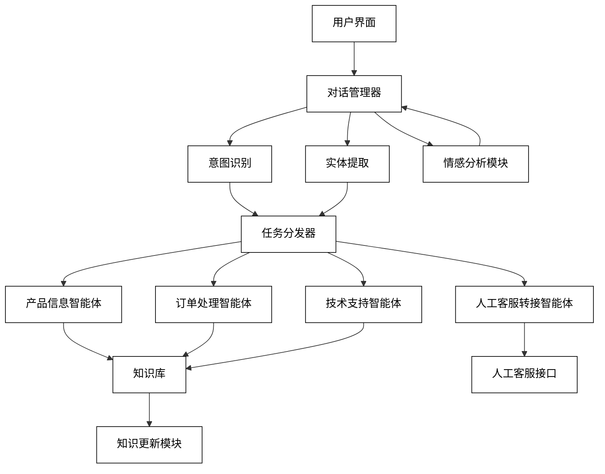
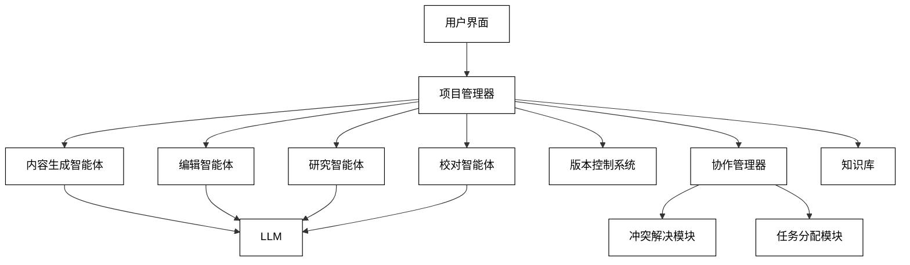

# 6 应用实例与案例分析

在本章中，我们将探讨基于LLM的多智能体系统在各种实际应用场景中的实现和效果。我们将详细分析五个具体的应用案例：智能客服系统、协作式内容创作平台、智能教育辅助系统、金融决策支持系统和智能城市管理平台。每个案例都将包括系统需求与设计、实现细节、性能评估以及用户体验分析。

## 6.1 智能客服系统

智能客服系统是LLM技术的一个典型应用场景，它能够大大提高客户服务的效率和质量。在这个案例中，我们将探讨如何使用基于LLM的多智能体系统来构建一个先进的智能客服平台。

### 6.1.1 系统需求与设计

1. 系统需求：
    - 能够处理多种类型的客户询问，包括产品信息、订单状态、技术支持等。
    - 支持多轮对话，能够理解上下文并保持对话连贯性。
    - 能够实时学习和更新知识库。
    - 支持多语言交互。
    - 能够识别复杂查询并适时转接人工客服。
    - 提供个性化的客户体验。
    - 具备情感分析能力，能够适当回应客户情绪。

2. 系统设计：



### 6.1.2 多智能体协作处理客户询问

以下是智能客服系统的核心组件实现示例：

1. 对话管理器

```python
class DialogueManager:
    def __init__(self, llm):
        self.llm = llm
        self.context = []

    async def process_input(self, user_input: str) -> str:
        self.context.append(f"User: {user_input}")
        
        prompt = f"""
Based on the following conversation context, generate an appropriate response:

{' '.join(self.context[-5:])}Assistant:
"""
        response = await self.llm.generate(prompt)
        self.context.append(f"Assistant: {response}")
        return response

2. 意图识别和实体提取

```python
class IntentEntityExtractor:
    def __init__(self, llm):
        self.llm = llm

    async def extract(self, user_input: str) -> Dict[str, Any]:
        prompt = f"""
Analyze the following user input and extract the intent and entities:

User Input: {user_input}

Provide the result in the following JSON format:
{{
    "intent": "intent_name",
    "entities": [
        {{"name": "entity_name", "value": "entity_value"}}
    ]
}}

Result:
"""
        result = await self.llm.generate(prompt)
        return json.loads(result)

3. 任务分发器

```python
class TaskDispatcher:
    def __init__(self, agents):
        self.agents = agents

    async def dispatch(self, intent: str, entities: List[Dict[str, str]]) -> str:
        if intent == "product_info":
            return await self.agents["product_info"].handle(entities)
        elif intent == "order_status":
            return await self.agents["order_processing"].handle(entities)
        elif intent == "technical_support":
            return await self.agents["technical_support"].handle(entities)
        else:
            return await self.agents["human_handoff"].handle(entities)

4. 产品信息智能体

```python
class ProductInfoAgent:
    def __init__(self, llm, knowledge_base):
        self.llm = llm
        self.knowledge_base = knowledge_base

    async def handle(self, entities: List[Dict[str, str]]) -> str:
        product_name = next((entity["value"] for entity in entities if entity["name"] == "product"), None)
        if not product_name:
            return "I'm sorry, but I couldn't identify the product you're asking about. Could you please provide more details?"

        product_info = await self.knowledge_base.query(f"Product information for {product_name}")
        
        prompt = f"""
Based on the following product information, provide a helpful response to the user's query about {product_name}:

{product_info}

Response:
"""
        return await self.llm.generate(prompt)

5. 情感分析模块

```python
class SentimentAnalyzer:
    def __init__(self, llm):
        self.llm = llm

    async def analyze(self, user_input: str) -> str:
        prompt = f"""
Analyze the sentiment of the following user input:

User Input: {user_input}

Provide the sentiment (positive, neutral, or negative) and a brief explanation.

Result:
"""
        return await self.llm.generate(prompt)

6. 主控制流程

```python
class IntelligentCustomerService:
    def __init__(self, llm):
        self.llm = llm
        self.dialogue_manager = DialogueManager(llm)
        self.intent_entity_extractor = IntentEntityExtractor(llm)
        self.sentiment_analyzer = SentimentAnalyzer(llm)
        self.knowledge_base = KnowledgeBase(llm)
        
        self.agents = {
            "product_info": ProductInfoAgent(llm, self.knowledge_base),
            "order_processing": OrderProcessingAgent(llm, self.knowledge_base),
            "technical_support": TechnicalSupportAgent(llm, self.knowledge_base),
            "human_handoff": HumanHandoffAgent(llm)
        }
        
        self.task_dispatcher = TaskDispatcher(self.agents)

    async def process_user_input(self, user_input: str) -> str:
        # 情感分析
        sentiment = await self.sentiment_analyzer.analyze(user_input)
        
        # 意图和实体提取
        intent_entities = await self.intent_entity_extractor.extract(user_input)
        
        # 任务分发
        agent_response = await self.task_dispatcher.dispatch(intent_entities["intent"], intent_entities["entities"])
        
        # 生成最终响应
        final_response = await self.dialogue_manager.process_input(f"{sentiment}\n{agent_response}")
        
        return final_response

# 使用示例
async def main():
    llm = SomeLLMImplementation()  # 替换为实际的LLM实现
    customer_service = IntelligentCustomerService(llm)
    
    user_inputs = [
        "What are the features of your latest smartphone?",
        "I haven't received my order yet, it's been a week!",
        "How do I reset my password?",
        "Your product is terrible, I want a refund!"
    ]
    
    for user_input in user_inputs:
        print(f"User: {user_input}")
        response = await customer_service.process_user_input(user_input)
        print(f"Assistant: {response}\n")

asyncio.run(main())
```

### 6.1.3 性能评估与用户体验分析

为了评估智能客服系统的性能和用户体验，我们可以采用以下方法：

1. 响应时间分析：
    - 使用性能监控工具记录每个请求的处理时间。
    - 计算平均响应时间、90th百分位数和99th百分位数。
    - 设置目标响应时间（如95%的请求在2秒内完成），并持续监控是否达标。

2. 准确性评估：
    - 创建一个标准测试集，包含各种类型的客户询问。
    - 使用人工评估或自动化测试来检查系统响应的准确性。
    - 计算准确率、精确率、召回率和F1分数。

3. 对话完成率：
    - 跟踪成功解决客户问题的对话比例。
    - 分析需要人工干预的对话，找出系统的不足之处。

4. 用户满意度调查：
    - 在对话结束时进行简短的满意度调查。
    - 收集定性反馈，了解用户的具体建议和抱怨。

5. A/B测试：
    - 对系统的不同版本或配置进行A/B测试，比较它们的性能。

6. 长期学习效果分析：
    - 跟踪系统随时间的改进情况，包括准确性提升和需要人工干预的比例下降。

7. 多语言支持评估：
    - 测试系统在不同语言下的表现，确保多语言支持的质量一致。

8. 压力测试：
    - 模拟高并发场景，测试系统的稳定性和可扩展性。

性能评估示例代码：

```python
import time
import statistics
from sklearn.metrics import accuracy_score, precision_score, recall_score, f1_score

class PerformanceEvaluator:
    def __init__(self):
        self.response_times = []
        self.accuracy_scores = []
        self.user_ratings = []

    def record_response_time(self, start_time, end_time):
        self.response_times.append(end_time - start_time)

    def record_accuracy(self, true_label, predicted_label):
        self.accuracy_scores.append(true_label == predicted_label)

    def record_user_rating(self, rating):
        self.user_ratings.append(rating)

    def get_performance_metrics(self):
        avg_response_time = statistics.mean(self.response_times)
        p90_response_time = statistics.quantiles(self.response_times, n=10)[-1]
        p99_response_time = statistics.quantiles(self.response_times, n=100)[-1]
        
        accuracy = accuracy_score(self.accuracy_scores, [True] * len(self.accuracy_scores))
        
        avg_user_rating = statistics.mean(self.user_ratings)
        
        return {
            "avg_response_time": avg_response_time,
            "p90_response_time": p90_response_time,
            "p99_response_time": p99_response_time,
            "accuracy": accuracy,
            "avg_user_rating": avg_user_rating
        }

# 使用示例
async def evaluate_system(customer_service, test_cases):
    evaluator = PerformanceEvaluator()
    
    for test_case in test_cases:
        start_time = time.time()
        response = await customer_service.process_user_input(test_case["input"])
        end_time = time.time()
        
        evaluator.record_response_time(start_time, end_time)
        evaluator.record_accuracy(test_case["expected_intent"], response["intent"])
        evaluator.record_user_rating(test_case["user_rating"])
    
    performance_metrics = evaluator.get_performance_metrics()
    print("Performance Metrics:")
    for metric, value in performance_metrics.items():
        print(f"{metric}: {value}")

# 运行评估
test_cases = [
    {"input": "What's the price of your latest phone?", "expected_intent": "product_info", "user_rating": 4},
    {"input": "I need help setting up my email", "expected_intent": "technical_support", "user_rating": 3},
    # 添加更多测试用例...
]

asyncio.run(evaluate_system(customer_service, test_cases))
```

通过这种全面的性能评估和用户体验分析，我们可以持续改进智能客服系统，提高其效率和用户满意度。关键的改进方向可能包括：

1. 优化LLM模型，提高响应速度和准确性。
2. 扩展知识库，覆盖更多的客户询问类型。
3. 改进情感分析算法，使系统能更好地理解和回应客户情绪。
4. 优化人工干预的触发机制，确保复杂问题能及时转接人工客服。
5. 增强系统的学习能力，使其能从每次交互中不断改进。

通过这个智能客服系统的案例，我们可以看到基于LLM的多智能体系统如何在实际应用中发挥作用。这种系统不仅能够提高客户服务的效率和质量，还能通过持续学习和优化不断提升其性能，为企业带来显著的价值。

## 6.2 协作式内容创作平台

协作式内容创作平台是一个利用LLM技术和多智能体系统来辅助和增强内容创作过程的创新应用。这种平台可以帮助作者、编辑和其他创作者更高效地生成、编辑和优化各种类型的内容。在本节中，我们将详细探讨如何设计和实现这样一个平台。

### 6.2.1 多智能体写作与编辑流程

1. 系统架构设计



2. 核心组件实现

a. 项目管理器

```python
class Project:
    def __init__(self, title, description, content_type):
        self.title = title
        self.description = description
        self.content_type = content_type
        self.sections = []
        self.version_history = []

class ProjectManager:
    def __init__(self, llm):
        self.llm = llm
        self.projects = {}

    async def create_project(self, title, description, content_type):
        project = Project(title, description, content_type)
        self.projects[title] = project
        await self.generate_outline(project)
        return project

    async def generate_outline(self, project):
        prompt = f"""
Create an outline for a {project.content_type} with the following title and description:

Title: {project.title}
Description: {project.description}

Provide the outline in the following format:
1. Section Title
   1.1 Subsection
   1.2 Subsection
2. Section Title
   2.1 Subsection
   2.2 Subsection

Outline:
"""
        outline = await self.llm.generate(prompt)
        project.sections = self.parse_outline(outline)

    def parse_outline(self, outline):
        # 解析大纲文本，返回结构化的章节列表
        # 这里省略具体实现
        pass

    async def get_project_status(self, title):
        project = self.projects.get(title)
        if not project:
            return None
        return {
            "title": project.title,
            "description": project.description,
            "content_type": project.content_type,
            "sections": [{"title": section.title, "status": section.status} for section in project.sections],
            "version_count": len(project.version_history)
        }

b. 内容生成智能体

```python
class ContentGenerationAgent:
    def __init__(self, llm):
        self.llm = llm

    async def generate_content(self, project, section):
        prompt = f"""
Generate content for the following section of the {project.content_type} titled "{project.title}":

Section: {section.title}

Consider the following context:
{project.description}

Generate detailed and engaging content for this section.

Content:
"""
        content = await self.llm.generate(prompt)
        return content

c. 编辑智能体

```python
class EditingAgent:
    def __init__(self, llm):
        self.llm = llm

    async def edit_content(self, content, style_guide):
        prompt = f"""
Edit the following content according to the provided style guide:

Style Guide:
{style_guide}

Content:
{content}

Provide the edited version of the content.

Edited Content:
"""
        edited_content = await self.llm.generate(prompt)
        return edited_content

    async def suggest_improvements(self, content):
        prompt = f"""
Analyze the following content and suggest improvements:

Content:
{content}

Provide specific suggestions for improving the content, such as areas to expand, clarify, or restructure.

Improvement Suggestions:
"""
        suggestions = await self.llm.generate(prompt)
        return suggestions

d. 研究智能体

```python
class ResearchAgent:
    def __init__(self, llm, knowledge_base):
        self.llm = llm
        self.knowledge_base = knowledge_base

    async def research_topic(self, topic):
        relevant_info = await self.knowledge_base.query(topic)
        prompt = f"""
Based on the following information, provide a comprehensive research summary on the topic: {topic}

Relevant Information:
{relevant_info}

Summarize the key points, identify any controversies or debates, and highlight recent developments or trends.

Research Summary:
"""
        summary = await self.llm.generate(prompt)
        return summary

    async def fact_check(self, content):
        prompt = f"""
Fact-check the following content and identify any potential inaccuracies or areas that require verification:

Content:
{content}

List any statements that need verification, along with suggested sources for fact-checking.

Fact-Check Results:
"""
        fact_check_results = await self.llm.generate(prompt)
        return fact_check_results

e. 校对智能体

```python
class ProofreadingAgent:
    def __init__(self, llm):
        self.llm = llm

    async def proofread(self, content):
        prompt = f"""
Proofread the following content for grammar, spelling, punctuation, and style consistency:

Content:
{content}

Provide a list of corrections and suggestions for improvement.

Proofreading Results:
"""
        proofreading_results = await self.llm.generate(prompt)
        return proofreading_results

f. 协作管理器

```python
class CollaborationManager:
    def __init__(self, llm):
        self.llm = llm
        self.tasks = []

    async def assign_tasks(self, project, team_members):
        prompt = f"""
Assign tasks for the following project to the given team members:

Project: {project.title}
Description: {project.description}
Sections: {[section.title for section in project.sections]}

Team Members: {', '.join(team_members)}

Provide task assignments in the following format:
Team Member: Task Description

Task Assignments:
"""
        assignments = await self.llm.generate(prompt)
        self.tasks = self.parse_assignments(assignments)
        return self.tasks

    def parse_assignments(self, assignments):
        # 解析任务分配文本，返回结构化的任务列表
        # 这里省略具体实现
        pass

    async def resolve_conflict(self, conflicting_versions):
        prompt = f"""
Resolve the conflict between the following versions of content:

Version 1:
{conflicting_versions[0]}

Version 2:
{conflicting_versions[1]}

Merge the two versions, keeping the best elements of both and ensuring consistency.

Resolved Version:
"""
        resolved_version = await self.llm.generate(prompt)
        return resolved_version

### 6.2.2 角色分配与专业知识整合

在协作式内容创作平台中，有效地分配角色并整合专业知识是提高内容质量和创作效率的关键。以下是一个实现这一目标的示例：

```python
class ExpertiseManager:
    def __init__(self, llm):
        self.llm = llm
        self.expert_profiles = {}

    async def create_expert_profile(self, name, expertise_areas, experience_level):
        self.expert_profiles[name] = {
            "expertise_areas": expertise_areas,
            "experience_level": experience_level
        }

    async def assign_experts(self, project, available_experts):
        project_requirements = await self.analyze_project_requirements(project)
        assignments = {}

        for section in project.sections:
            best_expert = await self.find_best_expert(section, project_requirements, available_experts)
            assignments[section.title] = best_expert

        return assignments

    async def analyze_project_requirements(self, project):
        prompt = f"""
Analyze the following project and identify the key areas of expertise required:

Project Title: {project.title}
Description: {project.description}
Content Type: {project.content_type}
Sections: {[section.title for section in project.sections]}

List the main areas of expertise needed for this project, along with their importance (high, medium, low).

Expertise Requirements:
"""
        requirements = await self.llm.generate(prompt)
        return self.parse_requirements(requirements)

    def parse_requirements(self, requirements):
        # 解析需求文本，返回结构化的需求列表
        # 这里省略具体实现
        pass

    async def find_best_expert(self, section, project_requirements, available_experts):
        section_requirements = [req for req in project_requirements if req["relevance"] to section.title is high]
        expert_scores = {}

        for expert in available_experts:
            profile = self.expert_profiles.get(expert)
            if not profile:
                continue

            score = self.calculate_expert_score(profile, section_requirements)
            expert_scores[expert] = score

        return max(expert_scores, key=expert_scores.get)

    def calculate_expert_score(self, profile, requirements):
        score = 0
        for req in requirements:
            if req["expertise"] in profile["expertise_areas"]:
                score += req["importance"] * profile["experience_level"]
        return score

class IntegratedContentCreationSystem:
    def __init__(self, llm):
        self.llm = llm
        self.project_manager = ProjectManager(llm)
        self.content_generator = ContentGenerationAgent(llm)
        self.editor = EditingAgent(llm)
        self.researcher = ResearchAgent(llm, KnowledgeBase(llm))
        self.proofreader = ProofreadingAgent(llm)
        self.collaboration_manager = CollaborationManager(llm)
        self.expertise_manager = ExpertiseManager(llm)

    async def create_content(self, project_title, team_members):
        project = await self.project_manager.create_project(project_title, "Project description", "article")
        expert_assignments = await self.expertise_manager.assign_experts(project, team_members)
        tasks = await self.collaboration_manager.assign_tasks(project, team_members)

        for section in project.sections:
            expert = expert_assignments[section.title]
            content = await self.content_generator.generate_content(project, section)
            researched_content = await self.researcher.research_topic(section.title)
            integrated_content = await self.integrate_content(content, researched_content)
            edited_content = await self.editor.edit_content(integrated_content, "Style guide")
            proofread_content = await self.proofreader.proofread(edited_content)
            section.content = proofread_content

        return project

    async def integrate_content(self, generated_content, researched_content):
        prompt = f"""
Integrate the following generated content with the researched information:

Generated Content:
{generated_content}

Researched Information:
{researched_content}

Provide a cohesive and well-integrated version that combines the original content with the research findings.

Integrated Content:
"""
        integrated_content = await self.llm.generate(prompt)
        return integrated_content

# 使用示例
async def main():
    llm = SomeLLMImplementation()  # 替换为实际的LLM实现
    system = IntegratedContentCreationSystem(llm)

    # 创建专家档案
    await system.expertise_manager.create_expert_profile("Alice", ["machine learning", "data science"], 5)
    await system.expertise_manager.create_expert_profile("Bob", ["web development", "user experience"], 4)
    await system.expertise_manager.create_expert_profile("Charlie", ["content marketing", "SEO"], 3)

    # 创建内容
    project = await system.create_content("The Future of AI in Web Development", ["Alice", "Bob", "Charlie"])

    # 输出结果
    print(f"Project: {project.title}")
    for section in project.sections:
        print(f"\nSection: {section.title}")
        print(f"Content: {section.content[:200]}...")  # 只打印前200个字符

asyncio.run(main())
```

### 6.2.3 创意生成与质量控制机制

为了确保生成的内容既富有创意又保持高质量，我们可以实现以下机制：

1. 创意生成器

```python
class CreativityEngine:
    def __init__(self, llm):
        self.llm = llm

    async def generate_creative_ideas(self, topic, num_ideas=5):
        prompt = f"""
Generate {num_ideas} creative and innovative ideas related to the following topic:

Topic: {topic}

Provide unique perspectives, unexpected connections, or novel approaches. Each idea should be briefly described.

Creative Ideas:
"""
        ideas = await self.llm.generate(prompt)
        return self.parse_ideas(ideas)

    def parse_ideas(self, ideas):
        # 解析创意文本，返回结构化的创意列表
        # 这里省略具体实现
        pass

    async def evaluate_creativity(self, content):
        prompt = f"""
Evaluate the creativity and originality of the following content:

Content:
{content}

Provide a creativity score (1-10) and explain your reasoning. Consider factors such as novelty, uniqueness, and innovative thinking.

Creativity Evaluation:
"""
        evaluation = await self.llm.generate(prompt)
        return self.parse_evaluation(evaluation)

    def parse_evaluation(self, evaluation):
        # 解析评估文本，返回结构化的评估结果
        # 这里省略具体实现
        pass

2. 质量控制系统

```python
class QualityControlSystem:
    def __init__(self, llm):
        self.llm = llm

    async def assess_quality(self, content, criteria):
        prompt = f"""
Assess the quality of the following content based on the given criteria:

Content:
{content}

Criteria:
{criteria}

Provide a detailed quality assessment, including scores for each criterion and suggestions for improvement.

Quality Assessment:
"""
        assessment = await self.llm.generate(prompt)
        return self.parse_assessment(assessment)

    def parse_assessment(self, assessment):
        # 解析评估文本，返回结构化的评估结果
        # 这里省略具体实现
        pass

    async def enforce_guidelines(self, content, guidelines):
        prompt = f"""
Ensure the following content adheres to the provided guidelines:

Content:
{content}

Guidelines:
{guidelines}

If any guidelines are not met, provide specific corrections or suggestions to bring the content into compliance.

Guideline Enforcement Results:
"""
        results = await self.llm.generate(prompt)
        return self.parse_results(results)

    def parse_results(self, results):
        # 解析结果文本，返回结构化的执行结果
        # 这里省略具体实现
        pass

3. 集成创意生成和质量控制

```python
class CreativeContentCreationSystem(IntegratedContentCreationSystem):
    def __init__(self, llm):
        super().__init__(llm)
        self.creativity_engine = CreativityEngine(llm)
        self.quality_control = QualityControlSystem(llm)

    async def create_content(self, project_title, team_members):
        project = await super().create_content(project_title, team_members)

        for section in project.sections:
            creative_ideas = await self.creativity_engine.generate_creative_ideas(section.title)
            enhanced_content = await self.enhance_with_creative_ideas(section.content, creative_ideas)
            section.content = enhanced_content

            quality_assessment = await self.quality_control.assess_quality(section.content, "Quality criteria")
            if quality_assessment["overall_score"] < 8:
                improved_content = await self.improve_content_quality(section.content, quality_assessment["suggestions"])
                section.content = improved_content

        return project

    async def enhance_with_creative_ideas(self, content, creative_ideas):
        prompt = f"""
Enhance the following content by incorporating these creative ideas:

Original Content:
{content}

Creative Ideas:
{creative_ideas}

Provide an enhanced version of the content that seamlessly integrates the creative ideas while maintaining coherence and flow.

Enhanced Content:
"""
        enhanced_content = await self.llm.generate(prompt)
        return enhanced_content

    async def improve_content_quality(self, content, suggestions):
        prompt = f"""
Improve the following content based on these quality improvement suggestions:

Original Content:
{content}

Improvement Suggestions:
{suggestions}

Provide an improved version of the content that addresses all the suggestions and enhances overall quality.

Improved Content:
"""
        improved_content = await self.llm.generate(prompt)
        return improved_content

# 使用示例
async def main():
    llm = SomeLLMImplementation()  # 替换为实际的LLM实现
    system = CreativeContentCreationSystem(llm)

    # 创建专家档案
    await system.expertise_manager.create_expert_profile("Alice", ["machine learning", "data science"], 5)
    await system.expertise_manager.create_expert_profile("Bob", ["web development", "user experience"], 4)
    await system.expertise_manager.create_expert_profile("Charlie", ["content marketing", "SEO"], 3)

    # 创建内容
    project = await system.create_content("The Future of AI in Web Development", ["Alice", "Bob", "Charlie"])

    # 输出结果
    print(f"Project: {project.title}")
    for section in project.sections:
        print(f"\nSection: {section.title}")
        print(f"Content: {section.content[:200]}...")  # 只打印前200个字符
        creativity_score = await system.creativity_engine.evaluate_creativity(section.content)
        print(f"Creativity Score: {creativity_score['score']}")
        quality_assessment = await system.quality_control.assess_quality(section.content, "Quality criteria")
        print(f"Quality Score: {quality_assessment['overall_score']}")

asyncio.run(main())
```

这个协作式内容创作平台展示了如何利用LLM和多智能体系统来增强内容创作过程。通过整合专业知识、促进协作、生成创意想法并确保内容质量，该系统可以显著提高内容创作的效率和质量。

主要优势包括：

1. 自动化的内容生成和编辑流程，减少人工工作量。
2. 基于专业知识的智能任务分配，确保每个部分由最合适的专家处理。
3. 创意生成引擎，为内容注入新颖和独特的想法。
4. 严格的质量控制机制，确保最终内容符合高标准。
5. 灵活的协作管理，支持团队成员之间的有效沟通和任务协调。

这种系统特别适用于需要高质量、创新内容的场景，如数字营销、技术博客、教育材料制作等。通过不断学习和优化，系统可以逐步提高其生成和编辑能力，为用户提供越来越优质的内容创作支持。## 6.3 智能教育辅助系统

智能教育辅助系统是利用LLM和多智能体技术来提升教育效果的创新应用。这种系统可以为学生提供个性化的学习体验，同时为教师提供有力的教学支持。本节将详细探讨如何设计和实现这样一个系统。

### 6.3.1 个性化学习路径规划

个性化学习路径规划是智能教育辅助系统的核心功能之一。它能够根据学生的学习风格、知识水平和学习目标来定制最适合的学习计划。

```python
import asyncio
from typing import List, Dict, Any

class LearningStyle:
    def __init__(self, visual: float, auditory: float, kinesthetic: float):
        self.visual = visual
        self.auditory = auditory
        self.kinesthetic = kinesthetic

class Student:
    def __init__(self, name: str, knowledge_level: Dict[str, float], learning_style: LearningStyle):
        self.name = name
        self.knowledge_level = knowledge_level
        self.learning_style = learning_style

class LearningPathPlanner:
    def __init__(self, llm):
        self.llm = llm

    async def create_learning_path(self, student: Student, subject: str, target_level: float) -> List[Dict[str, Any]]:
        current_level = student.knowledge_level.get(subject, 0)
        prompt = f"""
Create a personalized learning path for a student with the following characteristics:

Name: {student.name}
Current knowledge level in {subject}: {current_level}
Target knowledge level: {target_level}
Learning style:
- Visual: {student.learning_style.visual}
- Auditory: {student.learning_style.auditory}
- Kinesthetic: {student.learning_style.kinesthetic}

Provide a step-by-step learning path that includes:
1. Topics to cover
2. Recommended learning resources (considering the student's learning style)
3. Estimated time for each step
4. Milestones and assessments

Present the learning path in a structured JSON format.

Learning Path:
"""
        learning_path_json = await self.llm.generate(prompt)
        return self.parse_learning_path(learning_path_json)

    def parse_learning_path(self, learning_path_json: str) -> List[Dict[str, Any]]:
        # 解析JSON格式的学习路径，返回结构化的学习计划
        # 这里省略具体实现
        pass

class AdaptiveLearningSystem:
    def __init__(self, llm):
        self.llm = llm
        self.learning_path_planner = LearningPathPlanner(llm)

    async def adapt_learning_path(self, student: Student, current_path: List[Dict[str, Any]], progress: float) -> List[Dict[str, Any]]:
        prompt = f"""
Adapt the current learning path based on the student's progress:

Student: {student.name}
Current progress: {progress * 100}%

Current learning path:
{current_path}

Provide an adapted learning path that addresses any difficulties or accelerates learning if the student is progressing faster than expected. Present the adapted path in the same structured JSON format.

Adapted Learning Path:
"""
        adapted_path_json = await self.llm.generate(prompt)
        return self.learning_path_planner.parse_learning_path(adapted_path_json)

    async def generate_practice_questions(self, topic: str, difficulty: float) -> List[Dict[str, Any]]:
        prompt = f"""
Generate a set of practice questions for the following topic:

Topic: {topic}
Difficulty level: {difficulty} (0-1 scale)

Provide 5 questions with varying formats (multiple choice, short answer, etc.) along with their correct answers and explanations. Present the questions in a structured JSON format.

Practice Questions:
"""
        questions_json = await self.llm.generate(prompt)
        return self.parse_practice_questions(questions_json)

    def parse_practice_questions(self, questions_json: str) -> List[Dict[str, Any]]:
        # 解析JSON格式的练习题，返回结构化的问题列表
        # 这里省略具体实现
        pass

# 使用示例
async def main():
    llm = SomeLLMImplementation()  # 替换为实际的LLM实现
    learning_system = AdaptiveLearningSystem(llm)

    student = Student(
        name="Alice",
        knowledge_level={"Math": 0.6, "Physics": 0.4},
        learning_style=LearningStyle(visual=0.7, auditory=0.2, kinesthetic=0.1)
    )

    # 创建初始学习路径
    initial_path = await learning_system.learning_path_planner.create_learning_path(student, "Physics", 0.8)
    print("Initial Learning Path:")
    print(initial_path)

    # 模拟学习进度并调整路径
    progress = 0.3
    adapted_path = await learning_system.adapt_learning_path(student, initial_path, progress)
    print("\nAdapted Learning Path:")
    print(adapted_path)

    # 生成练习题
    practice_questions = await learning_system.generate_practice_questions("Newton's Laws of Motion", 0.6)
    print("\nPractice Questions:")
    print(practice_questions)

asyncio.run(main())
```

### 6.3.2 多角色教学支持（导师、助教、同伴）

智能教育辅助系统可以模拟不同角色来提供全面的教学支持。以下是一个实现多角色教学支持的示例：

```python
class TeachingRole:
    def __init__(self, llm):
        self.llm = llm

    async def provide_support(self, student: Student, context: Dict[str, Any]) -> str:
        raise NotImplementedError

class Tutor(TeachingRole):
    async def provide_support(self, student: Student, context: Dict[str, Any]) -> str:
        prompt = f"""
As a tutor, provide personalized guidance to the following student:

Student: {student.name}
Topic: {context['topic']}
Current understanding: {context['current_understanding']}
Learning style: {student.learning_style.__dict__}

Offer explanations, examples, and guidance tailored to the student's learning style and current understanding. Your response should be encouraging and supportive.

Tutor's Guidance:
"""
        return await self.llm.generate(prompt)

class TeachingAssistant(TeachingRole):
    async def provide_support(self, student: Student, context: Dict[str, Any]) -> str:
        prompt = f"""
As a teaching assistant, help the student with their current task:

Student: {student.name}
Task: {context['task']}
Current progress: {context['progress']}
Difficulties: {context['difficulties']}

Provide step-by-step assistance to help the student overcome their difficulties and complete the task. Your response should be clear and instructive.

Teaching Assistant's Help:
"""
        return await self.llm.generate(prompt)

class PeerLearner(TeachingRole):
    async def provide_support(self, student: Student, context: Dict[str, Any]) -> str:
        prompt = f"""
As a peer learner, engage in a collaborative learning session with the following student:

Student: {student.name}
Topic: {context['topic']}
Discussion point: {context['discussion_point']}

Simulate a peer-to-peer discussion on the given topic. Your response should encourage critical thinking, share insights, and ask thought-provoking questions.

Peer Learner's Response:
"""
        return await self.llm.generate(prompt)

class MultiRoleTeachingSystem:
    def __init__(self, llm):
        self.llm = llm
        self.roles = {
            "tutor": Tutor(llm),
            "teaching_assistant": TeachingAssistant(llm),
            "peer_learner": PeerLearner(llm)
        }

    async def get_support(self, student: Student, role: str, context: Dict[str, Any]) -> str:
        if role not in self.roles:
            raise ValueError(f"Unknown role: {role}")
        return await self.roles[role].provide_support(student, context)

# 使用示例
async def main():
    llm = SomeLLMImplementation()  # 替换为实际的LLM实现
    teaching_system = MultiRoleTeachingSystem(llm)

    student = Student(
        name="Bob",
        knowledge_level={"Math": 0.5, "Physics": 0.3},
        learning_style=LearningStyle(visual=0.4, auditory=0.4, kinesthetic=0.2)
    )

    # 获取导师支持
    tutor_context = {
        "topic": "Calculus - Derivatives",
        "current_understanding": "Basic concept of rate of change"
    }
    tutor_support = await teaching_system.get_support(student, "tutor", tutor_context)
    print("Tutor Support:")
    print(tutor_support)

    # 获取助教支持
    ta_context = {
        "task": "Solve a differential equation",
        "progress": "Stuck on setting up the equation",
        "difficulties": "Identifying the correct variables"
    }
    ta_support = await teaching_system.get_support(student, "teaching_assistant", ta_context)
    print("\nTeaching Assistant Support:")
    print(ta_support)

    # 获取同伴学习者支持
    peer_context = {
        "topic": "Applications of derivatives in real-world problems",
        "discussion_point": "How derivatives are used in optimization problems"
    }
    peer_support = await teaching_system.get_support(student, "peer_learner", peer_context)
    print("\nPeer Learner Support:")
    print(peer_support)

asyncio.run(main())
```

### 6.3.3 学习效果评估与反馈

为了确保学习的有效性，系统需要持续评估学生的学习效果并提供及时的反馈。以下是一个实现学习效果评估与反馈的示例：

```python
class LearningAssessment:
    def __init__(self, llm):
        self.llm = llm

    async def assess_understanding(self, student: Student, topic: str, responses: List[Dict[str, Any]]) -> Dict[str, Any]:
        prompt = f"""
Assess the student's understanding of the topic based on their responses:

Student: {student.name}
Topic: {topic}

Responses:
{responses}

Provide an assessment that includes:
1. Overall understanding level (0-1 scale)
2. Strengths
3. Areas for improvement
4. Recommended next steps

Present the assessment in a structured JSON format.

Assessment:
"""
        assessment_json = await self.llm.generate(prompt)
        return self.parse_assessment(assessment_json)

    def parse_assessment(self, assessment_json: str) -> Dict[str, Any]:
        # 解析JSON格式的评估结果，返回结构化的评估数据
        # 这里省略具体实现
        pass

    async def generate_feedback(self, assessment: Dict[str, Any]) -> str:
        prompt = f"""
Generate constructive feedback based on the following assessment:

{assessment}

The feedback should be encouraging, specific, and actionable. Provide guidance on how the student can improve and build on their strengths.

Feedback:
"""
        return await self.llm.generate(prompt)

class LearningAnalytics:
    def __init__(self, llm):
        self.llm = llm

    async def analyze_progress(self, student: Student, subject: str, assessments: List[Dict[str, Any]]) -> Dict[str, Any]:
        prompt = f"""
Analyze the student's learning progress based on their assessment history:

Student: {student.name}
Subject: {subject}

Assessment History:
{assessments}

Provide an analysis that includes:
1. Overall progress trend
2. Identified learning patterns
3. Potential obstacles or challenges
4. Recommendations for optimizing the learning path

Present the analysis in a structured JSON format.

Learning Progress Analysis:
"""
        analysis_json = await self.llm.generate(prompt)
        return self.parse_analysis(analysis_json)

    def parse_analysis(self, analysis_json: str) -> Dict[str, Any]:
        # 解析JSON格式的分析结果，返回结构化的分析数据
        # 这里省略具体实现
        pass

class IntegratedLearningSystem:
    def __init__(self, llm):
        self.llm = llm
        self.learning_path_planner = LearningPathPlanner(llm)
        self.adaptive_learning_system = AdaptiveLearningSystem(llm)
        self.multi_role_teaching_system = MultiRoleTeachingSystem(llm)
        self.learning_assessment = LearningAssessment(llm)
        self.learning_analytics = LearningAnalytics(llm)

    async def run_learning_session(self, student: Student, subject: str, target_level: float):
        # 创建初始学习路径
        learning_path = await self.learning_path_planner.create_learning_path(student, subject, target_level)
        
        assessments = []
        for step in learning_path:
            # 提供学习材料和支持
            tutor_support = await self.multi_role_teaching_system.get_support(student, "tutor", {"topic": step["topic"], "current_understanding": "Starting to learn"})
            print(f"Tutor support for {step['topic']}:")
            print(tutor_support)

            # 生成练习题
            practice_questions = await self.adaptive_learning_system.generate_practice_questions(step["topic"], step["difficulty"])

            # 模拟学生回答（在实际应用中，这里会是学生的真实回答）
            student_responses = [{"question": q["question"], "answer": "Simulated student answer"} for q in practice_questions]

            # 评估理解程度
            assessment = await self.learning_assessment.assess_understanding(student, step["topic"], student_responses)
            assessments.append(assessment)

            # 生成反馈
            feedback = await self.learning_assessment.generate_feedback(assessment)
            print(f"\nFeedback for {step['topic']}:")
            print(feedback)

            # 适应性调整学习路径
            learning_path = await self.adaptive_learning_system.adapt_learning_path(student, learning_path, assessment["understanding_level"])

        # 分析整体学习进度
        progress_analysis = await self.learning_analytics.analyze_progress(student, subject, assessments)
        print("\nLearning Progress Analysis:")
        print(progress_analysis)

# 使用示例
async def main():
    llm = SomeLLMImplementation()  # 替换为实际的LLM实现
    learning_system = IntegratedLearningSystem(llm)

    student = Student(
        name="Charlie",
        knowledge_level={"Math": 0.4, "Physics": 0.2},
        learning_style=LearningStyle(visual=0.5, auditory=0.3, kinesthetic=0.2)
    )

    await learning_system.run_learning_session(student, "Physics", 0.7)

asyncio.run(main())
```

这个智能教育辅助系统展示了如何利用LLM和多智能体技术来创建一个全面的学习环境。系统的主要特点包括：

1. 个性化学习路径规划：根据学生的知识水平、学习风格和目标定制学习计划。
2. 自适应学习：根据学生的进度和表现动态调整学习路径。
3. 多角色教学支持：模拟导师、助教和同伴学习者，提供全方位的学习支持。
4. 实时评估和反馈：持续评估学生的理解程度，提供及时、有针对性的反馈。
5. 学习分析：分析学生的长期学习趋势，识别模式和潜在障碍。

这种系统特别适用于在线教育平台、个性化辅导系统和自适应学习软件。通过整合LLM的强大能力，系统可以提供近乎人类水平的教学支持，同时保持高度的可扩展性和个性化。

## 6.4 金融决策支持系统

金融决策支持系统是LLM和多智能体技术在金融领域的一个重要应用。这种系统可以帮助投资者、分析师和金融机构做出更明智的决策，管理风险，并优化投资策略。本节将详细探讨如何设计和实现这样一个系统。

### 6.4.1 多源数据分析与风险评估

```python
import asyncio
from typing import List, Dict, Any
import pandas as pd
import numpy as np
from sklearn.preprocessing import MinMaxScaler

class DataSource:
    def __init__(self, name: str, data: pd.DataFrame):
        self.name = name
        self.data = data

class FinancialDataAnalyzer:
    def __init__(self, llm):
        self.llm = llm

    async def analyze_data(self, data_sources: List[DataSource]) -> Dict[str, Any]:
        combined_data = self.combine_data(data_sources)
        analysis_prompt = self.create_analysis_prompt(combined_data)
        analysis_result = await self.llm.generate(analysis_prompt)
        return self.parse_analysis_result(analysis_result)

    def combine_data(self, data_sources: List[DataSource]) -> pd.DataFrame:
        # 合并多个数据源的数据
        # 这里使用一个简单的合并策略，实际应用中可能需要更复杂的数据处理
        combined_data = pd.concat([source.data for source in data_sources], axis=1)
        return combined_data

    def create_analysis_prompt(self, data: pd.DataFrame) -> str:
        # 创建数据分析提示
        data_description = data.describe().to_string()
        correlation_matrix = data.corr().to_string()
        
        prompt = f"""
Analyze the following financial data:

Data Summary:
{data_description}

Correlation Matrix:
{correlation_matrix}

Provide a comprehensive analysis including:
1. Key trends and patterns
2. Significant correlations and their implications
3. Potential anomalies or outliers
4. Overall market sentiment

Analysis:
"""
        return prompt

    def parse_analysis_result(self, analysis_result: str) -> Dict[str, Any]:
        # 解析LLM生成的分析结果
        # 这里假设LLM返回的是结构化的JSON格式
        # 实际应用中可能需要更复杂的解析逻辑
        return eval(analysis_result)

class RiskAssessor:
    def __init__(self, llm):
        self.llm = llm

    async def assess_risk(self, data: pd.DataFrame, analysis_result: Dict[str, Any]) -> Dict[str, float]:
        risk_prompt = self.create_risk_prompt(data, analysis_result)
        risk_assessment = await self.llm.generate(risk_prompt)
        return self.parse_risk_assessment(risk_assessment)

    def create_risk_prompt(self, data: pd.DataFrame, analysis_result: Dict[str, Any]) -> str:
        volatility = data.pct_change().std().to_dict()
        
        prompt = f"""
Assess the risk based on the following information:

Data Volatility:
{volatility}

Market Analysis:
{analysis_result}

Provide a risk assessment for different aspects of the market, including:
1. Overall market risk
2. Sector-specific risks
3. Individual asset risks
4. Systematic vs. unsystematic risks

Present the risk assessment as a dictionary with risk factors as keys and risk scores (0-1) as values.

Risk Assessment:
"""
        return prompt

    def parse_risk_assessment(self, risk_assessment: str) -> Dict[str, float]:
        # 解析LLM生成的风险评估结果
        return eval(risk_assessment)

class FinancialDecisionSupport:
    def __init__(self, llm):
        self.llm = llm
        self.data_analyzer = FinancialDataAnalyzer(llm)
        self.risk_assessor = RiskAssessor(llm)

    async def analyze_and_assess(self, data_sources: List[DataSource]) -> Dict[str, Any]:
        analysis_result = await self.data_analyzer.analyze_data(data_sources)
        combined_data = self.data_analyzer.combine_data(data_sources)
        risk_assessment = await self.risk_assessor.assess_risk(combined_data, analysis_result)
        
        return {
            "analysis": analysis_result,
            "risk_assessment": risk_assessment
        }

# 使用示例
async def main():
    llm = SomeLLMImplementation()  # 替换为实际的LLM实现
    financial_system = FinancialDecisionSupport(llm)

    # 模拟数据源
    stock_data = pd.DataFrame(np.random.randn(100, 5), columns=['Stock A', 'Stock B', 'Stock C', 'Stock D', 'Stock E'])
    economic_indicators = pd.DataFrame(np.random.randn(100, 3), columns=['GDP', 'Inflation', 'Unemployment'])
    market_sentiment = pd.DataFrame(np.random.randn(100, 2), columns=['Bull', 'Bear'])

    data_sources = [
        DataSource("Stock Prices", stock_data),
        DataSource("Economic Indicators", economic_indicators),
        DataSource("Market Sentiment", market_sentiment)
    ]

    result = await financial_system.analyze_and_assess(data_sources)
    
    print("Market Analysis:")
    print(result["analysis"])
    print("\nRisk Assessment:")
    print(result["risk_assessment"])

asyncio.run(main())
```

### 6.4.2 投资策略制定与模拟

```python
class InvestmentStrategy:
    def __init__(self, llm):
        self.llm = llm

    async def generate_strategy(self, analysis: Dict[str, Any], risk_assessment: Dict[str, float], investor_profile: Dict[str, Any]) -> Dict[str, Any]:
        strategy_prompt = self.create_strategy_prompt(analysis, risk_assessment, investor_profile)
        strategy = await self.llm.generate(strategy_prompt)
        return self.parse_strategy(strategy)

    def create_strategy_prompt(self, analysis: Dict[str, Any], risk_assessment: Dict[str, float], investor_profile: Dict[str, Any]) -> str:
        prompt = f"""
Generate an investment strategy based on the following information:

Market Analysis:
{analysis}

Risk Assessment:
{risk_assessment}

Investor Profile:
{investor_profile}

Provide a comprehensive investment strategy that includes:
1. Asset allocation (percentages for stocks, bonds, cash, etc.)
2. Sector focus
3. Specific investment recommendations
4. Risk management tactics
5. Timeline and milestones

Present the strategy in a structured JSON format.

Investment Strategy:
"""
        return prompt

    def parse_strategy(self, strategy: str) -> Dict[str, Any]:
        # 解析LLM生成的投资策略
        return eval(strategy)

class PortfolioSimulator:
    def __init__(self, llm):
        self.llm = llm

    async def simulate_performance(self, strategy: Dict[str, Any], market_data: pd.DataFrame, simulation_period: int) -> Dict[str, Any]:
        simulation_prompt = self.create_simulation_prompt(strategy, market_data, simulation_period)
        simulation_result = await self.llm.generate(simulation_prompt)
        return self.parse_simulation_result(simulation_result)

    def create_simulation_prompt(self, strategy: Dict[str, Any], market_data: pd.DataFrame, simulation_period: int) -> str:
        # 将市场数据转换为字符串表示
        market_data_str = market_data.to_string()

        prompt = f"""
Simulate the performance of the following investment strategy:

Strategy:
{strategy}

Market Data:
{market_data_str}

Simulation Period: {simulation_period} days

Provide a simulation result that includes:
1. Daily portfolio values
2. Overall return
3. Volatility
4. Sharpe ratio
5. Maximum drawdown
6. Performance against benchmarks

Present the simulation result in a structured JSON format.

Simulation Result:
"""
        return prompt

    def parse_simulation_result(self, simulation_result: str) -> Dict[str, Any]:
        # 解析LLM生成的模拟结果
        return eval(simulation_result)

class EnhancedFinancialDecisionSupport(FinancialDecisionSupport):
    def __init__(self, llm):
        super().__init__(llm)
        self.investment_strategy = InvestmentStrategy(llm)
        self.portfolio_simulator = PortfolioSimulator(llm)

    async def generate_and_simulate_strategy(self, data_sources: List[DataSource], investor_profile: Dict[str, Any], simulation_period: int) -> Dict[str, Any]:
        analysis_and_risk = await self.analyze_and_assess(data_sources)
        
        strategy = await self.investment_strategy.generate_strategy(
            analysis_and_risk["analysis"],
            analysis_and_risk["risk_assessment"],
            investor_profile
        )
        
        combined_data = self.data_analyzer.combine_data(data_sources)
        simulation_result = await self.portfolio_simulator.simulate_performance(strategy, combined_data, simulation_period)
        
        return {
            "analysis": analysis_and_risk["analysis"],
            "risk_assessment": analysis_and_risk["risk_assessment"],
            "strategy": strategy,
            "simulation": simulation_result
        }

# 使用示例
async def main():
    llm = SomeLLMImplementation()  # 替换为实际的LLM实现
    financial_system = EnhancedFinancialDecisionSupport(llm)

    # 模拟数据源
    stock_data = pd.DataFrame(np.random.randn(100, 5), columns=['Stock A', 'Stock B', 'Stock C', 'Stock D', 'Stock E'])
    economic_indicators = pd.DataFrame(np.random.randn(100, 3), columns=['GDP', 'Inflation', 'Unemployment'])
    market_sentiment = pd.DataFrame(np.random.randn(100, 2), columns=['Bull', 'Bear'])

    data_sources = [
        DataSource("Stock Prices", stock_data),
        DataSource("Economic Indicators", economic_indicators),
        DataSource("Market Sentiment", market_sentiment)
    ]

    investor_profile = {
        "risk_tolerance": "moderate",
        "investment_horizon": "5 years",
        "goals": ["capital growth", "income generation"],
        "constraints": ["no more than 20% in any single stock"]
    }

    result = await financial_system.generate_and_simulate_strategy(data_sources, investor_profile, simulation_period=30)
    
    print("Market Analysis:")
    print(result["analysis"])
    print("\nRisk Assessment:")
    print(result["risk_assessment"])
    print("\nInvestment Strategy:")
    print(result["strategy"])
    print("\nSimulation Result:")
    print(result["simulation"])

asyncio.run(main())
```

### 6.4.3 实时市场监控与预警

```python
import asyncio
import random
from typing import List, Dict, Any

class MarketMonitor:
    def __init__(self, llm):
        self.llm = llm
        self.thresholds = {}

    async def set_alert_thresholds(self, asset: str, metrics: Dict[str, Dict[str, float]]):
        self.thresholds[asset] = metrics

    async def monitor_market(self, market_data: pd.DataFrame) -> List[Dict[str, Any]]:
        alerts = []
        for asset in market_data.columns:
            if asset in self.thresholds:
                asset_data = market_data[asset]
                asset_alerts = await self.check_thresholds(asset, asset_data)
                alerts.extend(asset_alerts)
        return alerts

    async def check_thresholds(self, asset: str, asset_data: pd.Series) -> List[Dict[str, Any]]:
        alerts = []
        for metric, threshold in self.thresholds[asset].items():
            if metric == "price":
                if asset_data.iloc[-1] <= threshold["low"]:
                    alerts.append({"asset": asset, "metric": metric, "type": "low", "value": asset_data.iloc[-1]})
                elif asset_data.iloc[-1] >= threshold["high"]:
                    alerts.append({"asset": asset, "metric": metric, "type": "high", "value": asset_data.iloc[-1]})
            elif metric == "volatility":
                volatility = asset_data.pct_change().std()
                if volatility >= threshold["max"]:
                    alerts.append({"asset": asset, "metric": metric, "type": "high", "value": volatility})
        return alerts

class AlertAnalyzer:
    def __init__(self, llm):
        self.llm = llm

    async def analyze_alerts(self, alerts: List[Dict[str, Any]], market_context: Dict[str, Any]) -> Dict[str, Any]:
        analysis_prompt = self.create_analysis_prompt(alerts, market_context)
        analysis = await self.llm.generate(analysis_prompt)
        return self.parse_analysis(analysis)

    def create_analysis_prompt(self, alerts: List[Dict[str, Any]], market_context: Dict[str, Any]) -> str:
        prompt = f"""
Analyze the following market alerts in the given market context:

Alerts:
{alerts}

Market Context:
{market_context}

Provide an analysis that includes:
1. Significance of each alert
2. Potential causes
3. Possible market implications
4. Recommended actions for investors

Present the analysis in a structured JSON format.

Alert Analysis:
"""
        return prompt

    def parse_analysis(self, analysis: str) -> Dict[str, Any]:
        # 解析LLM生成的分析结果
        return eval(analysis)

class RealTimeMarketMonitoringSystem(EnhancedFinancialDecisionSupport):
    def __init__(self, llm):
        super().__init__(llm)
        self.market_monitor = MarketMonitor(llm)
        self.alert_analyzer = AlertAnalyzer(llm)

    async def setup_monitoring(self, assets: List[str], thresholds: Dict[str, Dict[str, Dict[str, float]]]):
        for asset in assets:
            await self.market_monitor.set_alert_thresholds(asset, thresholds[asset])

    async def monitor_and_analyze(self, market_data: pd.DataFrame) -> Dict[str, Any]:
        alerts = await self.market_monitor.monitor_market(market_data)
        
        if alerts:
            market_context = await self.get_market_context(market_data)
            analysis = await self.alert_analyzer.analyze_alerts(alerts, market_context)
            return {"alerts": alerts, "analysis": analysis}
        else:
            return {"alerts": [], "analysis": None}

    async def get_market_context(self, market_data: pd.DataFrame) -> Dict[str, Any]:
        # 获取市场上下文信息，如整体市场趋势、主要指数表现等
        # 这里使用一个简化的实现
        return {
            "overall_trend": "bullish" if market_data.iloc[-1].mean() > market_data.iloc[0].mean() else "bearish",
            "volatility": market_data.pct_change().std().mean(),
            "trading_volume": random.randint(1000000, 10000000)  # 模拟交易量
        }

# 使用示例
async def main():
    llm = SomeLLMImplementation()  # 替换为实际的LLM实现
    monitoring_system = RealTimeMarketMonitoringSystem(llm)

    # 设置监控阈值
    assets = ['Stock A', 'Stock B', 'Stock C', 'Stock D', 'Stock E']
    thresholds = {
        asset: {
            "price": {"low": 90, "high": 110},
            "volatility": {"max": 0.05}
        } for asset in assets
    }
    await monitoring_system.setup_monitoring(assets, thresholds)

    # 模拟市场数据
    market_data = pd.DataFrame(np.random.randn(100, 5) * 10 + 100, columns=assets)

    # 运行监控和分析
    result = await monitoring_system.monitor_and_analyze(market_data)
    
    if result["alerts"]:
        print("Alerts detected:")
        for alert in result["alerts"]:
            print(alert)
        print("\nAlert Analysis:")
        print(result["analysis"])
    else:
        print("No alerts detected.")

asyncio.run(main())
```

这个金融决策支持系统展示了如何利用LLM和多智能体技术来创建一个全面的金融分析和决策平台。系统的主要特点包括：

1. 多源数据分析：整合多个数据源，提供全面的市场分析。
2. 风险评估：基于市场数据和分析结果进行风险评估。
3. 投资策略生成：根据市场分析、风险评估和投资者档案生成个性化投资策略。
4. 投资组合模拟：模拟投资策略的表现，提供详细的性能指标。
5. 实时市场监控：持续监控市场数据，检测异常情况。
6. 智能预警分析：分析市场警报，提供洞察和建议。

这种系统特别适用于金融机构、投资顾问和专业投资者。它可以帮助用户更好地理解市场动态，管理风险，并做出更明智的投资决策。通过整合LLM的强大分析能力，系统可以处理复杂的金融数据，识别潜在的机会和威胁，并提供近乎人类专家水平的分析和建议。

在实际应用中，这个系统还可以进一步扩展和优化：

1. 增加更多数据源，如社交媒体情绪分析、公司财报数据等。
2. 实现更复杂的金融模型和算法，如机器学习预测模型。
3. 添加自然语言交互界面，允许用户通过对话方式查询和分析。
4. 集成区块链技术，提供更安全和透明的交易记录。
5. 实现自动化交易功能，根据系统建议执行交易。

通过不断学习和优化，这个系统可以成为金融专业人士的强大助手，帮助他们在复杂多变的金融市场中做出更好的决策。

## 6.5 智能城市管理平台

智能城市管理平台是LLM和多智能体系统在城市管理领域的一个创新应用。这种平台可以帮助城市管理者更有效地协调各个部门，优化资源分配，并快速响应城市问题。本节将详细探讨如何设计和实现这样一个平台。

### 6.5.1 多部门协作与资源调度

```python
import asyncio
from typing import List, Dict, Any

class Department:
    def __init__(self, name: str, resources: Dict[str, int]):
        self.name = name
        self.resources = resources

class Task:
    def __init__(self, description: str, required_resources: Dict[str, int], priority: int):
        self.description = description
        self.required_resources = required_resources
        self.priority = priority
        self.status = "pending"

class ResourceManager:
    def __init__(self, llm):
        self.llm = llm
        self.departments = {}

    def add_department(self, department: Department):
        self.departments[department.name] = department

    async def allocate_resources(self, task: Task) -> Dict[str, Any]:
        allocation_prompt = self.create_allocation_prompt(task)
        allocation_result = await self.llm.generate(allocation_prompt)
        return self.parse_allocation_result(allocation_result)

    def create_allocation_prompt(self, task: Task) -> str:
        departments_info = "\n".join([f"{name}: {dept.resources}" for name, dept in self.departments.items()])
        prompt = f"""
Allocate resources for the following task:

Task Description: {task.description}
Required Resources: {task.required_resources}
Priority: {task.priority}

Available Departments and Resources:
{departments_info}

Provide a resource allocation plan that optimizes efficiency and fairness. The plan should specify which department(s) should contribute what resources.

Present the allocation plan in a structured JSON format.

Resource Allocation Plan:
"""
        return prompt

    def parse_allocation_result(self, allocation_result: str) -> Dict[str, Any]:
        # 解析LLM生成的资源分配计划
        return eval(allocation_result)

class CollaborationCoordinator:
    def __init__(self, llm):
        self.llm = llm

    async def create_collaboration_plan(self, task: Task, allocated_resources: Dict[str, Any]) -> Dict[str, Any]:
        plan_prompt = self.create_plan_prompt(task, allocated_resources)
        collaboration_plan = await self.llm.generate(plan_prompt)
        return self.parse_collaboration_plan(collaboration_plan)

    def create_plan_prompt(self, task: Task, allocated_resources: Dict[str, Any]) -> str:
        prompt = f"""
Create a collaboration plan for the following task and resource allocation:

Task Description: {task.description}
Priority: {task.priority}
Allocated Resources: {allocated_resources}

Provide a detailed collaboration plan that includes:
1. Step-by-step actions for each department
2. Communication protocols
3. Timeline and milestones
4. Potential challenges and mitigation strategies

Present the collaboration plan in a structured JSON format.

Collaboration Plan:
"""
        return prompt

    def parse_collaboration_plan(self, collaboration_plan: str) -> Dict[str, Any]:
        # 解析LLM生成的协作计划
        return eval(collaboration_plan)

class CityManagementSystem:
    def __init__(self, llm):
        self.llm = llm
        self.resource_manager = ResourceManager(llm)
        self.collaboration_coordinator = CollaborationCoordinator(llm)
        self.tasks = []

    def add_department(self, department: Department):
        self.resource_manager.add_department(department)

    async def submit_task(self, task: Task) -> Dict[str, Any]:
        self.tasks.append(task)
        allocation = await self.resource_manager.allocate_resources(task)
        collaboration_plan = await self.collaboration_coordinator.create_collaboration_plan(task, allocation)
        
        return {
            "task": task.description,
            "resource_allocation": allocation,
            "collaboration_plan": collaboration_plan
        }

    async def get_system_status(self) -> Dict[str, Any]:
        departments_status = {name: dept.resources for name, dept in self.resource_manager.departments.items()}
        tasks_status = [{"description": task.description, "status": task.status} for task in self.tasks]
        
        return {
            "departments": departments_status,
            "tasks": tasks_status
        }

# 使用示例
async def main():
    llm = SomeLLMImplementation()  # 替换为实际的LLM实现
    city_system = CityManagementSystem(llm)

    # 添加部门
    city_system.add_department(Department("Transportation", {"vehicles": 50, "staff": 200}))
    city_system.add_department(Department("Public Works", {"equipment": 30, "staff": 150}))
    city_system.add_department(Department("Emergency Services", {"ambulances": 20, "firefighters": 100}))

    # 提交任务
    task = Task(
        description="Repair major road damage caused by recent flooding",
        required_resources={"vehicles": 10, "equipment": 5, "staff": 50},
        priority=8
    )

    result = await city_system.submit_task(task)
    
    print("Task Submission Result:")
    print(f"Task: {result['task']}")
    print(f"Resource Allocation: {result['resource_allocation']}")
    print(f"Collaboration Plan: {result['collaboration_plan']}")

    # 获取系统状态
    status = await city_system.get_system_status()
    print("\nSystem Status:")
    print(f"Departments: {status['departments']}")
    print(f"Tasks: {status['tasks']}")

asyncio.run(main())
```

### 6.5.2 突发事件响应与处理

```python
class EmergencyEvent:
    def __init__(self, type: str, location: str, severity: int, description: str):
        self.type = type
        self.location = location
        self.severity = severity
        self.description = description
        self.status = "reported"

class EmergencyResponsePlanner:
    def __init__(self, llm):
        self.llm = llm

    async def create_response_plan(self, event: EmergencyEvent, available_resources: Dict[str, Any]) -> Dict[str, Any]:
        plan_prompt = self.create_plan_prompt(event, available_resources)
        response_plan = await self.llm.generate(plan_prompt)
        return self.parse_response_plan(response_plan)

    def create_plan_prompt(self, event: EmergencyEvent, available_resources: Dict[str, Any]) -> str:
        prompt = f"""
Create an emergency response plan for the following event:

Event Type: {event.type}
Location: {event.location}
Severity: {event.severity}
Description: {event.description}

Available Resources:
{available_resources}

Provide a detailed emergency response plan that includes:
1. Immediate actions to be taken
2. Resource allocation and deployment
3. Coordination between different departments
4. Communication strategy (public and inter-department)
5. Potential risks and mitigation strategies

Present the emergency response plan in a structured JSON format.

Emergency Response Plan:
"""
        return prompt

    def parse_response_plan(self, response_plan: str) -> Dict[str, Any]:
        # 解析LLM生成的应急响应计划
        return eval(response_plan)

class EmergencySimulator:
    def __init__(self):
        self.current_events = []

    def add_event(self, event: EmergencyEvent):
        self.current_events.append(event)

    def update_events(self):
        # 模拟事件进展
        for event in self.current_events:
            if event.status == "reported":
                event.status = "in_progress"
            elif event.status == "in_progress":
                if random.random() < 0.2:  # 20% 概率解决事件
                    event.status = "resolved"

        # 移除已解决的事件
        self.current_events = [event for event in self.current_events if event.status != "resolved"]

class EnhancedCityManagementSystem(CityManagementSystem):
    def __init__(self, llm):
        super().__init__(llm)
        self.emergency_planner = EmergencyResponsePlanner(llm)
        self.emergency_simulator = EmergencySimulator()

    async def report_emergency(self, event: EmergencyEvent) -> Dict[str, Any]:
        self.emergency_simulator.add_event(event)
        available_resources = self.get_available_resources()
        response_plan = await self.emergency_planner.create_response_plan(event, available_resources)
        
        # 实施响应计划（这里只是模拟）
        await self.implement_response_plan(response_plan)
        
        return {
            "event": event.__dict__,
            "response_plan": response_plan
        }

    def get_available_resources(self) -> Dict[str, Any]:
        return {name: dept.resources for name, dept in self.resource_manager.departments.items()}

    async def implement_response_plan(self, response_plan: Dict[str, Any]):
        # 模拟响应计划的实施
        # 在实际应用中，这里会涉及到实际的资源调度和行动执行
        pass

    async def update_emergency_status(self) -> List[Dict[str, Any]]:
        self.emergency_simulator.update_events()
        return [event.__dict__ for event in self.emergency_simulator.current_events]

# 使用示例
async def main():
    llm = SomeLLMImplementation()  # 替换为实际的LLM实现
    city_system = EnhancedCityManagementSystem(llm)

    # 添加部门（与之前相同）

    # 报告紧急事件
    event = EmergencyEvent(
        type="Flood",
        location="Downtown Area",
        severity=9,
        description="Severe flooding in the downtown area due to heavy rainfall. Several streets are underwater."
    )

    result = await city_system.report_emergency(event)
    
    print("Emergency Response Result:")
    print(f"Event: {result['event']}")
    print(f"Response Plan: {result['response_plan']}")

    # 更新紧急情况状态
    for _ in range(3):  # 模拟3个时间步
        status = await city_system.update_emergency_status()
        print(f"\nEmergency Status Update:")
        for event in status:
            print(f"Event: {event['type']}, Status: {event['status']}")

asyncio.run(main())
```

### 6.5.3 城市规划与政策制定辅助

```python
class UrbanPlanningAssistant:
    def __init__(self, llm):
        self.llm = llm

    async def generate_urban_plan(self, city_data: Dict[str, Any], objectives: List[str]) -> Dict[str, Any]:
        plan_prompt =self.create_plan_prompt(city_data, objectives)
        urban_plan = await self.llm.generate(plan_prompt)
        return self.parse_urban_plan(urban_plan)

    def create_plan_prompt(self, city_data: Dict[str, Any], objectives: List[str]) -> str:
        prompt = f"""
Generate an urban development plan based on the following city data and objectives:

City Data:
{city_data}

Objectives:
{objectives}

Provide a comprehensive urban development plan that includes:
1. Land use allocation
2. Infrastructure development
3. Environmental considerations
4. Economic development strategies
5. Social and community development initiatives
6. Timeline and phasing of development

Present the urban development plan in a structured JSON format.

Urban Development Plan:
"""
        return prompt

    def parse_urban_plan(self, urban_plan: str) -> Dict[str, Any]:
        # 解析LLM生成的城市规划方案
        return eval(urban_plan)

class PolicyAdvisor:
    def __init__(self, llm):
        self.llm = llm

    async def generate_policy_recommendations(self, issue: str, current_situation: Dict[str, Any], goals: List[str]) -> Dict[str, Any]:
        policy_prompt = self.create_policy_prompt(issue, current_situation, goals)
        policy_recommendations = await self.llm.generate(policy_prompt)
        return self.parse_policy_recommendations(policy_recommendations)

    def create_policy_prompt(self, issue: str, current_situation: Dict[str, Any], goals: List[str]) -> str:
        prompt = f"""
Generate policy recommendations for the following urban issue:

Issue: {issue}

Current Situation:
{current_situation}

Goals:
{goals}

Provide comprehensive policy recommendations that include:
1. Specific policy measures
2. Implementation strategies
3. Potential impacts and benefits
4. Challenges and mitigation strategies
5. Monitoring and evaluation methods

Present the policy recommendations in a structured JSON format.

Policy Recommendations:
"""
        return prompt

    def parse_policy_recommendations(self, policy_recommendations: str) -> Dict[str, Any]:
        # 解析LLM生成的政策建议
        return eval(policy_recommendations)

class ComprehensiveCityManagementSystem(EnhancedCityManagementSystem):
    def __init__(self, llm):
        super().__init__(llm)
        self.urban_planning_assistant = UrbanPlanningAssistant(llm)
        self.policy_advisor = PolicyAdvisor(llm)

    async def develop_urban_plan(self, city_data: Dict[str, Any], objectives: List[str]) -> Dict[str, Any]:
        urban_plan = await self.urban_planning_assistant.generate_urban_plan(city_data, objectives)
        return urban_plan

    async def get_policy_recommendations(self, issue: str, current_situation: Dict[str, Any], goals: List[str]) -> Dict[str, Any]:
        policy_recommendations = await self.policy_advisor.generate_policy_recommendations(issue, current_situation, goals)
        return policy_recommendations

# 使用示例
async def main():
    llm = SomeLLMImplementation()  # 替换为实际的LLM实现
    city_system = ComprehensiveCityManagementSystem(llm)

    # 城市规划
    city_data = {
        "population": 1000000,
        "area": 500,  # 平方公里
        "current_land_use": {
            "residential": 40,
            "commercial": 20,
            "industrial": 15,
            "green_space": 15,
            "others": 10
        },
        "economic_indicators": {
            "gdp_per_capita": 50000,
            "unemployment_rate": 5.5
        },
        "environmental_data": {
            "air_quality_index": 75,
            "green_cover_percentage": 20
        }
    }
    objectives = [
        "Increase green space by 10%",
        "Reduce traffic congestion by 20%",
        "Boost economic growth by 5% annually",
        "Improve air quality to meet WHO standards"
    ]

    urban_plan = await city_system.develop_urban_plan(city_data, objectives)
    print("Urban Development Plan:")
    print(urban_plan)

    # 政策制定
    issue = "Rising housing costs and lack of affordable housing"
    current_situation = {
        "average_house_price": 500000,
        "median_income": 60000,
        "homelessness_rate": 0.5,
        "housing_supply_growth": 1.5  # 年增长率
    }
    goals = [
        "Increase affordable housing supply by 20% in 5 years",
        "Reduce homelessness rate by 50% in 3 years",
        "Ensure housing costs do not exceed 30% of median income for 60% of population"
    ]

    policy_recommendations = await city_system.get_policy_recommendations(issue, current_situation, goals)
    print("\nPolicy Recommendations:")
    print(policy_recommendations)

asyncio.run(main())
```

这个智能城市管理平台展示了如何利用LLM和多智能体技术来创建一个全面的城市管理系统。系统的主要特点包括：

1. 多部门协作与资源调度：优化不同部门之间的资源分配和协作。
2. 突发事件响应与处理：快速制定和实施应急响应计划。
3. 城市规划辅助：根据城市数据和目标生成全面的城市发展规划。
4. 政策制定支持：针对具体城市问题提供政策建议。

这种系统特别适用于现代化的智慧城市管理。它可以帮助城市管理者更好地应对复杂的城市问题，提高决策效率，并优化资源利用。通过整合LLM的强大分析和生成能力，系统可以处理大量复杂的城市数据，提供近乎人类专家水平的分析和建议。

在实际应用中，这个系统还可以进一步扩展和优化：

1. 集成实时数据源，如交通流量、空气质量传感器、能源消耗等。
2. 实现可视化界面，展示城市状态和规划方案。
3. 添加公民参与模块，收集和分析市民反馈。
4. 集成机器学习模型，预测城市发展趋势和潜在问题。
5. 实现跨城市比较和最佳实践共享功能。

通过不断学习和优化，这个系统可以成为城市管理者的强大助手，帮助他们建设更宜居、可持续和智能的城市。它不仅可以提高日常城市管理的效率，还能在面对复杂挑战和紧急情况时提供及时、全面的决策支持。

总结来说，基于LLM的多智能体系统在智能客服、协作式内容创作、智能教育辅助、金融决策支持和智能城市管理等领域都展现出了巨大的潜力。这些应用案例展示了如何将先进的AI技术应用于解决实际问题，提高效率，并创造新的价值。随着技术的不断发展和完善，我们可以期待看到更多创新和令人兴奋的应用出现在各个领域。
